# Setup and Configure Always On Availability Group

## Introduction

This lab walks you through the steps to create the Always On Availability Group in SQL Server.

Estimated Time:  1 hour

### Objectives
In this lab, you will learn to :
* Create Sample database creation
* Enable the Always-on feature for SQL Server Engine
* Create Always On Availability group
* Failover test of Always On Availability group

### Prerequisites  

This lab assumes you have:
- A Free or LiveLabs Oracle Cloud account
- IAM policies to create resources in the compartment

##  Task 1: Create Sample Database

1. RDP to the Bastion host server using the username **.\opc** and password. From the Bastion host, opens the Remote Desktop and connect to the Node1 server using the private IP Address.

2. Open SSMS from **Windows Start Menu**, once opened choose the Server type **Database Engine**, provide the Node1 server name, Choose the **Authentication** type Windows Authentication, and then click on **Connect**.

  

3. Once successfully connected to the database engine, click on **New Query** and create the sample database using the following script. Click on the **Execute** command to create the sample database.  

    **Create database TestAOAG;**

  

4. The database will be visible in the following image.

  

5. Select **databases**, right-click on newly created database, and then select **tasks**, choose **Backup**

  

6. Choose the backup location and click on **OK**.

  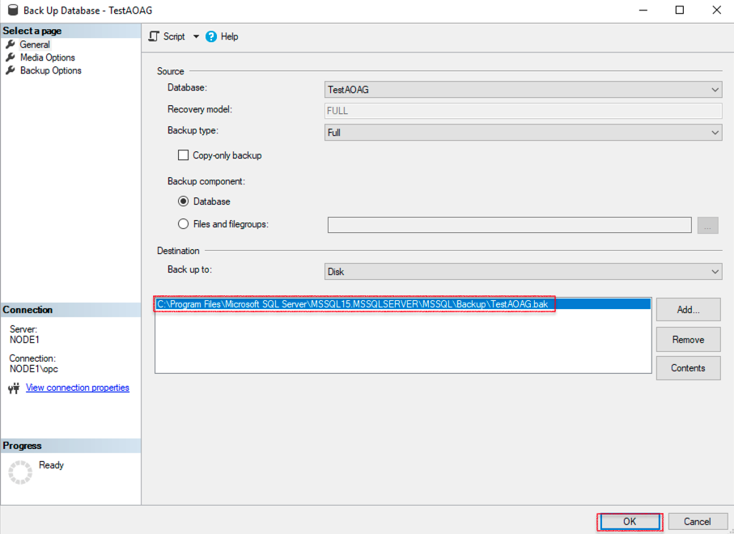

  You may now **proceed to the next lab**.

##  Task 2: Enable the Always-On feature for Node1 Database Engine and configure the SQL Engine services to run with Domain Users.

1. From the Windows taskbar, click the search button, search for **SQL Server 2019 Configuration Manager**, and click on the SQL Server 2019 Configuration Manager app.

  

2. Right-click on database Engine **SQL Server (MSSQLSERVER)**, and then click on **Properties**.

  

3. Click on **Always on Availability Groups**, select the check box **Enable Always on Availability Groups**, and then click on Apply.

  

4. The following **Warning** message will appear on the screen, and then click on **OK**.

  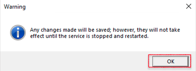

5. Finally, click on **OK** to apply the changes.

  

6. To apply the changes, restart the SQL Engine, Right-click on database Engine **SQL Server (MSSQLSERVER)**, and then click Restart.

  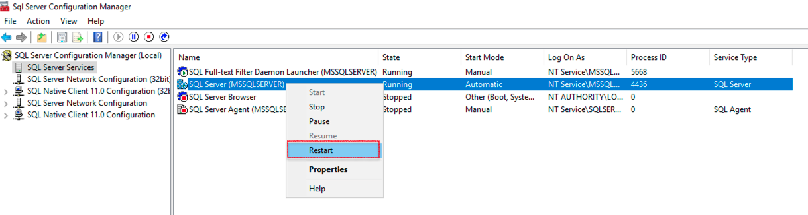

7. To create the SQL service domain service account: From the taskbar, click the search button and search for the run command. Once the run command opens, type **dsa.MSC** to open the Active Directory users and computer, then click on **users**.

  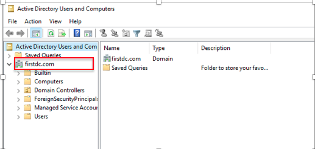

8. Provide the username details, and then click on **Next**.

  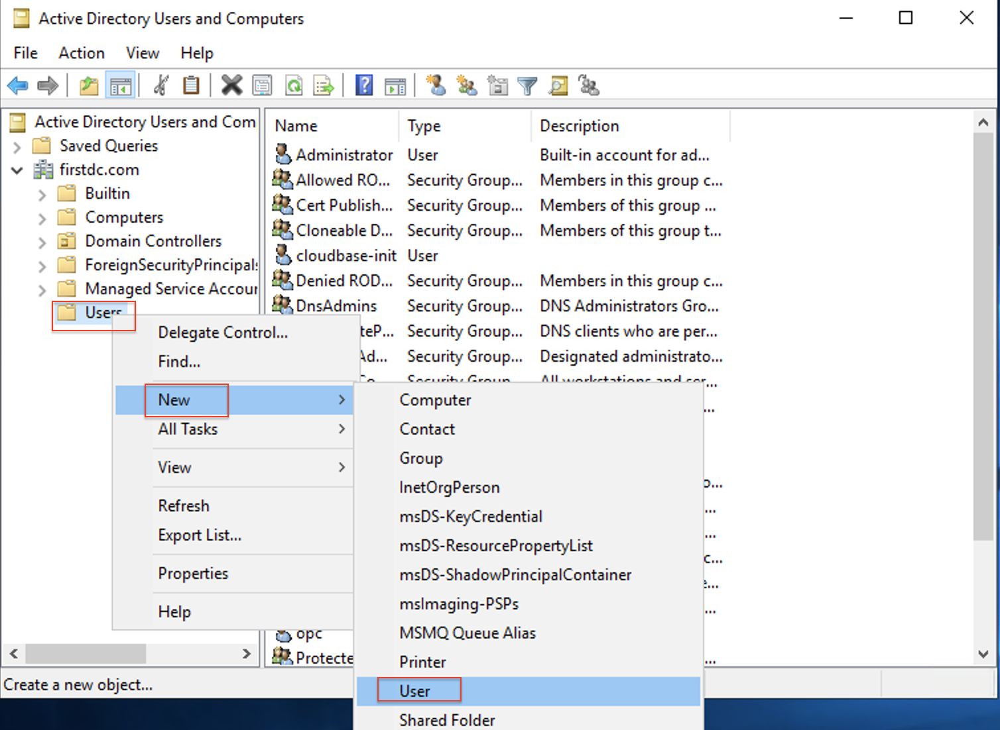

9. Provide the password and confirm the password, then click on **Next** and click on **Finish** to close the create window.

  

  

11. From the taskbar, click the search button, search for **SQL Server 2019 Configuration Manager**, and click on the SQL Server 2019 Configuration Manager app.

12. Right-click on database Engine **SQL Server (MSSQLSERVER)** and then click on **Properties**. Click on **Log On** and provide the user name and password created in the above step, and then click on **apply** and **OK** to apply changes.

 

##  Task 3: Enable the Always-On feature for Node2 Database Engine and configure the SQL Engine services to run with Domain Users.

  * Repeat all the steps from Task 2 to enable the **Always On feature for Node2**.

##  Task 4: Grant permissions to Virtual Computer Object.

1. Ensure you are logged in as a domain admin user with permission to create computer objects in the domain.

2. From the taskbar, click the search button and search for the run. Once the run command opens, type **dsa.MSC** to open the Active Directory users and computer.

  

3. Click view and select **Advanced Features** to view the Advanced features.  
  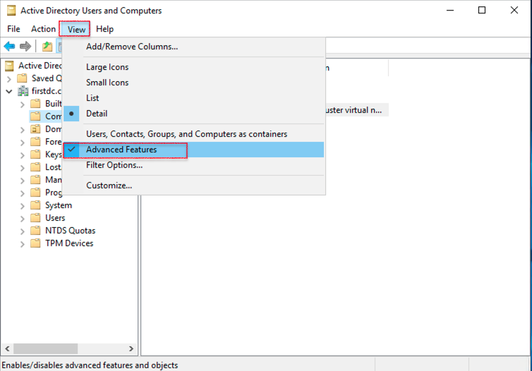

4. Right-click on Computers, and select the **Properties**.
  

5. Click on **Security**, and then click on **Add**.

  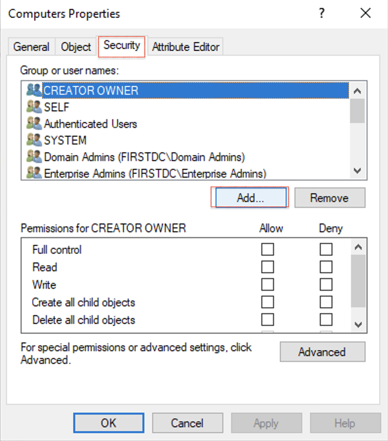

6. Click on **Object Types**.

  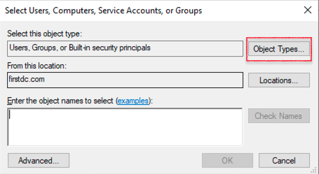

7. Select the check box **Computers**, and then click on **OK**.

  

8. Search for the cluster name created in Lab 3: Task 5, then click on **OK**.

  

9. select the cluster name and click on **Advanced**.

  

10. Click on **Edit** to edit the permissions.

  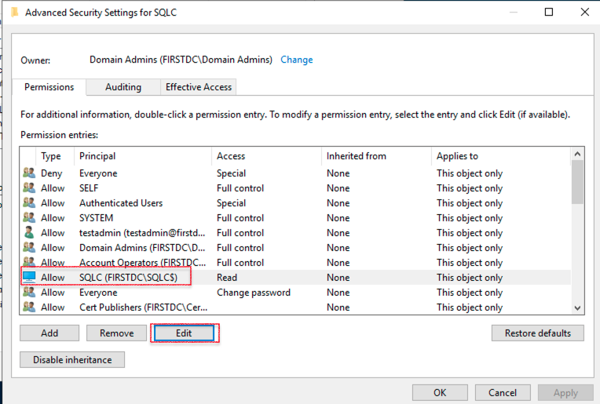

11. Choose the **Create Computer Objects** permission.

  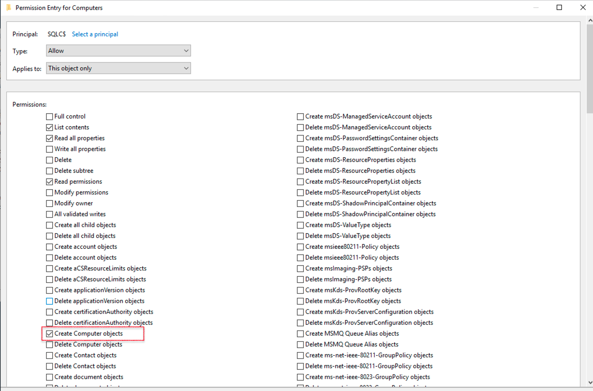

12. Click on **Apply** and click on **OK** to apply the changes.

  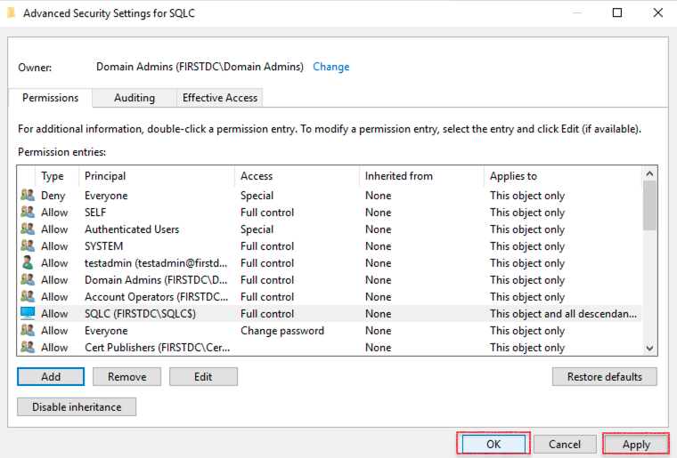

13. Click on **Apply** and click **OK** to grant permission to the computer account.  

  

##  Task 5: Configure Always On Availability Group

1. Open SSMS from **Windows Start Menu**, once opened choose the Server type **Database Engine**, provide the Node1 server name, Choose the **Authentication** type Windows Authentication, and then click on **Connect**.

  

2. Navigate to **Always On High Availability**, right-click, and click on **New Availability Group Wizard**.

  

3. This screen shows the **Introduction** of setup Wizard.

  

4. In **Specify Options**, provide the **Availability group name**, and then click on **Next**.

  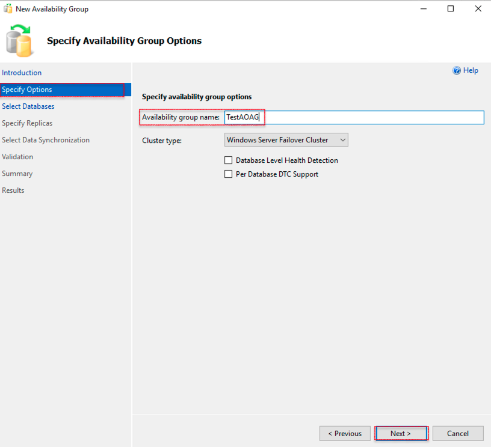

5. Select the database you need to create in the **Select Databases** section.

  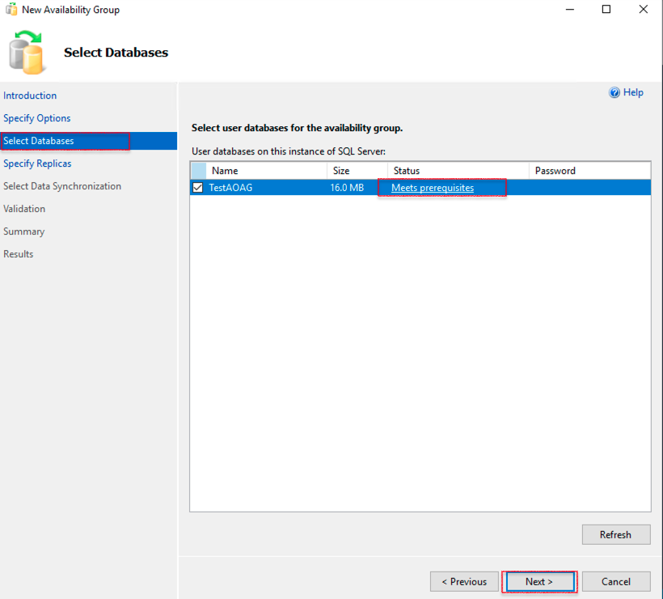

6. In **Specify Replicas**, click on **Replicas**, and then click on **Add Replica**. The setup will pop up **Connect to Server**.

  

7. click on **Connect**.

  

8. The **Replicas** screen is shown as follows.

  

9. In **Select Data synchronization**, and then select the **Automatic Seeding**.

  

10. The **Validation** screen shown as follows.

  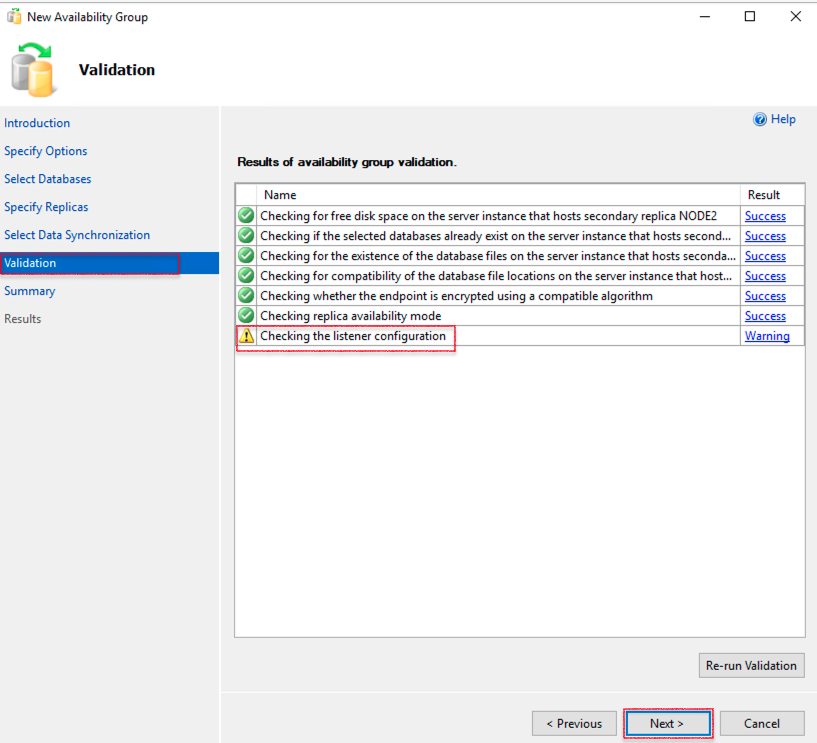

11. The **Summary** screen shows as follows.

  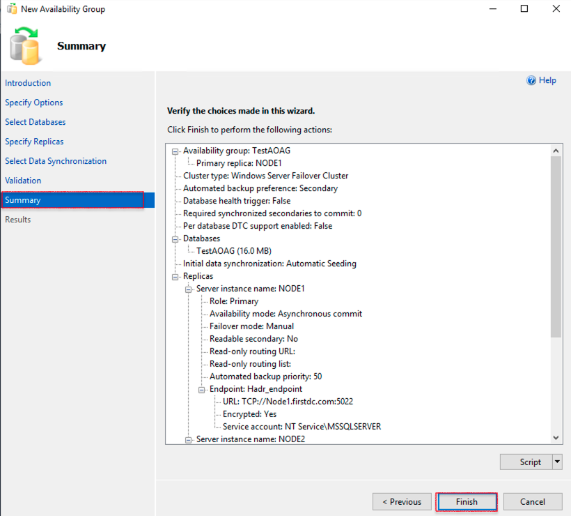

12. The **Results** section shows the **The wizard completed successfully** message as shown in the following image, and then click on **Close**.

  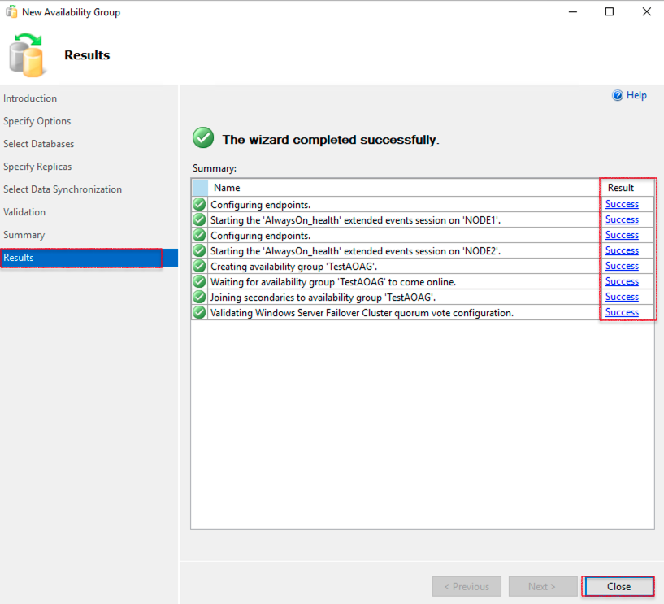

13. Open the show dashboard on the newly created Availability group. You can see the successfully primary and read replica shown in the following image.

  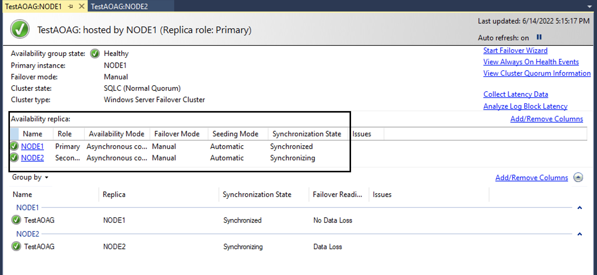

  With the above step, you have successfully set up the Microsoft SQL Server Always On Availability Group. You may now **proceed to the next lab**.

## Acknowledgements
* **Author** - Ramesh Babu Donti, Principal Cloud Architect, NA Cloud Engineering
* **Contributors** -  Devinder Pal Singh, Senior Cloud Engineer, NA Cloud Engineering
* **Last Updated By/Date** - Ramesh Babu Donti, Principal Cloud Architect, NA Cloud Engineering, June 2022