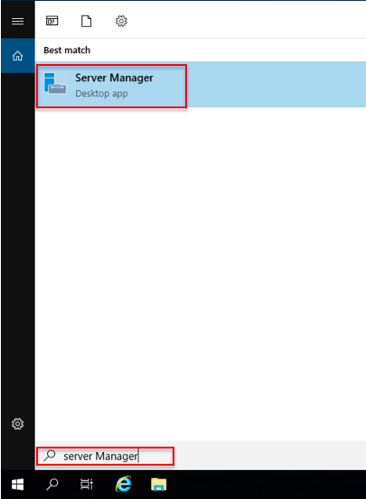
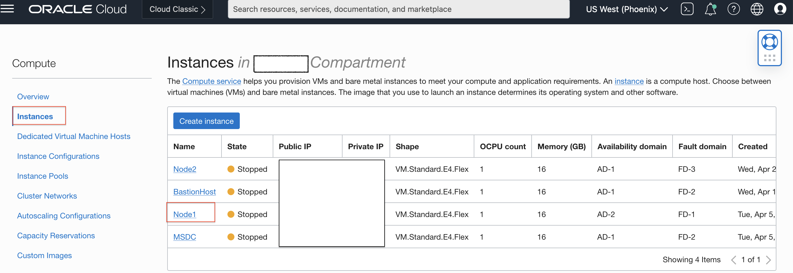

# In Compute Instance, create a two-node Windows Server Failover Cluster.

## Introduction

This lab walks you through the steps to create a Windows Server Failover Cluster.

A Failover Cluster is a group of independent computers that work together to increase the availability and scalability of clustered roles.

Estimated Time:  1 hour

### Objectives
In this lab, you will learn to :
* How to install the Failover Clustering features on the Windows server
* How to create the Private secondary IPs for Computer Instance VNICS
* How to configure the two-node Windows Failover Cluster

### Prerequisites  

This lab assumes you have:
- A Free or LiveLabs Oracle Cloud account
- IAM policies to create resources in the compartment

##  Task 1: Install Failover Clustering features in Node1

1. Open the Remote Desktop client on the Bastion host and connect to the Node1 server using the private IP address using the **opc** user.

2. Click the **search button** in the taskbar, search for Server Manager, and then click on Server Manager.

  

3. Click on **Add roles and features**.

  

4. The Add Roles and Features Wizard look like the following image. Click on **Next**.

  

5. Choose the Installation Type **Role-based or feature-based Installation**, click on **Next**.

  

6. Choose the Server Selection Type **Select a server from the server pool**, click on **Next**.

  

7. Put a tick mark on **Failover Clustering** and click on **Add Features** to install the feature with dependency.

  

  Click on **Next** to continue with the installation.

  

8. The Confirmation will show the details for roles, role services, or features on selected servers, choose the **Restart the destination server automatically if required**, a pop up will appear to check on **yes** for auto restart, click on **Install** to proceed with the Installation.

  

9. In Installation progress **Results** show that the Installation succeeded.

  

10. To verify the Failover Cluster services, From the taskbar, click the **search button** and search for **Failover Cluster**.

  

  The **Failover Cluster Manager** opens as shown in the following image.

  

##  Task 2: Install Failover Clustering features in Node2

* Repeat the all steps from **Task 1** to install **Failover Clustering features** in Node2

## Task 3: Create Secondary Private IPs for Node1

  Add two secondary IPs for each node. One is used for Windows Server Failover Clustering and will use the other for the Always-On Availability Group.

1. Open the navigation menu, click Compute, and click Instances.

  

2. Click on the **Compute Instance** to add the secondary IPs.

  

3. In the **Resource** section, click on **Attached VNICs**, and then click on Primary VNIC to add the secondary IPs.

  

4. Open VNIC and click on **IPv4 Address**.

  

5. The **IPv4 Address** show the Primary IP address details, and then click on **Assign Secondary Private IP Address**.

  

6. Click on **Assign** will automatically assign the available private IP. Repeat the same step to assign another private IP.

  

7. In the **IPv4 Addresses** Section, we can see one Primary IP and two secondary IP addresses, as shown in the following image.

  

## Task 4: Create Secondary Private IPs for Node2

* Repeat the all steps from **Task 3** to add secondary IPs for Node2 VNICS.

## Task 5:  Configure the two-node Windows Failover Cluster

1. RDP to the Bastion host server using the username **use the testadmin user created in lab 1, Task 2 in step 35** and password, from the Bastion host, open the Remote Desktop and connect to the Node1 server using the private IP Address.

2. From the taskbar, click the **search button** and search for **Failover Cluster**.

  

  The **Failover Cluster Manager** opens as shown in the following image, right-click **Failover Cluster Manager**and click on **Create Cluster**.

  

3. The **Cluster Wizard** is shown in the following image, then click on **Next**.

  

4. Click on Browse and search for the two servers which we created in **Lab 2**.

  

5. After adding the two servers, it will show as below, and then click on **Next**.

  

6. In the Validation warning section, select **yes**and click on **Next**.

  

7. The validation configuration wizard is shown as follows, and then click on **Next** to continue validation.

  

8. In the **Testing Options** tab, choose the **Run all tests (recommended)** option and click on **Next**.

  

9. The confirmation screen shows all servers we added to cluster validation, and then click on **Next**.

  

10. The validation will run a test.

  

11. Once the validation is completed, we can see the status as **Validated**and click on **View Report** to view the complete report in **Html** format.

  

12. In **Access Point for Administering the Cluster**, choose the **Cluster Name** and then click on **Next**.

  

13. The **Confirmation** screen shows the cluster name, node details, and another few domain-related information, and then click on **Next** to continue with the configuration.

  

14. Once the Cluster is configured, you can see the confirmation that **You have completed the Create Cluster Wizard** message as shown follows.

  

15. The cluster details are shown below after successfully creating the Cluster.

  

16. Select the Cluster and navigate to **Cluster Core Resources**. The cluster resource will show offline, as shown in the following image. To bring the Cluster online, we need to update the **Static IP Address**, which we created in **Task 3** and **Task4**.

  

17. Right-click on **IP Address on Cluster Network 1**, and then click on **Properties**. Select the Static IP Address and provide the secondary IP address which we created in **Task 3** for node1.

  

18. Repeat the same above step for the Node2 network.

  

19. Once the static secondary IP is updated, right-click on SQLName and click on **Bring online** cluster.

  

20. The Cluster should come online, as shown in the following image. Since the Cluster is a multi-subnet cluster, we can see only one network online.

  

  With the above step, you have successfully set up the two-node Windows Server Failover Cluster. You may now **proceed to the next lab**.

## Acknowledgements
* **Author** - Ramesh Babu Donti, Principal Cloud Architect, NA Cloud Engineering
* **Contributors** -  Devinder Pal Singh, Senior Cloud Engineer, NA Cloud Engineering
* **Last Updated By/Date** - Ramesh Babu Donti, Principal Cloud Architect, NA Cloud Engineering, June 2022