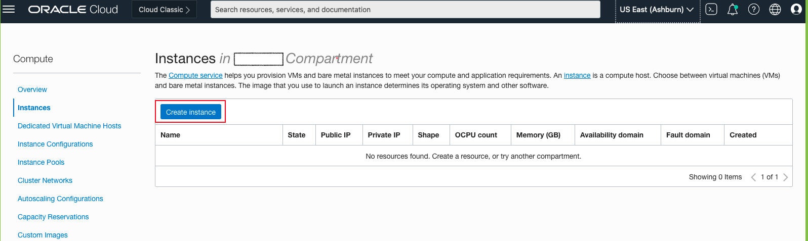
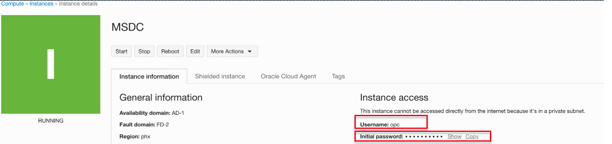
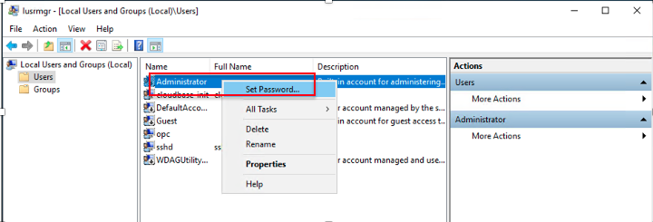
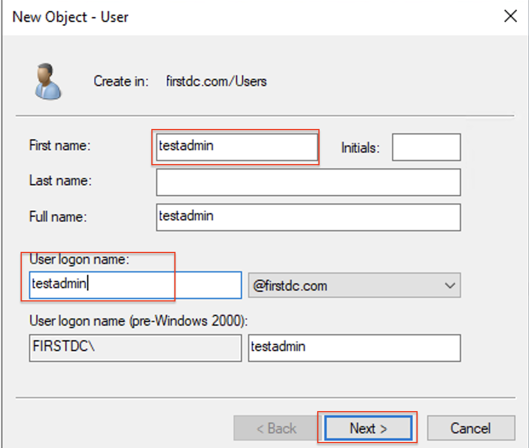
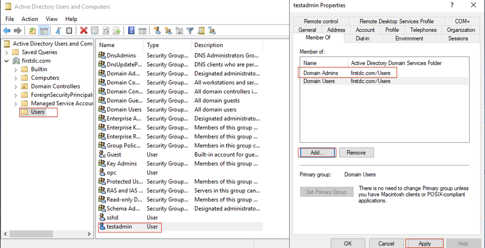

# Setup Windows bastion host and Windows AD Domain Services

## Introduction

This lab walks you through creating a Windows bastion host and setting up the Active Directory Domain Services in a Compute Instance. It involves creating the Windows bastion host and Windows server in a Compute Instance and installing and configuring the Microsoft Active Directory Domain Services.

Estimated Time:  1 Hour 30 min

### Objectives
In this lab, you will learn to :
* Setup the Windows bastion host
* Setup the Windows Active Directory Domain Services in Compute Instance

### Prerequisites  

This lab assumes you have:
- A Free or LiveLabs Oracle Cloud account
- IAM policies to create resources in the compartment
- Required Subnets are available in VCN

##  Task 1: Create the Bastion host in Public Subnet

1. Open the navigation menu, click **Compute**, and then click **Instances**.

  

2. Compute will show the page below. The Compute service helps you provision VMs and bare metal Instances to meet your compute and application requirements. Navigate to **Instances**, and then click on **Create Instance**.

  

3. Choose the Instance name and compartment where the Compute Instance needs to create and select the desired Availability Domain.

  

4. Click on **Change image** to select the edition of Windows image build and Click on **Change Shape** to choose the Shape of the Instance.

  

5. Choose the compartment where the Compute Instance should reside and then choose the public subnet as shown below. Click on assign a public IPv4 address to connect from the public internet.

  

6. Choose the default values and click on the **Create** Instance.

  

7. The Compute Instance will be in a provisioning state shown in the below image.

  

8. Once the Compute Instance is provisioned successfully, the Instance state will be running state.

  

9. You can connect to the newly created Instance via Remote Desktop using the **opc** username and the initial password shown in the console; the user must change the password at the next logon. The Compute Instance must allow RDP TCP port **3389** in the security list.

  

  You may now **proceed to the next Task**.

##  Task 2: Create the Windows Domain Controller in Private Subnet

1. Open the navigation menu, click on **Compute**, and then click **Instances**.

  

2. Navigate to **Instances**, and then click on **Create Instance**.

  

3. Choose the Instance name and compartment where the Compute Instance needs to be created and select the desired Availability Domain.

  

4. Click on **Change image** to select the required Windows image and click on **Change shape** to select the instance shape.

  

5. Choose the compartment where the Compute Instance resides, then choose the private subnet as shown below. Since we have chosen a private subnet, the public IP address is selected as Do not assign a public IPv4 address automatically.

  

6. Choose the default values and click on Create Instance.

  

7. The Compute Instance will be in a provisioning state shown in the below image.

  

8. Once the Compute Instance provisioning is completed, you will be able to see the Instance state is running.

  

9. You can connect to the newly created Instance via Remote Desktop using the **opc** username and the initial password shown in the console; the user must change the password at the next logon. The Compute Instance must allow RDP TCP port **3389** in the security list.

  

10. From the Bastion host server using the username **opc** and password, open the Remote Desktop and connect to the Domain Controller server using the private IP address.

11. From the taskbar, click the **search button** and search for **run**. Once the run command opens, type **lusrmgr.msc** to open the local users.

  

12. Once open, click on **Local Users and Group**. Click on **Users** and right-click on **Administrator** to set the password. The password reset is needed to run successful  **Prerequisites**  during the Domain creation.

  
  

13. From the taskbar, click the **search button**, search for Server Manager, and click on Server Manager.

  

14. Click on **Add roles and features**.

  

15. The Add Roles and Features Wizard look like the following image and then click on **Next**.

  

16. Choose the Installation Type **Role-based or feature-based Installation**, and then click on **Next**.

  

17. Choose the Server Selection Type **Select a server from the server pool**, and then click on **Next**.

  

18. Choose the Server Roles **Active Directory Domain Services**, click on **Add Features**, and then click on **Next**.

  

19. Select the features **Telnet Client**, which will be required to perform the ping test, and then click **next**.

  

20. In the AD DS section, and then click on **next**.

    

21. The confirmation will show the details for roles, role services, or features on selected servers. Select **Restart the destination server automatically if required**. A pop-up will appear asking you to confirm the auto restart. Click **Install** to continue with the installation.

    

22. The **Results** section in the installation progress shows that the installation succeeded and the configuration required message, as shown in the image below, and then click **close**.

    

23. Click the **search button** in the taskbar, search for "Server Manager," and click on "Server Manager." Click on the flag and click on **Promote the server to a Domain Controller**.

    

24. From the **Deployment Configuration**, select **Add a new forest** and provide the desired Domain name in **Root Domain name:**, click on **Next**.

    

25. In the **Domain Controller Options**, enter the **DSRM** password and click **Next**.

    

26. In the **DNS Options**, ignore the warning and click on **Next**.

    

27. The **NetBIOS Domain name:** will resolve automatically. Click on **Next**.

    

28. choose the required paths for log files, and click on **Next**.

    

29. In the **Review Options**, you can see the details settings. Click on **Next**.

    

30. The configuration will verify the required prerequisites checks, as shown in the image below. Click **Install** to complete the installation.

    

31. Once the server is configured with the Domain Controller, the system will automatically restart.

    

32. To verify the Domain details, click the search button on the taskbar and type **dsa.msc** into the run command to open the Active Directory users and computers.

    

33. Open **Control Panel**, and navigate to   **Control Panel\System and Security\Windows Defender Firewall**.

    

34. In the **Customize settings**and choose the **Turn off Windows Firewall**, and then click on **OK** to apply the changes.

    

35. To create Domain Administrator users, go to the taskbar and search for the run command; once the run command opens, type **dsa.msc** to open the Active Directory users and computers, then click on **users**.

    

36. Provide the username details, and then click on **Next**.

    

37. Provide the password and confirm the password, and then click on **Next**.

    

38. Click on **Finish** to create the Domain user.

    

39. Double click on the newly created user, click on **Member of**, and then add the **Domain Admins** and click on **Apply** to add the **Domain Admins** to the newly created user.

    

    You may now **proceed to the next lab**.

## Learn More
- You can find more information about Launching a Windows Instance [here](https://docs.oracle.com/en-us/iaas/Content/GSG/Tasks/launchinginstanceWindows.htm)

## Acknowledgements
* **Author** - Ramesh Babu Donti, Principal Cloud Architect, NA Cloud Engineering
* **Contributors** -  Devinder Pal Singh, Senior Cloud Engineer, NA Cloud Engineering
* **Last Updated By/Date** - Ramesh Babu Donti, Principal Cloud Architect, NA Cloud Engineering, June 2022
