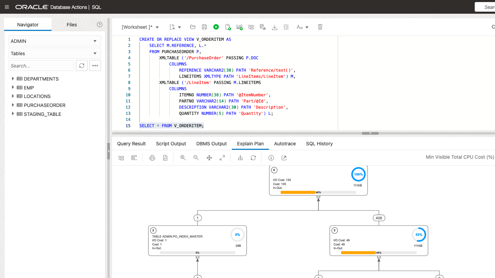
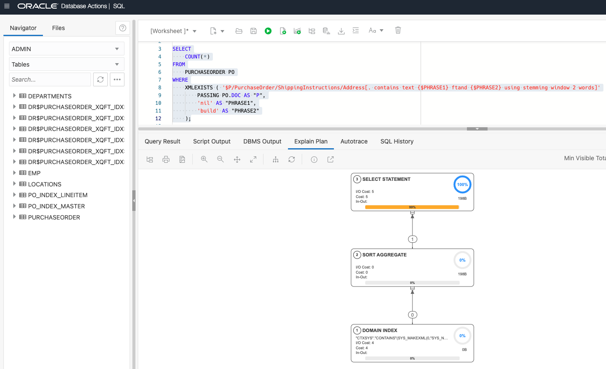
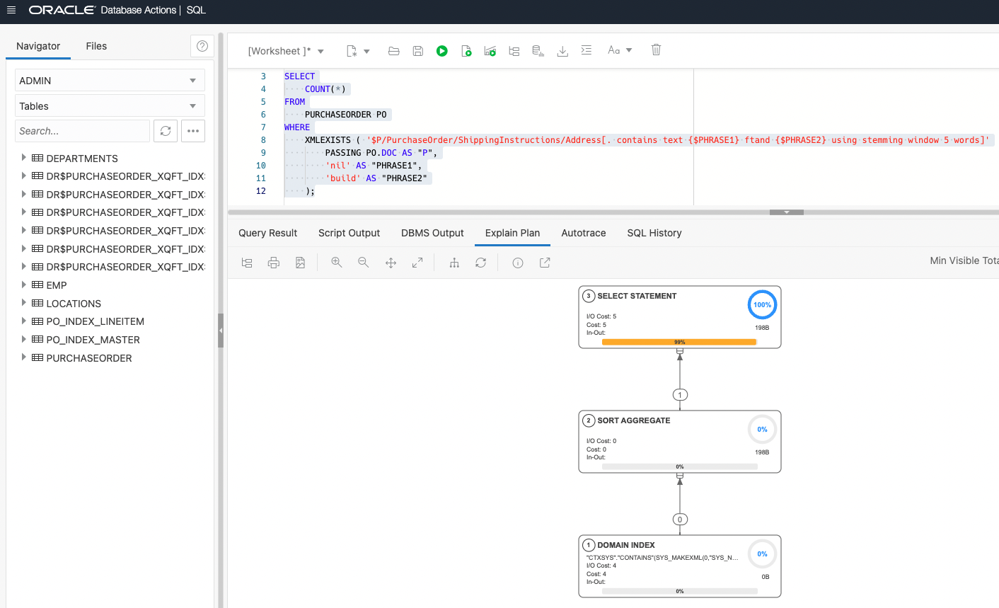

# Index XML data

## Introduction
Indexing XML data will give you quick access to the data and significantly improve the query performance. The use of indexes is particularly recommended for online transaction processing (OLTP) environments involving few updates.

Generally, when your XML data contains structured, predictable part of data and your queries are known, we recommend using XMLIndex with a structured component. When you need to support ad-hoc XML queries, range, or text search queries, we recommend using the XML Search index. In this lab, we will explore both XMLIndex and XML Search Index.

Estimated Time: 45 minutes

### Objectives
In this lab, you will learn:
-	Using Structured XMLIndex,
-	Using XML Search Index.

### Prerequisites
- Be logged into your Oracle Cloud Account.
- Go to the SQL worksheet in Database Actions.

## Task 2: Index Structured XML Data

1. Create Structured XMLIndex
  
    Often times users know the structure or pattern of the queries. For example, consider the following few examples: 

    ```
    <copy>
    SELECT
        XMLQUERY('/PurchaseOrder/LineItems/LineItem/@ItemNumber'
            PASSING P.DOC
        RETURNING CONTENT).GETCLOBVAL() as ItemNumber
    FROM
        PURCHASEORDER P
    WHERE
        XMLEXISTS ('/PurchaseOrder[Reference="CJONES-2022PST"]'
            PASSING P.DOC
        );
    </copy>
    ```

    ```
    <copy>
    CREATE OR REPLACE VIEW V_ORDERITEM AS 
        SELECT M.REFERENCE, L.*
        FROM PURCHASEORDER P,
            XMLTABLE ('/PurchaseOrder' PASSING P.DOC
                COLUMNS
                    REFERENCE VARCHAR2(30) PATH 'Reference/text()',
                    LINEITEMS XMLTYPE PATH 'LineItems/LineItem') M,
            XMLTABLE ('/LineItem' PASSING M.LINEITEMS
                COLUMNS
                    ITEMNO NUMBER(38) PATH '@ItemNumber',
                    PARTNO VARCHAR2(14) PATH 'Part/text()',
                    DESCRIPTION VARCHAR2(30) PATH 'Part/@Description',
                    QUANTITY NUMBER(5) PATH '/Quantity') L;
    </copy>
    ```

    The queries use a similar XPath to access /PurchaserOrder/Reference or /PurchaseOrder/LineItems/LineItem elements. We can create a structured XML index on these structured parts of the data. An XML index will also help the query performance significantly. 

    The following XML index creates two internal index tables PO_INDEX_MASTER and PO_INDEX_LINEITEM. PO_INDEX_MASTER has columns reference and lineitem. Column lineitem is of type XMLTYPE which is virtual. It represents a collection and is passed to the second XMLTable construct to form the second-level relational index table, PO_INDEX_LINEITEM, which has columns itemno, partno, description, and quantity. Queries are optimized through Structured XML Index directly from the underneath relational index tables

    ```
    <copy>
    DROP INDEX PURCHASEORDER_IDX;

    CREATE INDEX PURCHASEORDER_IDX
        ON purchaseorder(doc) INDEXTYPE IS XDB.XMLIndex
        PARAMETERS ('
            XMLTABLE PO_INDEX_MASTER
                    ''/PurchaseOrder''
            COLUMNS
                reference VARCHAR2(30) PATH ''Reference/text()'',
                lineitem  XMLTYPE PATH ''LineItems/LineItem'' VIRTUAL
            XMLTable PO_INDEX_LINEITEM
                    ''/LineItem'' PASSING lineitem
            COLUMNS
                ITEMNO number(38)   PATH ''@ItemNumber'',
                PARTNO varchar2(14)  PATH ''Part/text()'',
                DESCRIPTION varchar2(30) PATH ''Part/@Description'',
                QUANTITY NUMBER(5) PATH ''/Quantity''
        ');
    </copy>
    ```

    Copy the above statement into the worksheet area and press "Run Statement".

    

    ```
    <copy>
    -- we can even create a secondary index on columns of the internal index tables. This will further improve the query performance
    -- creating a secondary index on the REFERENCE column
    CREATE UNIQUE INDEX REFERENCE_IDX ON
        PO_INDEX_MASTER (
            REFERENCE
        );

    -- creating a secondary index on the UPC column
    CREATE INDEX UPC_IDX ON
        PO_INDEX_LINEITEM (
            PARTNO
        );
    </copy>
    ```

    Copy the above statement into the worksheet area and press "Run Statement".

    

    ```
    <copy>
    SELECT
        XMLQUERY('/PurchaseOrder/LineItems/LineItem/@ItemNumber'
            PASSING P.DOC
        RETURNING CONTENT).GETCLOBVAL()
    FROM
        PURCHASEORDER P
    WHERE
        XMLEXISTS ( '/PurchaseOrder[Reference="CJONES-2022PST"]'
            PASSING P.DOC
        );
    </copy>
    ```

    Copy the above statement into the worksheet area and press "Explain Plan".

    

    ```
    <copy>
    CREATE OR REPLACE VIEW V_ORDERITEM AS  
        SELECT M.REFERENCE, L.*
        FROM PURCHASEORDER P,
            XMLTABLE ('/PurchaseOrder' PASSING P.DOC
                COLUMNS
                    REFERENCE VARCHAR2(30) PATH 'Reference/text()',
                    LINEITEMS XMLTYPE PATH 'LineItems/LineItem') M,
            XMLTABLE ('/LineItem' PASSING M.LINEITEMS
                COLUMNS
                    ITEMNO NUMBER(38) PATH '@ItemNumber',
                    PARTNO VARCHAR2(14) PATH 'Part/@Id',
                    DESCRIPTION VARCHAR2(30) PATH 'Description',
                    QUANTITY NUMBER(5) PATH 'Quantity') L;

    SELECT * FROM V_ORDERITEM;
    </copy>
    ```

    Copy the above statement into the worksheet area and press "Explain Plan".

    

2. Create XML Search Index
    
    In the case of ad-hoc XML queries or queries requiring text search or range search, we recommend creating an XML Search index to get a performance boost.

    ```
    <copy>
    BEGIN
        CTX_DDL.DROP_PREFERENCE('STORAGE_PREFS');
    END;
    /

    BEGIN
        CTX_DDL.DROP_SECTION_GROUP('XQFT');
    END;
    /

    BEGIN
        CTX_DDL.CREATE_SECTION_GROUP('XQFT', 'PATH_SECTION_GROUP');
        CTX_DDL.SET_SEC_GRP_ATTR('XQFT', 'XML_ENABLE', 'T');
        CTX_DDL.CREATE_PREFERENCE('STORAGE_PREFS', 'BASIC_STORAGE');
    END;
    /
    </copy>
    ```

    Copy the above statement into the worksheet area and press "Run Statement".

    

    ```
    <copy>
    CREATE INDEX PURCHASEORDER_XQFT_IDX ON
        PURCHASEORDER (
            DOC
        )
    INDEXTYPE IS CTXSYS.CONTEXT PARAMETERS ( 'storage STORAGE_PREFS 
                section group XQFT' );
    </copy>
    ```

    Copy the above statement into the worksheet area and press "Run Statement".

    

    

3. Run queries and check explain plan
    
    3.1. Finding addresses given a zipCode. After creating the search index, a query like this will significantly improve the query performance.

    ```
    <copy>
    SELECT
        COUNT(*)
    FROM
        PURCHASEORDER PO
    WHERE
        XMLEXISTS ( '(#ora:use_xmltext_idx #)
    {$P/PurchaseOrder/LineItems/LineItem[@ItemNumber > $num]}'
            PASSING PO.DOC AS "P",
            '0' AS "num"
        );
    </copy>
    ```

    Copy the above statement into the worksheet area and press "Explain Plan".

    
        


    3.2. Search for a contains match on a phrase. The contains match is case sensitive. 

    ```
    <copy>
    SELECT
        COUNT(*)
    FROM
        PURCHASEORDER PO
    WHERE
        XMLEXISTS ( ' (#ora:use_xmltext_idx #)
    {$P/PurchaseOrder/ShippingInstructions/Address/street[contains(.,$PHRASE)]}'
            PASSING PO.DOC AS "P",
            'Building' AS "PHRASE"
        );
    </copy>
    ```

    Copy the above statement into the worksheet area and press "Explain Plan".

    

    

    3.3. An XQuery Full-Text "contains text" search on a phrase. The index is used since "contains text" comparisons are case insensitive. 

    ```
    <copy>
    SELECT
        COUNT(*)
    FROM
        PURCHASEORDER PO
    WHERE
        XMLEXISTS ( '(#ora:use_xmltext_idx #) {$P/PurchaseOrder/ShippingInstructions/Address/street[. contains text {$PHRASE}]}'
            PASSING PO.DOC AS "P",
            'building' AS "PHRASE"
        );
    </copy>
    ```

    Copy the above statement into the worksheet area and press "Explain Plan".

    
    

    3.4. An XQuery Full-Text "contains text" search on a phrase with stemming.

    ```
    <copy>
    SELECT
        COUNT(*)
    FROM
        PURCHASEORDER PO
    WHERE
        XMLEXISTS ( '$P/PurchaseOrder/ShippingInstructions/Address/street[. contains text {$PHRASE} using stemming]'
            PASSING PO.DOC AS "P",
            'build' AS "PHRASE"
        );
    </copy>
    ```

    Copy the above statement into the worksheet area and press "Explain Plan".

    
    

    3.5. An XQuery Full-Text "contains text" search on a fragment using the ftand operator. 

    ```
    <copy>
    SELECT
        COUNT(*)
    FROM
        PURCHASEORDER PO
    WHERE
        XMLEXISTS ( '$P/PurchaseOrder/ShippingInstructions/Address[. contains text {$PHRASE1} ftand {$PHRASE2} using stemming]'
            PASSING PO.DOC AS "P",
            'nil' AS "PHRASE1",
            'build' AS "PHRASE2"
        );
    </copy>
    ```

    Copy the above statement into the worksheet area and press "Explain Plan".

    
    

    ```
    <copy>
    SELECT
        COUNT(*)
    FROM
        PURCHASEORDER PO
    WHERE
        XMLEXISTS ( '$P/PurchaseOrder/ShippingInstructions/Address[. contains text {$PHRASE1} ftand {$PHRASE2} using stemming window 2 words]'
            PASSING PO.DOC AS "P",
            'nil' AS "PHRASE1",
            'build' AS "PHRASE2"
        );
    </copy>
    ```

    Copy the above statement into the worksheet area and press "Explain Plan".

    
    

    ```
    <copy>
    SELECT
        COUNT(*)
    FROM
        PURCHASEORDER PO
    WHERE
        XMLEXISTS ( '$P/PurchaseOrder/ShippingInstructions/Address[. contains text {$PHRASE1} ftand {$PHRASE2} using stemming window 5 words]'
            PASSING PO.DOC AS "P",
            'nil' AS "PHRASE1",
            'build' AS "PHRASE2"
        );
    </copy>
    ```

    Copy the above statement into the worksheet area and press "Explain Plan".

    
 
You may now **proceed to the next lab**.

## Learn More

- [Manage and Monitor Autonomous Database](https://apexapps.oracle.com/pls/apex/dbpm/r/livelabs/view-workshop?wid=553)
- [Scale and Performance in the Autonomous Database](https://apexapps.oracle.com/pls/apex/dbpm/r/livelabs/view-workshop?wid=608)
- [Oracle XML DB](https://www.oracle.com/database/technologies/appdev/xmldb.html)
- [Oracle Autonomous Database](https://www.oracle.com/database/autonomous-database.html)
- [XML DB Developer Guide](https://docs.oracle.com/en/database/oracle/oracle-database/23/adxdb/index.html)


## Acknowledgements
* **Author** - Harichandan Roy, Principal Member of Technical Staff, Oracle Document DB
* **Contributors** -  XDB Team
* **Last Updated By/Date** - Harichandan Roy, February 2023
