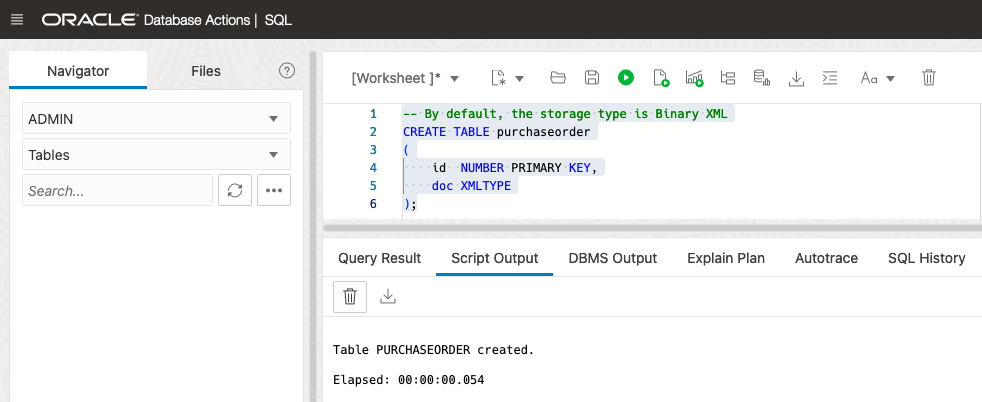
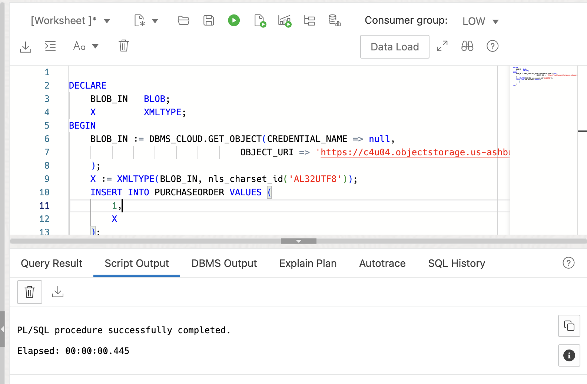

# Create tables and populate data

## Introduction
This lab will use the SQL Workshop in Database Actions from the Autonomous Transaction Processing page. We will create a simple table with an XMLType column in it and populate the table with some XML documents.

Estimated Time: 15 minutes

### Objectives
In this lab, you will learn:
1.	How to create and populate a table with an XMLType column

### Prerequisites
Be logged into your Oracle Cloud Account

## Task 1: Open Database Actions
1.	Log in to the Oracle Cloud.
2.	If you are using a Free Trial or Always Free account, and you want to use Always Free Resources, you need to be in a region where Always Free Resources are available. You can see your current default Region in the top, right-hand corner of the page.
3.	Click the navigation menu in the upper left to show top-level navigation choices.
4.	Click on Oracle Database and choose Autonomous Transaction Processing.
5.	If using FreeTier, your compartment should be the root compartment for your tenancy.
Note: Avoid the use of the ManagedCompartmentforPaaS compartment as this is an Oracle default used for Oracle Platform Services.
6.	You should see your database XMLDB listed in the center. Click on the database name "XMLDB".
7.	On the database page, choose Database Actions.
8.	You are now in Database Actions.
Database Actions allows you to connect to your Autonomous Database through various browser-based tools. We will just be using the SQL workshop tool.
9.	You should be in the Database Actions panel. Click on the SQL card.

## Task 2: Create and Populate a Table with an XMLType Column
1.	Go to Database Actions panel

    Click on the SQL card. When you first enter SQL, you will get a tour of the features. We recommend you step through it, but you can skip the tour by clicking on the "X". The tour is available at any time by clicking the tour button. You can dismiss the warning that you are logged in as an ADMIN user.

2.	Create a table with XMLType column

    We will create a simple table to record the sample purchase orders. It contains a numeric column for purchase ID and an XMLType column for purchase details. 

    Copy the following into the 'Worksheet' area and press the "Run Statement" button:

    ```
    <copy>
    -- By default, the storage type is Binary XML
    CREATE TABLE purchaseorder
    (
        id  NUMBER,
        doc XMLTYPE
    );
    </copy>
    ```

    ```
    <copy>
    -- You can also specify the storage type
    CREATE TABLE PURCHASEORDER (
        ID  NUMBER,
        DOC XMLTYPE
    ) XMLTYPE DOC STORE AS BINARY XML;
    </copy>
    ```
    You should see the message "Table PURCHASEORDER created". 

    

    On the left side, click the "Refresh" button to see your new table in the tables list.

    

3.	Populate the table with a few rows

    Use the 'trashcan' icon to delete the previous statement from the Worksheet area. Copy the following SQL into the worksheet area. Make sure you highlight the whole statement with your mouse and press the "Run Statement" button:

    Here we are assuming that the XML files are stored in the Object store. So, we will now load the XML data to our table from the Object store.

    **Note:** The value of OBJECT_URI has been modified here. ```url/livelab-xmldoc-1.xml``` is not the actual value.
    The actual link is the authenticated link retrieved from the object store. Please refer to object store how to get it.
    If you find it difficult to load the data into the tables, please use other approaches you find appropriate. The most easy to follow approach is ```insert into [TABLE] (...)```. 

    ```
    <copy>
    -- Create the credentials
    begin
    DBMS_CLOUD.create_credential(
        credential_name => 'OBJ_STORE_CRED',
        username => 'your_email_address',
        password => 'your_password'
    );
    end;
    / 
    </copy>
    ```
    Now let’s insert the documents from the object store.

    ```
    <copy>
    -- Inserting xmldoc-1
    DECLARE
        BLOB_IN   BLOB;
        X         XMLTYPE;
    BEGIN
        BLOB_IN := DBMS_CLOUD.GET_OBJECT(CREDENTIAL_NAME => 'OBJ_STORE_CRED', 
                                        OBJECT_URI => 'url/livelab-xmldoc-1.xml'
        );
        X := XMLTYPE(BLOB_IN, nls_charset_id('AL32UTF8'));
        INSERT INTO PURCHASEORDER VALUES (
            1,
            X
        );
    END;
    </copy>
    ```

    

    Similarly, we can insert other sample documents.

    ```
    <copy>
    -- Inserting xmldoc-2
    DECLARE
        BLOB_IN   BLOB;
        X         XMLTYPE;
    BEGIN
        BLOB_IN := DBMS_CLOUD.GET_OBJECT(CREDENTIAL_NAME => 'OBJ_STORE_CRED', 
                                        OBJECT_URI => 'url/livelab-xmldoc-2.xml'
        );
        X := XMLTYPE(BLOB_IN, nls_charset_id('AL32UTF8'));
        INSERT INTO PURCHASEORDER VALUES (
            2,
            X
        );
    END;
    </copy>
    ```

    ```
    <copy>
    -- Inserting xmldoc-3
    DECLARE
        BLOB_IN   BLOB;
        X         XMLTYPE;
    BEGIN
        BLOB_IN := DBMS_CLOUD.GET_OBJECT(CREDENTIAL_NAME => 'OBJ_STORE_CRED', 
                                        OBJECT_URI => 'url/livelab-xmldoc-3.xml'
        );
        X := XMLTYPE(BLOB_IN, nls_charset_id('AL32UTF8'));
        INSERT INTO PURCHASEORDER VALUES (
            3,
            X
        );
    END;

    COMMIT;
    </copy>
    ```

    ```
    <copy>
    -- Check if all docs are inserted correctly
    SELECT
        t.DOC.GETCLOBVAL()
    FROM
        PURCHASEORDER t;
    </copy>
    ```

    You can also use the external table approach to load the XML documents into your table. Here is the link for more info: [External table approach to load the data] (https://blogs.oracle.com/datawarehousing/post/loading-xml-data-from-your-object-store-into-autonomous-database)

    If your XML documents are smaller, you can even use the ‘insert into’ statements to insert the docs into your table.

    ```
    <copy>
    INSERT INTO PURCHASEORDER VALUES (
        3,
        '<PurchaseOrder>
                        <Reference>ROY-1PDT</Reference>
                        <Requestor>H. Roy 1</Requestor>
                        <User>ROY-1</User>
                        <CostCenter>H1</CostCenter>
                        <ShippingInstructions>
                            <name>H. Roy 1</name>
                            <Address>
                                <street>1 Nil Rd, Building 1</street>
                                <city>SFO-1</city>
                                <state>CA</state>
                                <zipCode>99236</zipCode>
                                <country>USA</country>
                            </Address>
                        </ShippingInstructions>
                        <SpecialInstructions>Overnight</SpecialInstructions>
                        <LineItems>
                            <LineItem ItemNumber="1">
                                <Part Description="Monitor" UnitPrice="350">1</Part>
                                <Quantity>1</Quantity>
                            </LineItem>
                            <LineItem ItemNumber="2">
                                <Part Description="Headphone" UnitPrice="550">1</Part>
                                <Quantity>1</Quantity>
                            </LineItem>
                            <LineItem ItemNumber="3">
                                <Part Description="Speaker" UnitPrice="750">1</Part>
                                <Quantity>1</Quantity>
                            </LineItem>
                        </LineItems>
                    </PurchaseOrder>'
    );
    </copy>
    ```

    You can choose any of the above approaches to insert the XML documents into the table. 

    Let's insert two more documents - this time NULL document.

    ```
    <copy>
    INSERT INTO purchaseorder
    VALUES      (4, NULL);

    INSERT INTO purchaseorder
    VALUES      (5, NULL);

    COMMIT;  
    </copy>
    ```

    ```
    <copy>
    -- Check if all docs are inserted correctly
    SELECT
        t.DOC.GETCLOBVAL()
    FROM
        PURCHASEORDER t;
    </copy>
    ```

    Now the table PURCHASEORDER table should have 5 rows.

    

4.	Check that we have rows in the table

    Copy the following simple SELECT into the worksheet area and press "Run Statement".

    ```
    <copy>
    SELECT
        t.id,
        t.doc.getclobval()
    FROM
        PURCHASEORDER t;
    </copy>
    ```

    You should see the rows you inserted. You can expand the view to see the whole text 
    column by adjusting the column header. 

    

    If there are no rows shown, return to Step 3.

You may now **proceed to the next lab**.

## Learn More
- [Database 19c - JSON] (https://apexapps.oracle.com/pls/apex/r/dbpm/livelabs/view-workshop?wid=638)
- [Developing with JSON and SODA in Oracle Database] (https://apexapps.oracle.com/pls/apex/r/dbpm/livelabs/view-workshop?wid=831)
- [JSON without Limits] (https://apexapps.oracle.com/pls/apex/r/dbpm/livelabs/view-workshop?wid=836)
- [Using the Database API for MongoDB] (https://apexapps.oracle.com/pls/apex/r/dbpm/livelabs/view-workshop?wid=3152)
- [Database API for MongoDB - The Basics] (https://apexapps.oracle.com/pls/apex/r/dbpm/livelabs/view-workshop?wid=3221)
- [Full-Text Search in Oracle Database] (https://apexapps.oracle.com/pls/apex/r/dbpm/livelabs/view-workshop?wid=3286)
- [Autonomous Database Dedicated](https://apexapps.oracle.com/pls/apex/dbpm/r/livelabs/view-workshop?wid=677)
- [Manage and Monitor Autonomous Database](https://apexapps.oracle.com/pls/apex/dbpm/r/livelabs/view-workshop?wid=553)
- [Scaling and Performance in the Autonomous Database](https://apexapps.oracle.com/pls/apex/dbpm/r/livelabs/view-workshop?wid=608)


## Acknowledgements
* **Author** - Harichandan Roy, Principal Member of Technical Staff, Oracle Document DB
* **Contributors** -  XDB Team
* **Last Updated By/Date** - Harichandan Roy, February 2023
