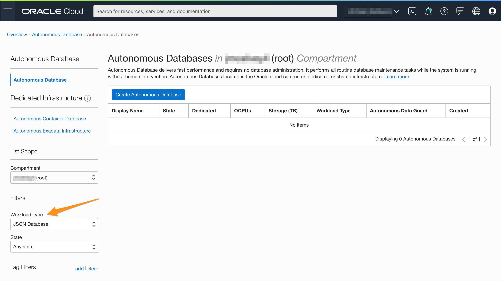
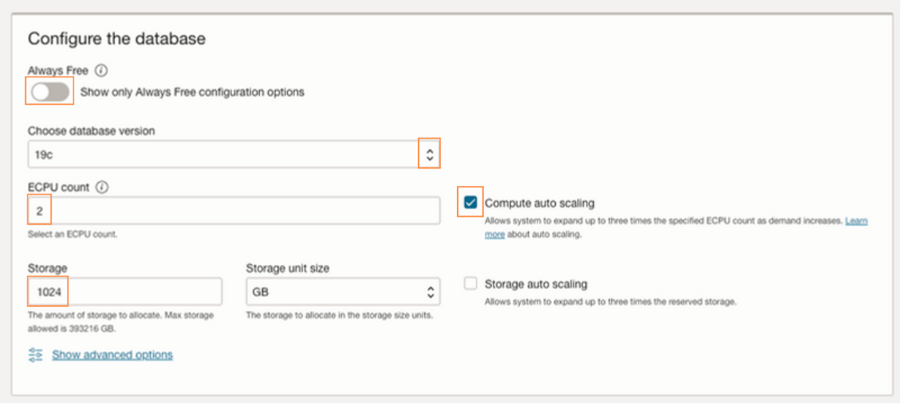
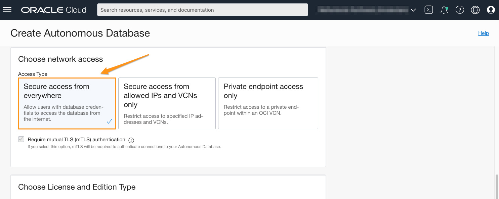
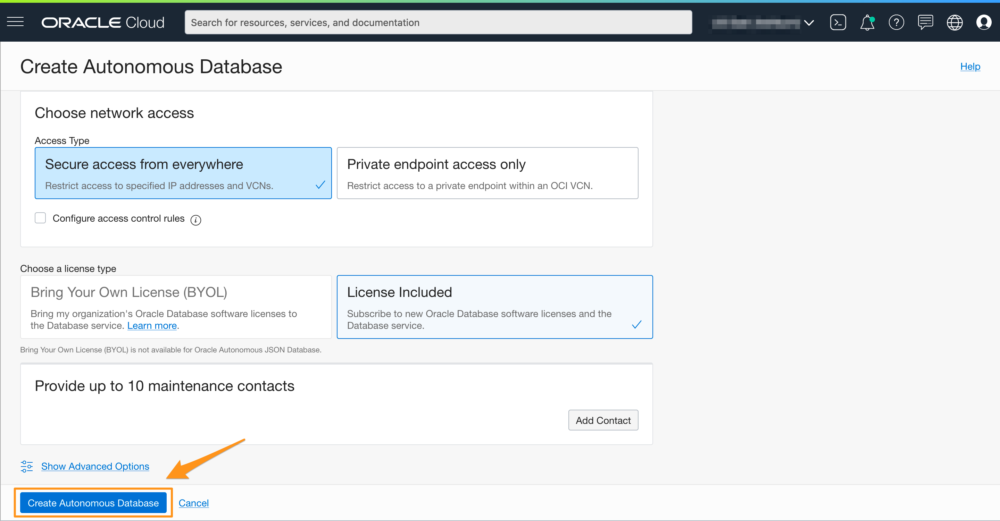

# Provision an autonomous database

## Introduction

This lab walks you through the steps to provision an Autonomous Database on Oracle Cloud. In this lab, you will provision a new Autonomous Transaction processing instance.

Estimated Time: 10 minutes

Watch the video below for a quick walk-through of the lab.
[Provision an Autonomous Database](videohub:1_6vuxgeyf)

### Objectives

In this lab, you will:

* Learn how to provision a new Autonomous Database

### Prerequisites

- Be logged in to your Oracle Cloud Account

## Task 1: Choose Autonomous Transaction Processing from the Services Menu

1. Log in to the Oracle Cloud.

<if type="freetier">

2. If you are using a Free Trial or Always Free account, and you want to use Always Free Resources, you need to be in a region where Always Free Resources are available. You can see your current default **Region** in the top, right-hand corner of the page.

    

</if>
<if type="livelabs">

2. If you are using a LiveLabs account, you need to be in the region your account was provisioned in. You can see your current default **Region** in the top, right-hand corner of the page. Make sure that it matches the region on the LiveLabs Launch page.

    

</if>

3. Click the navigation menu in the upper left to show top-level navigation choices.

    

4. Click on **Oracle Database** and choose **Autonomous Transaction Processing**.

    

5. Use the __List Scope__ drop-down menu on the left to select a compartment. Make sure your workload type is __Transaction Processing__. <if type="livelabs">Enter the first part of your user name, for example `LL185` in the Search Compartments field to quickly locate your compartment.

    

</if>
<if type="freetier">
    
</if>
    

<if type="freetier">
   > **Note:** Avoid the use of the ManagedCompartmentforPaaS compartment as this is an Oracle default used for Oracle Platform Services.
</if>

## Task 2: Create the Autonomous Transaction Processing Instance

1. Click **Create Autonomous Database** to start the instance creation process.

    

2.  This brings up the __Create Autonomous Database__ screen where you will specify the configuration of the instance.

3. Provide basic information for the autonomous database:

<if type="freetier">
    - __Choose a compartment__ - Select a compartment for the database from the drop-down list.
</if>
<if type="livelabs">
    - __Choose a compartment__ - Use the default compartment that includes your user id.
</if>
    - __Display Name__ - Enter a memorable name for the database for display purposes. For this lab, use __XMLDB__.
<if type="freetier">
    - __Database Name__ - Use letters and numbers only, starting with a letter. Maximum length is 14 characters. (Underscores not initially supported.) For this lab, use __TEXTDB__.

    
</if>
<if type="livelabs">
    - __Database Name__ - Use letters and numbers only, starting with a letter. Maximum length is 14 characters. (Underscores not initially supported.) For this lab, use __TEXTDB__ and append you LiveLabs user id. For example, __TEXTDB7199__.

    
</if>

4. Choose a workload type: Select the workload type for your database from the choices:

    - __Transaction Processing__ - For this lab, choose __Transaction Processing__ as the workload type.

    

5. Choose a deployment type: Select the deployment type for your database from the choices:

    - __Serverless__ - For this lab, choose __Serverless__ as the deployment type.
    - __Dedicated Infrastructure__ - Alternatively, you could have chosen Dedicated Infrastructure as the deployment type.

    

6. Configure the database:

    <if type="freetier">
    - __Always Free__ - If your Cloud Account is an Always Free account, you can select this option to create an always free autonomous database. An always free database comes with 1 CPU and 20 GB of storage. For this lab, we recommend you leave Always Free checked if you have that as an option.
    </if>
    <if type="livelabs">
    - __Always Free__ - For this lab, we recommend you leave Always Free checked if it is available to you.
    </if>
    - __Choose database version__ - Select 19c from the database version. Note: This lab should work on a 21c AJD database as well.
    - __OCPU count__ - Number of OCPUs for your service. For this lab, leave the default __1 OCPU__. If you choose an Always Free database, it comes with 1 OCPU.
    - __Storage (TB)__ - Select your storage capacity in terabytes. For this lab, leave the default __1 TB__ of storage. If you choose an Always Free database, it comes with 20 GB of storage.
    - __Auto Scaling__ - For this lab, keep auto scaling enabled, to allow the system to automatically use up to three times more CPU and IO resources to meet workload demand.

    *Note: You cannot scale up/down an Always Free autonomous database.*

    

7. Create administrator credentials:

    - __Password and Confirm Password__ - Specify the password for ADMIN user of the service instance and confirm the password.

    The password must meet the following requirements:
    - The password must be between 12 and 30 characters long and must include at least one uppercase letter, one lowercase letter, and one numeric character.
    - The password cannot contain the username.
    - The password cannot contain the double quote (") character.
    - The password must be different from the last 4 passwords used.
    - The password must not be the same password that is set less than 24 hours ago.
    - Re-enter the password to confirm it. Make a note of this password.
 
    

8. Set network access:

    Network access allows you to limit connections to certain IP addresses. For this workshop, we'll set it to "Secure access from anywhere"

    

9. Choose a license type:

    For Autonomous JSON Database, only __License Included__ is available. For other Autonomous Database workloads, you have these options:
    - __Bring Your Own License (BYOL)__ - Select this type when your organization has existing database licenses.
    - __License Included__ - Select this type when you want to subscribe to new database software licenses and the database cloud service.

    

10. Click __Create Autonomous Database__.

    

11.  Your instance will begin provisioning. In a few minutes, the state will turn from Provisioning to Available. At this point, your Autonomous database is ready to use! Have a look at your instance's details here including the Database Name, Database Version, OCPU Count, and Storage.

    

You may now **proceed to the next lab**.

## Learn More

* [Provision Autonomous JSON Database](https://docs.oracle.com/en/cloud/paas/autonomous-json-database/ajdug/autonomous-provision.html#GUID-0B230036-0A05-4CA3-AF9D-97A255AE0C08)

## Acknowledgements

- **Author** - Roger Ford, Principal Product Manager, Oracle Database
- **Contributors** - Kamryn Vinson, Andres Quintana, James Zheng
- **Last Updated By/Date** - Roger Ford, March 2022
