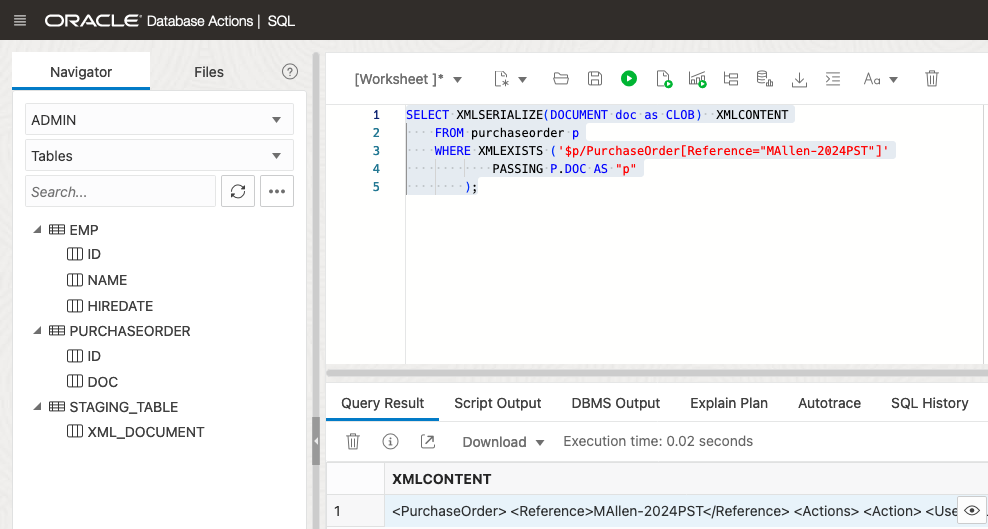

# Analyze your data using SQL and XQuery

## Introduction

This lab will use the SQL Worksheet from your Autonomous Database. We will explore XQuery to query XML content stored in Oracle XML DB. It is one of the main ways that you interact with XML data in Oracle XML DB. It is the W3C language designed for querying and updating XML data.

The support for the XQuery Language is provided through a native implementation of SQL/XML functions: XMLQuery, XMLTable, XMLExists, and XMLCast. These SQL/XML functions are defined by the SQL/XML standard as a general interface between the SQL and XQuery languages.

Estimated Time: 45 minutes

### Objectives

In this lab, you will execute the following tasks:
-	Querying XML documents or fragments,
-	Extracting XML nodes/scalar values,
-	Constructing new XML documents from stored documents,
-	Generating relational data from XML documents,
-	Serializing XML data,
-	Joining XML data with relational data.

### Prerequisites

- Be logged into your Oracle Cloud Account and have access to the SQL Worksheet in Database Actions.

## Task 1: Get the number of not-null XML documents

Let's first see how many non-null XML documents we have in our table. The WHERE clause in the following statement filters the not-null documents.

In SQL Worksheet, copy the following simple SELECT into the worksheet area and press "Run Statement".

```
<copy>
SELECT
    COUNT(*)
FROM
    PURCHASEORDER
WHERE
    DOC IS NOT NULL;
</copy>
``` 


## Task 2:  Search for the specific XML documents

The XMLExists SQL/XML function can be used in the WHERE clause to filter rows based on an XQuery expression. It evaluates whether or not a given document contains a node that matches the specified XQuery expression.

The following query will return the XML documents which satisfy the XPath /PurchaseOrder/Reference.

```
<copy>
SELECT
    P.DOC.GETCLOBVAL() XMLDOC
FROM
    PURCHASEORDER P
WHERE
    XMLEXISTS ('/PurchaseOrder/Reference'
        PASSING P.DOC
    );
</copy>
``` 

Copy the above statement into the worksheet area and press "Run Statement". All non-null documents are returned since all of them have the same XPath node.


The next query is even more specific, and it will return the XML documents where XPath /PurchaseOrder/Reference has 'CJONES-2022PST' as the value.

```
<copy>
SELECT
    P.DOC.GETCLOBVAL() XMLDOC
FROM
    PURCHASEORDER P
WHERE
    XMLEXISTS ('$p/PurchaseOrder[Reference="CJONES-2022PST"]'
        PASSING P.DOC AS "p"
    );
</copy>
``` 

Copy the above statement into the worksheet area and press "Run Statement". You'll see that we only have one document with a purchase order reference to 'CJONES-2022PST'.


You can also use a bind variable to pass a value, as shown in the example below. Bind variables should always be used when a query will be executed multiple times with different predicates.

 ```
<copy>
SELECT
    P.DOC.GETCLOBVAL() XMLDOC
FROM
    PURCHASEORDER P
WHERE
    XMLEXISTS ( '$p/PurchaseOrder[Reference=$REF]'
        PASSING P.DOC AS "p",
        'CJONES-2022PST' AS "REF"
    );
</copy>
``` 

Copy the above statement into the worksheet area and press "Run Statement".
    


## Task 3:  Access fragments or nodes of your XML documents

 If we are not interested in all the information in the XML documents, but are interested in only seeing a fragment of the documents, we can use XMLQuery function which takes an XQuery expression and returns the fragments or nodes we are looking for.

 The WHERE clause of this query will filter the documents that we are looking for and the XMLQuery will extract only the fragments/nodes of the shipping instruction information from our filtered XML documents. 

```
<copy>
SELECT
    XMLQUERY('/PurchaseOrder/ShippingInstructions'
        PASSING P.DOC
    RETURNING CONTENT).GETCLOBVAL() XMLNODE
FROM
    PURCHASEORDER P
WHERE
    XMLEXISTS ( '$p/PurchaseOrder[Reference="MAllen-2024PST"]'
        PASSING P.DOC AS "p"
    );
</copy>
``` 

Copy the above statement into the worksheet area and press "Run Statement". You will see that only one row satisfied our filter criteria, and the returned data contains only the fragment of the shipping information.
    


## Task 4:  Extract the scalar value from XML fragments or nodes

So far we have worked with XML documents or fragments of XML documents. Very often it is desirable to extract portions of our documents as classical scalar values for display or further processing in SQL as relational data. If we want to extract the scalar value of fragments or nodes from your XML documents, we can use XMLCast function to map the XQuery result to a SQL data type.

The following query will return the scalar value of the 'name' node in 'ShippingInstructions' of the documents having 'SBELL-2023PDT' as the Reference value.

```
<copy>
SELECT
    XMLCAST(XMLQUERY('/PurchaseOrder/ShippingInstructions/name'
        PASSING P.DOC
    RETURNING CONTENT) AS VARCHAR2(50)) XMLNODE
FROM
    PURCHASEORDER P
WHERE
    XMLEXISTS ('$p/PurchaseOrder[Reference="SBELL-2023PDT"]'
        PASSING P.DOC AS "p"
    );
</copy>
``` 

Copy the above statement into the worksheet area and press "Run Statement". You will see the name 'Sarah J. Bell' being returned as scalar value, the name element of our shipping instructions.
    


## Task 5:  Generate relational data from XML data

We just learned how to extract simple scalar values. However, XML documents consist of more complex structures, such as nested path or arrays. The XMLTable function allows us to decomposes the result of a XQuery evaluation into relational rows and columns of a new virtual table. We can insert this data into a relational table, or we can query it using SQL depending on the use cases.

In task 3 we extracted the ShippingInstructions as an XML fragment. The following statement will give us the same fragment as a relational table.

```
<copy>
SELECT
    SI.*
FROM
    PURCHASEORDER P,
    XMLTABLE ('/PurchaseOrder/ShippingInstructions'
            PASSING P.DOC
        COLUMNS
            NAME VARCHAR2(15) PATH 'name',
            STREET VARCHAR2(30) PATH 'Address/street',
            CITY VARCHAR2(15) PATH 'Address/city',
            STATE VARCHAR2(10) PATH 'Address/state',
            ZIPCODE VARCHAR2(10) PATH 'Address/zipCode',
            COUNTRY VARCHAR2(30) PATH 'Address/country',
            TELEPHONE VARCHAR2(15) PATH 'telephone'
    ) SI
WHERE
    XMLEXISTS ('$p/PurchaseOrder[Reference="SBELL-2023PDT"]'
        PASSING P.DOC AS "p"
    );
``` 

Copy the above statement into the worksheet area and press "Run Statement".
    


Furthermore, we can chain (unnest) the XMLTable calls when we want to see data contained in multiple levels. For example, in the following example, the element PurchaseOrder is first decomposed to a relational view of two columns, reference as varchar2 and lineitem as XMLType. The lineitem column is then passed to a second XMLTable call to be broken into its various parts as multiple columns of relational values.

```
<copy>
SELECT
    PO.REFERENCE,
    LI.*
FROM
    PURCHASEORDER P,
    XMLTABLE ('/PurchaseOrder'
            PASSING P.DOC
        COLUMNS
            REFERENCE VARCHAR2(30) PATH 'Reference',
            LINEITEM XMLTYPE PATH 'LineItems/LineItem'
    )             PO,
    XMLTABLE ('/LineItem'
            PASSING PO.LINEITEM
        COLUMNS
            ITEMNO NUMBER(3) PATH '@ItemNumber',
            PARTNO NUMBER(12) PATH 'Part/@Id',
            DESCRIPTION VARCHAR2(25) PATH 'Description',
            UNITPRICE NUMBER(8, 4) PATH 'Part/@UnitPrice',
            QUANTITY NUMBER(12, 2) PATH 'Quantity'
    )             LI
WHERE
    XMLEXISTS ('$p/PurchaseOrder[Reference="CJONES-2022PST"]'
        PASSING P.DOC AS "p"
    );
</copy>
``` 

Copy the above statement into the worksheet area and press "Run Statement".
    


## Task 6:  Join relational tables with XML tables/columns

In task 5 we used the XMLTable function to create an in-line relational view of XML content. The result can be used to join with other relational tables in the database.

Let's first create a simple relational table, EMP, and then insert a few rows. We will use this table later on to join with our XML document table.

```
<copy>
CREATE TABLE EMP (
    ID   NUMBER,
    NAME VARCHAR(20),
    HIREDATE DATE
);

insert into emp values(101, 'Sarah J. Bell', date '2001-06-01');
insert into emp values(102, 'Cindy Jones', date '2019-01-20');
insert into emp values(103, 'Michael Allen', date '2005-09-01');

COMMIT;
</copy>
``` 

Copy the above statement into the worksheet area and press "Run Statement" to insert our three sample rows. 


    
Check that we inserted the data correctly with the following statement.
```
<copy>
SELECT
    *
FROM
    EMP;
</copy>
``` 


Let us now join our relational table EMP with our XML documents on the extracted node REQUESTOR of our XML document. We could have also returned a combination of relational (scalar) data and XML documents or fragments.

```
<copy>
SELECT
    E.ID,
    T.*
FROM
    EMP           E,
    PURCHASEORDER P,
    XMLTABLE ('/PurchaseOrder' PASSING P.DOC
        COLUMNS
            REQUESTOR PATH 'Requestor/text()',
            INSTRUCTIONS PATH 'SpecialInstructions/text()'
    ) T
WHERE
    E.NAME = T.REQUESTOR;
</copy>
``` 

Copy the above statement into the worksheet area and press "Run Statement".
    


## Task 7:  Construct a new response XML document

Let's assume we have some purchase order XML documents containing massive, detailed purchase information. We only want to generate a new and smaller XML document containing only the required information as a response to an application request. The following query just does that:

```
<copy>
SELECT
    XMLQUERY('<Response>{
            $XML/PurchaseOrder/Reference,
            $XML/PurchaseOrder/User,
            $XML/PurchaseOrder/SpecialInstructions
        }
        </Response>'
        PASSING P.DOC AS "XML"
    RETURNING CONTENT).GETCLOBVAL() INITIAL_STATE
FROM
    PURCHASEORDER P
WHERE
    P.DOC IS NOT NULL;
 </copy>
``` 

Copy the above statement into the worksheet area and press "Run Statement".
    


## Task 8:  Serialize XML data 

Consider you have an application or product that does not support XMLType data. In that case, you can serialize the XML data as CLOB or BLOB and view or process it in your application. Oracle XML DB provides an XMLSerialize function to achieve this goal. XMLSerialize also allows control over the layout of the serialized XML:

```
<copy>
SELECT XMLSERIALIZE(DOCUMENT doc as CLOB)  XMLCONTENT
FROM purchaseorder p
WHERE XMLEXISTS ('$p/PurchaseOrder[Reference="MAllen-2024PST"]'
        PASSING P.DOC AS "p"
    );
</copy>
```



In this module you got a first taste of how to query and analyze your XML documents, combine it with relational data, and return your desired results in relational format, XML format, or a combination of both. You may now **proceed to the next lab**.

## Learn More

* [Get started with Oracle Autonomous Database Serverless ](https://docs.oracle.com/en/cloud/paas/autonomous-database/serverless/videos.html)
- [XML DB Developer's Guide](https://docs.oracle.com/en/database/oracle/oracle-database/23/adxdb/index.html)
- [Oracle XML DB](https://www.oracle.com/database/technologies/appdev/xmldb.html)


## Acknowledgements
* **Author** - Harichandan Roy, Principal Member of Technical Staff, Oracle Document DB
* **Contributors** -  XDB Team
- **Last Updated By/Date** - Ernesto Alvarez, April 2024
