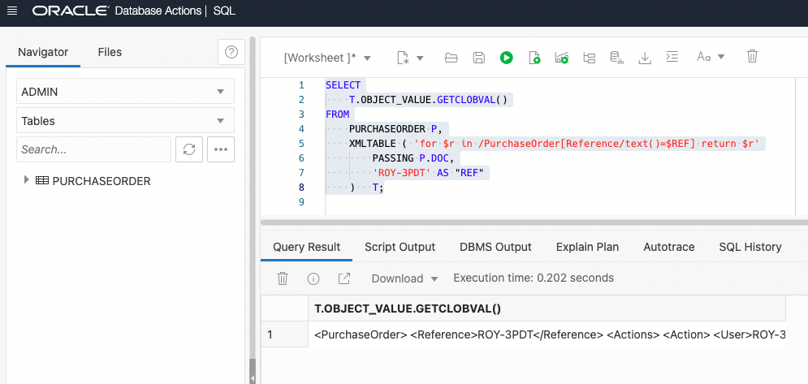

# Run queries

## Introduction

This lab will use the SQL Workshop in Database Actions from the Autonomous Transaction Processing page. Here we will explore XQuery to query XML content stored in Oracle XML DB. It is one of the main ways that you interact with XML data in Oracle XML DB. It is the W3C language designed for querying and updating XML data.

The support for the XQuery Language is provided through a native implementation of SQL/XML functions: XMLQuery, XMLTable, XMLExists, and XMLCast. These SQL/XML functions are defined by the SQL/XML standard as a general interface between the SQL and XQuery languages.

Estimated Time: 60 minutes

### Objectives

In this lab, you will learn:
-	XQuery basics,
-	SQL/XML basics,
-	Querying XML documents or fragments,
-	Extracting XML nodes/scalar values,
-	Constructing new XML documents from stored documents,
-	Generating relational data from XML documents,
-	Serializing XML data,
-	Joining XML data with relational data.

### Prerequisites

- Be logged into your Oracle Cloud Account.

## Task 1: XQuery Basics

XQuery is the W3C language designed for querying and updating XML data. The core part of it is the XQuery expression. XQuery expressions are case-sensitive. An XQuery expression is either a simple expression or an updating expression, the latter being an expression that represents data modification. More precisely, these are the possible XQuery expressions:

-	Basic updating expression – an insert, delete, replace, or rename expression, or a call to an updating function.
-	Updating expression – a basic updating expression or an expression (other than a transform expression) that contains another updating expression (this is a recursive definition).
-	Simple expression – An XQuery 1.0 expression. It does not call for any updating.
Simple expressions include the following:
    - Primary expression – literal, variable, or function application. A variable name starts with a dollar sign ($) – for example, $foo. Literals include numerals, strings, and character or entity references.
    - XPath expression – Any XPath expression. The XPath 2.0 standard is a subset of XQuery.
    - FLWOR expression – The most important XQuery expression, composed of the following, in order, from which FLWOR takes its name: for, let, where, order by, and return.
    - XQuery sequence – The comma (,) constructor creates sequences. Sequence-manipulating functions such as union and intersect are also available. All XQuery sequences are effectively flat: a nested sequence is treated as its flattened equivalent. Thus, for instance, (1, 2, (3, 4, (5), 6), 7) is treated as (1, 2, 3, 4, 5, 6, 7). A singleton sequence, such as (42), acts the same in most XQuery contexts as does its single item, 42. Remember that the result of any XQuery expression is a sequence.
- And Conditional, Arithmetic, Relational expressions, and so on.

In this lab, we don’t intend to discuss XQuery in detail, please refer to the links below for more information about XQuery. 

The overview of XQuery language: [XQuery Overview] (https://docs.oracle.com/en/database/oracle/oracle-database/21/adxdb/xquery-and-XML-DB.html#GUID-927FB610-9553-4772-8D3E-FAA7546C4371)

The W3C XQuery link: [W3C Xquery] (https://www.w3.org/TR/xquery-31/)

## Task 2: SQL/XML Basics

SQL/XML functions, XMLQuery, XMLTable, XMLExists, and XMLCast, are defined by the SQL/XML standard as a general interface between SQL and XQuery languages. Using these functions, you can construct XML data using relational data, query relational data as if it were XML data, and construct relational data from XML data.

Here is a short overview of these SQL/XML functions:
-	XMLQuery - Use this function to construct or query XML data. It takes an XQuery expression as an argument and returns the result of evaluating the XQuery expression, as an XMLType instance. (Example in Task 4.3)

-	XMLTable - Use this function XMLTable to decompose the result of an XQuery-expression evaluation into the relational rows and columns of a new, virtual table. You can insert this data into a pre-existing database table, or you can query it using SQL — in a join expression, for example. (Example in Task 4.5)

-	XMLExists - Use this function to check whether a given XQuery expression returns a non-empty XQuery sequence. If so, the function returns TRUE. Otherwise, it returns FALSE. (Example in Task 4.2)

-	XMLCast - Use this function to cast an XQuery value to a SQL data type. (Example in Task 4.4)

Here is the link for more information: [XQL/XML functions] (https://docs.oracle.com/en/database/oracle/oracle-database/21/adxdb/xquery-and-XML-DB.html#GUID-4805CF1C-A00D-4B88-AF2E-00A9DB6F3392)

## Task 3: Open Database Actions

1. Log in to the Oracle Cloud.
2. If you are using a Free Trial or Always Free account, and you want to use Always Free Resources,  you need to be in a region where Always Free Resources are available. You can see your current default Region in the top, right-hand corner of the page.
3. Click the navigation menu in the upper left to show top-level navigation choices.
4. Click on Oracle Database and choose Autonomous Transaction Processing.
5. If using FreeTier, your compartment should be the root compartment for your tenancy.
Note: Avoid the use of the ManagedCompartmentforPaaS compartment as this is an Oracle default used for Oracle Platform Services.
6. You should see your database XMLDB listed in the center. Click on the database name "XMLDB".
7. On the database page, choose Database Actions.
8. You are now in Database Actions.
Database Actions allows you to connect to your Autonomous Database through various browser-based tools. We will just be using the SQL workshop tool.
9. You should be in the Database Actions panel. Click on the SQL card

## Task 4: Queries

1. Get the number of not-null XML documents
    
    Let’s first see how many not-null XML documents we have. The ‘where’ clause in the following statement filters the not-null documents.
    
    Copy the following simple SELECT into the worksheet area and press "Run Statement".

    ```
    <copy>
    SELECT
        COUNT(*)
    FROM
        PURCHASEORDER
    WHERE
        DOC IS NOT NULL;
    </copy>
    ``` 

    

2. Search for the specific XML documents

    If we want to search for specific XML documents, we can use XMLExists SQL/XML function in the where clause. Based on the XQuery expression provided in the XMLExists function, it will filter out the XML documents we are looking for.

    This query will return the XML documents which satisfy the XPath /PurchaseOrder/Reference.

    ```
    <copy>
    SELECT
        P.DOC.GETCLOBVAL() XMLDOC
    FROM
        PURCHASEORDER P
    WHERE
        XMLEXISTS ( '/PurchaseOrder/Reference'
            PASSING P.DOC
        );
    </copy>
    ``` 

    Copy the above statement into the worksheet area and press "Run Statement".

    
    

    The next query is even more specific, and it will return the XML documents where XPath /PurchaseOrder/Reference has 'ROY-1PDT' as the value.

    ```
    <copy>
    SELECT
        P.DOC.GETCLOBVAL() XMLDOC
    FROM
        PURCHASEORDER P
    WHERE
        XMLEXISTS ( '$p/PurchaseOrder[Reference="ROY-1PDT"]'
            PASSING P.DOC AS "p"
        );
    </copy>
    ``` 

    Copy the above statement into the worksheet area and press "Run Statement".

    


    ```
    <copy>
    -- You can also use a bind variable to pass a value
    SELECT
        P.DOC.GETCLOBVAL() XMLDOC
    FROM
        PURCHASEORDER P
    WHERE
        XMLEXISTS ( '$p/PurchaseOrder[Reference=$REF]'
            PASSING P.DOC AS "p",
            'ROY-1PDT' AS "REF"
        );
    </copy>
    ``` 

    Copy the above statement into the worksheet area and press "Run Statement".
    
    


3. Access fragments or nodes of the XML documents

    In Q2, we get the specific XML documents. Now let's access the XMl fragments or nodes of those returned documents. To do that, we will use XMLQuery and pass an XQuery expression to XMLQuery to get the fragments or nodes we are looking for.

    The ‘where’ clause of this query will filter the documents that we are looking for and the XMLQuery will extract the fragments/nodes from those filtered XML documents. 

    ```
    <copy>
    SELECT
        XMLQUERY('/PurchaseOrder/ShippingInstructions'
            PASSING P.DOC
        RETURNING CONTENT).GETCLOBVAL() XMLNODE
    FROM
        PURCHASEORDER P
    WHERE
        XMLEXISTS ( '$p/PurchaseOrder[Reference="ROY-1PDT"]'
            PASSING P.DOC AS "p"
        );
    </copy>
    ``` 

    Copy the above statement into the worksheet area and press "Run Statement".
    
    


4. Extract the scalar value from XML fragments or nodes

    In Q2, we filter out some XML documents and then access the fragments or nodes of those documents in Q3. Now let's extract the scalar value of those fragments or nodes. To do that, we can use XMLCast to map the XQuery result to a SQL type.

    This query will return the scalar value of the ‘name’ node in ‘ShippingInstructions’ of the documents having 'ROY-1PDT' as the Reference value.

    ```
    <copy>
    SELECT
        XMLCAST(XMLQUERY('/PurchaseOrder/ShippingInstructions/name'
            PASSING P.DOC
        RETURNING CONTENT) AS VARCHAR2(50)) XMLNODE
    FROM
        PURCHASEORDER P
    WHERE
        XMLEXISTS ( '$p/PurchaseOrder[Reference="ROY-1PDT"]'
            PASSING P.DOC AS "p"
        );
    </copy>
    ``` 

    Copy the above statement into the worksheet area and press "Run Statement".
    
    


    You can also use the text() function for the same.

    ```
    <copy>
    SELECT
        XMLQUERY('/PurchaseOrder/ShippingInstructions/name/text()'
            PASSING P.DOC
        RETURNING CONTENT).GETCLOBVAL() XMLNODE_VAL
    FROM
        PURCHASEORDER P
    WHERE
        XMLEXISTS ( '$p/PurchaseOrder[Reference="ROY-1PDT"]'
            PASSING P.DOC AS "p"
        );
    </copy>
    ``` 

    Copy the above statement into the worksheet area and press "Run Statement".

    


5. Generate relation data from XML data

    To decompose the result of an XQuery expression’s evaluation into the relational rows and columns of a new, virtual table, we will use XMLTable. We can insert this data into a relational table, or we can query it using SQL depending on the use cases.

    In Q3, we get the ShippingInstructions as an XML fragment. The following statement will give us the same fragment as a relational table.

    ```
    <copy>
    SELECT
        SI.*
    FROM
        PURCHASEORDER P,
        XMLTABLE ( '/PurchaseOrder/ShippingInstructions'
                PASSING P.DOC
            COLUMNS
                NAME VARCHAR2(15) PATH 'name',
                STREET VARCHAR2(30) PATH 'Address/street',
                CITY VARCHAR2(15) PATH 'Address/city',
                STATE VARCHAR2(10) PATH 'Address/state',
                ZIPCODE VARCHAR2(10) PATH 'Address/zipCode',
                COUNTRY VARCHAR2(30) PATH 'Address/country',
                TELEPHONE VARCHAR2(15) PATH 'telephone'
        )             SI
    WHERE
        XMLEXISTS ( '$p/PurchaseOrder[Reference="ROY-1PDT"]'
            PASSING P.DOC AS "p"
        );
    </copy>
    ``` 

    Copy the above statement into the worksheet area and press "Run Statement".
    
    


    Furthermore, we can chain the XMLTable calls when we want to see data contained in multiple levels. For example, in the following example, the element PurchaseOrder is first decomposed to a relational view of two columns, reference as varchar2 and lineitem as XMLType. The lineitem column is then passed to a second XMLTable call to be broken into its various parts as multiple columns of relational values.

    ```
    <copy>
    SELECT
        PO.REFERENCE,
        LI.*
    FROM
        PURCHASEORDER P,
        XMLTABLE ( '/PurchaseOrder'
                PASSING P.DOC
            COLUMNS
                REFERENCE VARCHAR2(30) PATH 'Reference',
                LINEITEM XMLTYPE PATH 'LineItems/LineItem'
        )             PO,
        XMLTABLE ( '/LineItem'
                PASSING PO.LINEITEM
            COLUMNS
                ITEMNO NUMBER(3) PATH '@ItemNumber',
                PARTNO NUMBER(3) PATH 'Part',
                DESCRIPTION VARCHAR2(25) PATH 'Part/@Description',
                UNITPRICE NUMBER(8, 4) PATH 'Part/@UnitPrice',
                QUANTITY NUMBER(12, 2) PATH 'Quantity'
        )             LI
    WHERE
        XMLEXISTS ( '$p/PurchaseOrder[Reference="ROY-1PDT"]'
            PASSING P.DOC AS "p"
        );
    </copy>
    ``` 

    Copy the above statement into the worksheet area and press "Run Statement".
    
    


    In the above examples, we have used very simple XQuery expression, and XPath expression, and passed them to the XMLTable function. However, users can pass any XQuery expression they want. In the following queries, we will use a little bit of complex XQuery just for demonstration purposes.
        
    ```
    <copy>
    SELECT
        T.OBJECT_VALUE.GETCLOBVAL()
    FROM
        PURCHASEORDER P,
        XMLTABLE ( 'for $r in /PurchaseOrder[Reference/text()=$REF] return $r'
            PASSING P.DOC,
            'ROY-3PDT' AS "REF"
        )   T;
    </copy>
    ``` 

    Copy the above statement into the worksheet area and press "Run Statement".
    
    


    Similarly, we can have multiple predicates as follows:

    ```
    <copy>
    SELECT
        T.OBJECT_VALUE.GETCLOBVAL()
    FROM
        PURCHASEORDER P,
        XMLTABLE ( 'for $r in /PurchaseOrder[CostCenter=$CC or Requestor=$REQUESTOR or count(LineItems/LineItem) > $QUANTITY]/Reference return $r'
            PASSING P.DOC,
            'H1' AS "CC",
            'H. Roy 1' AS "REQUESTOR",
            1 AS "QUANTITY"
        )   T;
    </copy>
    ``` 

    Copy the above statement into the worksheet area and press "Run Statement".
    
    


6. Join relational tables with XML tables/columns

    In Q5, we saw that we can join XMLTable calls. Here, we will show that you can join relational tables with XMLTable as well.

    Let’s first create a simple relational table, EMP, and then insert a few rows.

    ```
    <copy>
    CREATE TABLE EMP (
        ID   NUMBER,
        NAME VARCHAR(20)
    );

    insert into emp values(1, 'H. Roy 1');
    insert into emp values(2, 'H. Roy 2');
    insert into emp values(3, 'H. Roy 3');

    COMMIT;
    </copy>
    ``` 

    Copy the above statement into the worksheet area and press "Run Statement".

    
    

    ```
    <copy>
    SELECT
        *
    FROM
        EMP;
    </copy>
    ``` 

    Copy the above statement into the worksheet area and press "Run Statement".

    


    ```
    <copy>
    SELECT
        E.ID,
        T.*
    FROM
        EMP           E,
        PURCHASEORDER P,
        XMLTABLE ( 'for $r in /PurchaseOrder where $r/Reference=$REFERENCE return $r'
                PASSING P.DOC,
                'ROY-1PDT' AS "REFERENCE"
            COLUMNS
                REQUESTOR PATH 'Requestor/text()',
                INSTRUCTIONS PATH 'SpecialInstructions/text()'
        )             T
    WHERE
            E.NAME = T.REQUESTOR
        AND ROWNUM <= 5;
    </copy>
    ``` 

    Copy the above statement into the worksheet area and press "Run Statement".
    
    


    In the above query, we have used the similar XMLTABLE query described in Q5 to keep it simple. Feel free to use other XMLTABLE queries and try different things.

7. Construct a new response document

    Let’s assume we have some purchase order XML documents containing detailed purchase information. We want to generate a new and smaller XML document containing only the required information as a response to an application request. The following query just does that:

    ```
    <copy>
    SELECT
        XMLQUERY('<Response>{
                $XML/PurchaseOrder/Reference,
                $XML/PurchaseOrder/User,
                $XML/PurchaseOrder/SpecialInstructions
            }
            </Response>'
            PASSING P.DOC AS "XML"
        RETURNING CONTENT).GETCLOBVAL() INITIAL_STATE
    FROM
        PURCHASEORDER P
    WHERE
        P.DOC IS NOT NULL;
    </copy>
    ``` 

    Copy the above statement into the worksheet area and press "Run Statement".
    
    


    The following query will do just the same.

    ```
    <copy>
    SELECT
        T.OBJECT_VALUE.GETCLOBVAL()
    FROM
        PURCHASEORDER P,
        XMLTABLE ( 'for $r in /PurchaseOrder
            return 
                <Response> 
                    { 
                    $r/Reference, 
                    $r/User, 
                    $r/SpecialInstructions
                    }
                </Response>'
            PASSING P.DOC
        )             T
    WHERE
        P.DOC IS NOT NULL;
    </copy>
    ``` 

    Copy the above statement into the worksheet area and press "Run Statement".
    
    


8. Serialize XML data 

    Now consider you have an application or product that does not support XMLType data. In that case, you can serialize the XML data as CLOB or BLOB and view or process it in your application or product. Oracle XML DB provides an XMLSerialize function to achieve this goal. XMLSerialize also allows control over the layout of the serialized XML:

    Here we are using the same Q7 queries inside the XMLSERIALIZE function.

    ```
    <copy>
    SELECT
        XMLSERIALIZE(CONTENT XMLQUERY('<Response>{
                $XML/PurchaseOrder/Reference,
                $XML/PurchaseOrder/User,
                $XML/PurchaseOrder/SpecialInstructions
            }
            </Response>'
            PASSING P.DOC AS "XML"
        RETURNING CONTENT) AS CLOB INDENT SIZE = 2) XMLCONTENT
    FROM
        PURCHASEORDER P
    WHERE
        P.DOC IS NOT NULL;
    </copy>
    ``` 

    Copy the above statement into the worksheet area and press "Run Statement".
    
    


    ```
    <copy>
    SELECT
        XMLSERIALIZE(CONTENT COLUMN_VALUE AS CLOB INDENT SIZE = 2) XMLCONTENT
    FROM
        PURCHASEORDER P,
        XMLTABLE ( 'for $r in /PurchaseOrder
            return 
                <Response> 
                    { 
                    $r/Reference, 
                    $r/User, 
                    $r/SpecialInstructions
                    }
                </Response>'
            PASSING P.DOC
        )             T
    WHERE
        P.DOC IS NOT NULL;
    </copy>
    ``` 

    Copy the above statement into the worksheet area and press "Run Statement".
    
    

You may now **proceed to the next lab**.

## Learn More
- [Database 19c - JSON] (https://apexapps.oracle.com/pls/apex/r/dbpm/livelabs/view-workshop?wid=638)
- [Developing with JSON and SODA in Oracle Database] (https://apexapps.oracle.com/pls/apex/r/dbpm/livelabs/view-workshop?wid=831)
- [JSON without Limits] (https://apexapps.oracle.com/pls/apex/r/dbpm/livelabs/view-workshop?wid=836)
- [Using the Database API for MongoDB] (https://apexapps.oracle.com/pls/apex/r/dbpm/livelabs/view-workshop?wid=3152)
- [Database API for MongoDB - The Basics] (https://apexapps.oracle.com/pls/apex/r/dbpm/livelabs/view-workshop?wid=3221)
- [Full-Text Search in Oracle Database] (https://apexapps.oracle.com/pls/apex/r/dbpm/livelabs/view-workshop?wid=3286)
- [Autonomous Database Dedicated](https://apexapps.oracle.com/pls/apex/dbpm/r/livelabs/view-workshop?wid=677)
- [Manage and Monitor Autonomous Database](https://apexapps.oracle.com/pls/apex/dbpm/r/livelabs/view-workshop?wid=553)
- [Scaling and Performance in the Autonomous Database](https://apexapps.oracle.com/pls/apex/dbpm/r/livelabs/view-workshop?wid=608)


## Acknowledgements
* **Author** - Harichandan Roy, Principal Member of Technical Staff, Oracle Document DB
* **Contributors** -  XDB Team
* **Last Updated By/Date** - Harichandan Roy, February 2023
