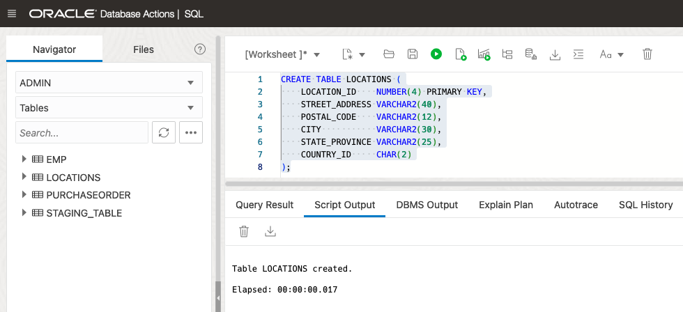
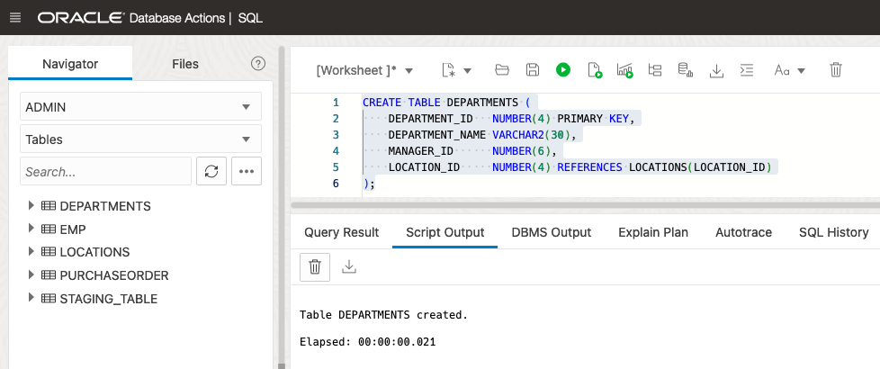
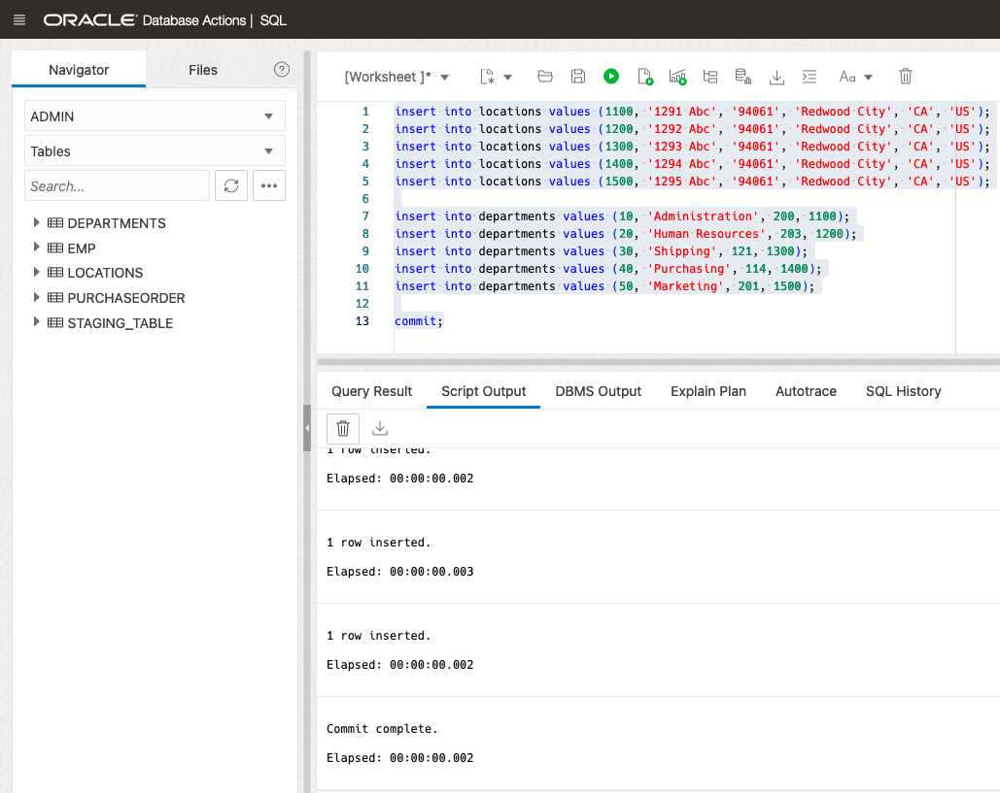
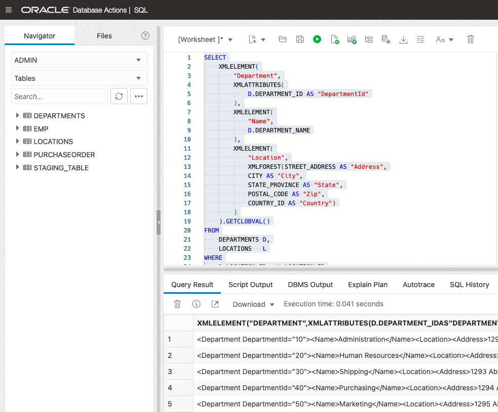

# Generate XML data from relational tables

## Introduction

Estimated Time: 10 minutes

### Objectives
In this lab, you will learn:
-	How to generate XML data from relational data

### Prerequisites
- Be logged into your Oracle Cloud Account and have access to the SQL Worksheet in Database Actions.

## Task 1: Generate XML data from relational tables

We have learned how to generate relational data from XML content in Lab 4. Now we will do the reverse and generate XML content from relational data. In many ways, it will be useful. Just for example, you can send data from relational tables as a response to an application’s request in XML format. Let’s see how to achieve that.

First, we will create two relational tables and then populate them with some sample data.

Table locations:
```
<copy>
CREATE TABLE LOCATIONS (
    LOCATION_ID    NUMBER(4) PRIMARY KEY,
    STREET_ADDRESS VARCHAR2(40),
    POSTAL_CODE    VARCHAR2(12),
    CITY           VARCHAR2(30),
    STATE_PROVINCE VARCHAR2(25),
    COUNTRY_ID     CHAR(2)
);
</copy>
```

Copy the above statement into the worksheet area and press "Run Statement".



Table departments:
```
<copy>
CREATE TABLE DEPARTMENTS (
    DEPARTMENT_ID   NUMBER(4) PRIMARY KEY,
    DEPARTMENT_NAME VARCHAR2(30),
    MANAGER_ID      NUMBER(6),
    LOCATION_ID     NUMBER(4) REFERENCES LOCATIONS(LOCATION_ID)
);
</copy>
```

Copy the above statement into the worksheet area and press "Run Statement".




```
<copy>
insert into locations values (1100, '1291 Abc', '94061', 'Redwood City', 'CA', 'US');
insert into locations values (1200, '1292 Abc', '94061', 'Redwood City', 'CA', 'US');
insert into locations values (1300, '1293 Abc', '94061', 'Redwood City', 'CA', 'US');
insert into locations values (1400, '1294 Abc', '94061', 'Redwood City', 'CA', 'US');
insert into locations values (1500, '1295 Abc', '94061', 'Redwood City', 'CA', 'US');

insert into departments values (10, 'Administration', 200, 1100);
insert into departments values (20, 'Human Resources', 203, 1200);
insert into departments values (30, 'Shipping', 121, 1300);
insert into departments values (40, 'Purchasing', 114, 1400);
insert into departments values (50, 'Marketing', 201, 1500);

commit;
</copy>
```

Copy the above statement into the worksheet area and press "Run Statement".



This query will generate XML data from DEPARTMENTS table and LOCATIONS table based on the primary key and foreign key relationship of these two tables.

```
<copy>
SELECT
    XMLELEMENT(
        "Department",
        XMLATTRIBUTES(
            D.DEPARTMENT_ID AS "DepartmentId"
        ),
        XMLELEMENT(
            "Name",
            D.DEPARTMENT_NAME
        ),
        XMLELEMENT(
            "Location",
            XMLFOREST(STREET_ADDRESS AS "Address",
            CITY AS "City",
            STATE_PROVINCE AS "State",
            POSTAL_CODE AS "Zip",
            COUNTRY_ID AS "Country")
        )
    ).GETCLOBVAL()
FROM
    DEPARTMENTS D,
    LOCATIONS   L
WHERE
    D.LOCATION_ID = L.LOCATION_ID;
</copy>
```

Copy the above statement into the worksheet area and press "Run Statement".



You have just experienced in just a couple of minutes how easy it is to generate XML documents from relational data. It's equally easy to wrap such statements in a view and expose our XML documents transparently for any application, hiding the XML generation statement within a view definition.

You may now **proceed to the next lab**.

## Learn More

* [Get started with Oracle Autonomous Database Serverless ](https://docs.oracle.com/en/cloud/paas/autonomous-database/serverless/videos.html)
- [XML DB Developer's Guide](https://docs.oracle.com/en/database/oracle/oracle-database/23/adxdb/index.html)
- [Oracle XML DB](https://www.oracle.com/database/technologies/appdev/xmldb.html)


## Acknowledgements
* **Author** - Harichandan Roy, Principal Member of Technical Staff, Oracle Document DB
* **Contributors** -  XDB Team
- **Last Updated By/Date** - Ernesto Alvarez, April 2024
