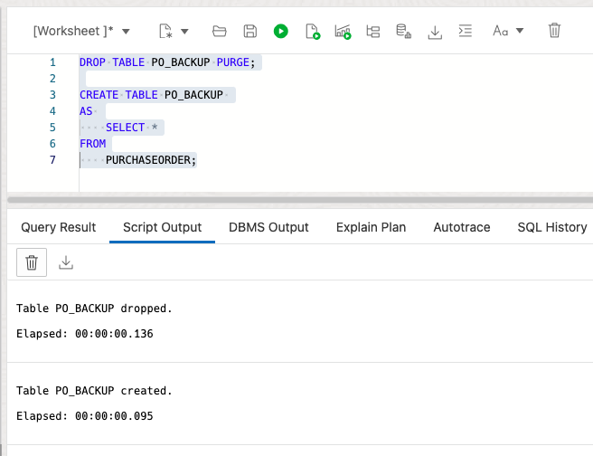

# Update your XML documents

## Introduction

In this lab, we will explore XQuery to update and manipulate XML content in Oracle XML DB using SQL/XML functions. XQuery is one of the main ways that you interact with XML data in Oracle XML DB. It is the W3C language designed for querying and updating XML data. 

Estimated Time: 20 minutes

### Objectives
In this lab, you do the following exercises:
-	Updating an entire XML document,
-	Replacing XML nodes,
-	Inserting XML nodes,
-	Deleting XML nodes,
-	Creating XML Views of customized data

### Prerequisites
- Be logged into your Oracle Cloud Account and have access to the SQL Worksheet in Database Actions.


## Task 1: Update an entire XML document
    
We can simply use the standard SQL update statement to update an entire XML document. 
    
1. First, let's create a backup table that we want to use for rollback. With our web-based SQL Worksheet the communication with the database is through REST, so we cannot run an update statement and a subsequent rollback individually through the web interface. REST-based communication is using auto commit.
    ```
    <copy>
    DROP TABLE PO_BACKUP PURGE;

    CREATE TABLE PO_BACKUP 
    AS 
        SELECT *
    FROM
        PURCHASEORDER;
    </copy>
    ```
        


2. Now let's check the content we are going to update before issuing the update statement.

    ```
    <copy>
    SELECT
        P.DOC.GETCLOBVAL()
    FROM
        PURCHASEORDER P
    WHERE
        P.ID = 1;
    </copy>
    ```

    Copy the above statement into the worksheet area and press "Run Statement".

        

2. Then, run the following SQL update statement to update an entire XML document. Warning: this will override your sample content with, well, nothing that makes business sense. But it's at least valid XML ...

    ```
    <copy>
    UPDATE PURCHASEORDER P
    SET
        P.DOC = XMLTYPE('<doc>updated doc</doc>')
    WHERE
        P.ID = 1;
    </copy>
    ```

    Copy the above statement into the worksheet area and press "Run Statement".

    

    

    Now let’s check the updated content and see the "updated doc" that you just updated to.

    ```
    <copy>
    SELECT
        P.DOC.GETCLOBVAL()
    FROM
        PURCHASEORDER P
    WHERE
        P.ID = 1;
    </copy>
    ```

    Copy the above statement into the worksheet area and press "Run Statement".

    

    You should see the updated XML doc for id 1. That's content we do not want to see, so let's do the next step.

    

3. Roll back to the previous content so that we can re-do this again at a later point in time if we want. 

    ```
    <copy>
    UPDATE PURCHASEORDER P
    SET
        P.DOC = (SELECT DOC FROM PO_BACKUP B WHERE B.ID = 1)
    WHERE
        P.ID = 1;
    
    SELECT P.DOC.GETCLOBVAL() FROM PURCHASEORDER P WHERE P.ID = 1;

    </copy>
    ```

    

    

## Task 2: Replace XML nodes
    
In the previous example, we replaced the entire document. However, in most practical scenarios we just need to modify a part of the document. To do that, we can use XQuery update with a SQL update statement.

In the following example, we will update the Requestor info in the XML document with the Reference value as 'MAllen-2024PST'. 

1. First, let's see the current value of the Requestor node.

    ```
    <copy>
    SELECT
        XMLQUERY('$p/PurchaseOrder/Requestor/text()'
            PASSING PO.DOC AS "p"
        RETURNING CONTENT).GETCLOBVAL() REQUESTOR
    FROM
        PURCHASEORDER PO
    WHERE
        XMLEXISTS ( '$p/PurchaseOrder[Reference="MAllen-2024PST"]'
            PASSING PO.DOC AS "p"
        );
    </copy>
    ```

    Copy the above statement into the worksheet area and press "Run Statement".

    

2. Now we pass the new value 'XDB Team' as a variable $p2 to the XQuery expression and evaluate the expression for the documents having Reference value as 'MAllen-2024PST'.

    ```
    <copy>
    UPDATE PURCHASEORDER PO
    SET
        PO.DOC = XMLQUERY('copy $i := $p1 modify
                    (for $j in $i/PurchaseOrder/Requestor
                    return replace value of node $j with $p2)
                    return $i'
            PASSING PO.DOC AS "p1",
            'XDB Team' AS "p2"
        RETURNING CONTENT)
    WHERE
        XMLEXISTS ( '$p/PurchaseOrder[Reference="MAllen-2024PST"]'
            PASSING PO.DOC AS "p"
        );
    </copy>
    ```

    Copy the above statement into the worksheet area and press "Run Statement".

    

    

3. Let’s see the updated content.

    ```
    <copy>
    SELECT
        XMLQUERY('$p/PurchaseOrder/Requestor/text()'
            PASSING PO.DOC AS "p"
        RETURNING CONTENT).GETCLOBVAL() REQUESTOR
    FROM
        PURCHASEORDER PO
    WHERE
        XMLEXISTS ( '$p/PurchaseOrder[Reference="MAllen-2024PST"]'
            PASSING PO.DOC AS "p"
        );
    </copy>
    ```

    Copy the above statement into the worksheet area and press "Run Statement".

    

That is a change we like. You don't have to rollback the operation, but feel free to do so.

## Task 3: Insert XML nodes
    
The user may want to add a new XML node to an XML document. This example inserts a new LineItem element as a child of the element LineItems. 

1. Before inserting a new XML node, let’s check the current content using this query:

    ```
    <copy>
    SELECT
        XMLQUERY('$p/PurchaseOrder/LineItems/LineItem[@ItemNumber=5]'
            PASSING PO.DOC AS "p"
        RETURNING CONTENT).GETCLOBVAL() ITEM
    FROM
        PURCHASEORDER PO
    WHERE
        XMLEXISTS ( '$p/PurchaseOrder[Reference="MAllen-2024PST"]'
            PASSING PO.DOC AS "p"
        );
    </copy>
    ```

    Copy the above statement into the worksheet area and press "Run Statement". If you have not updated the data before and are arriving here for the first time, you will see that there is no XML node with itemNumber = 5.

        

2. Now we will use the XQuery update statement to insert a new XML node into the document. The following query is inserting a new XML node LineItem with ItemNumber = 5 into an XML document having "MAllen-2024PST" as its Reference value.

    ```
    <copy>
    UPDATE PURCHASEORDER PO
    SET
        PO.DOC = XMLQUERY('copy $i := $p1 modify
                        (for $j in $i/PurchaseOrder/LineItems
                        return (# ora:child-element-name LineItem #)
                                {insert node $p2 into $j})
                        return $i'
            PASSING PO.DOC AS "p1",
            XMLTYPE('<LineItem ItemNumber="5">
                        <Part Id="1" UnitPrice="100"/>
                        <Description>Keyboard</Description>
                        <Quantity>1</Quantity>
                    </LineItem>') AS "p2"
        RETURNING CONTENT)
    WHERE
        XMLEXISTS ( '$p/PurchaseOrder[Reference="MAllen-2024PST"]'
            PASSING PO.DOC AS "p"
        );
    </copy>
    ```

    Copy the above statement into the worksheet area and press "Run Statement".

    

3. Whether the new XML node was inserted or not, let’s run this query and see if it’s there:

    ```
    <copy>
    SELECT
        XMLQUERY('$p/PurchaseOrder/LineItems/LineItem[@ItemNumber=5]'
            PASSING PO.DOC AS "p"
        RETURNING CONTENT).GETCLOBVAL() ITEM
    FROM
        PURCHASEORDER PO
    WHERE
        XMLEXISTS ( '$p/PurchaseOrder[Reference="MAllen-2024PST"]'
            PASSING PO.DOC AS "p"
        );
    </copy>
    ```

    Copy the above statement into the worksheet area and press "Run Statement". If you have executed the update statement in the previous section, then you will see a new lineitem with ItemNumber=5 as shown below. Note the subtlety that the insertion of a new lineitem in your XML document is actually semantically an update of the document. 

    

## Task 4: Delete XML nodes
    
In this example, we will use an XQuery update statement to delete an XML node, LineItem with ItemNumber = 5 from the XML documents having "MAllen-2024PST" as the Reference value.

1. Let’s first check the current content in the document. If you did the previous exercise, you should see an ItemNumber=5

    ```
    <copy>
    SELECT
        XMLQUERY('$p/PurchaseOrder/LineItems/LineItem[@ItemNumber=5]'
            PASSING PO.DOC AS "p"
        RETURNING CONTENT).GETCLOBVAL() ITEM
    FROM
        PURCHASEORDER PO
    WHERE
        XMLEXISTS ( '$p/PurchaseOrder[Reference="MAllen-2024PST"]'
            PASSING PO.DOC AS "p"
        );
    </copy>
    ```

    Copy the above statement into the worksheet area and press "Run Statement".

    
    

2. Let's now run the following update statement to delete the XML node:

    ```
    <copy>
    UPDATE PURCHASEORDER PO
    SET
        PO.DOC = XMLQUERY('copy $i := $p modify
                        delete nodes $i/PurchaseOrder/LineItems/LineItem[@ItemNumber="5"]
                        return $i'
            PASSING PO.DOC AS "p"
        RETURNING CONTENT)
    WHERE
        XMLEXISTS ( '$p/PurchaseOrder[Reference="MAllen-2024PST"]'
            PASSING PO.DOC AS "p"
        );
    </copy>
    ```

    Copy the above statement into the worksheet area and press "Run Statement".

        

3. Now let’s check the updated content of the documents.

    ```
    <copy>
    SELECT
        XMLQUERY('$p/PurchaseOrder/LineItems/LineItem[@ItemNumber=5]'
            PASSING PO.DOC AS "p"
        RETURNING CONTENT).GETCLOBVAL() ITEM
    FROM
        PURCHASEORDER PO
    WHERE
        XMLEXISTS ( '$p/PurchaseOrder[Reference="MAllen-2024PST"]'
            PASSING PO.DOC AS "p"
        );
    </copy>
    ```

    Copy the above statement into the worksheet area and press "Run Statement".

        

You just have experienced how easy it is to change your XML documents, either as a whole or individual fragments of your XML document.

## Task 5: Create an XML View of customized data
    
Sometimes the size of the XML document is very big, or it may have some information that users are not interested in or maybe some confidentiality or other reasons, the users may want to see some customized or synthesized or even null data in some fields of the documents. In this example, we will show you how to achieve that. This query nullifies some of its content and returns the remaining document.

```
<copy>
SELECT
    XMLQUERY('copy $i := $p1 modify
                        ((for $j in $i/PurchaseOrder/Actions
                        return replace value of node $j with ()),
                        (for $j in $i/PurchaseOrder/ShippingInstructions
                        return replace value of node $j with ()),
                        (for $j in $i/PurchaseOrder/LineItems
                        return replace value of node $j with ()))
                    return $i'
        PASSING PO.DOC AS "p1"
    RETURNING CONTENT).GETCLOBVAL() RESPONSE
FROM
    PURCHASEORDER PO
WHERE
    PO.ID = 2;
</copy>
```

Copy the above statement into the worksheet area and press "Run Statement".


Congratulations. You went through all the basics of working with XML documents in the Oracle Database. You may now **proceed to the next lab** and clean up your environment, if desired.

## Learn More

* [Get started with Oracle Autonomous Database Serverless ](https://docs.oracle.com/en/cloud/paas/autonomous-database/serverless/videos.html)
- [XML DB Developer's Guide](https://docs.oracle.com/en/database/oracle/oracle-database/23/adxdb/index.html)
- [Oracle XML DB](https://www.oracle.com/database/technologies/appdev/xmldb.html)


## Acknowledgements
* **Author** - Harichandan Roy, Principal Member of Technical Staff, Oracle Document DB
* **Contributors** -  XDB Team
- **Last Updated By/Date** - Ernesto Alvarez, April 2024
