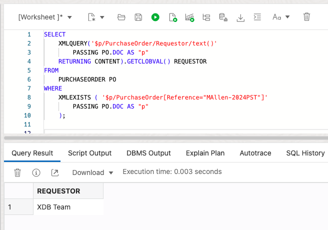

# Update XML content

## Introduction

In this lab, we will explore XQuery to update and manipulate XML content in Oracle XML DB using SQL/XML functions. XQuery is one of the main ways that you interact with XML data in Oracle XML DB. It is the W3C language designed for querying and updating XML data. 

Estimated Time: 30 minutes

### Objectives
In this lab, you will learn:
-	Updating an entire XML document,
-	Replacing XML nodes,
-	Inserting XML nodes,
-	Deleting XML nodes,
-	Creating XML Views of customized data

### Prerequisites
- Be logged into your Oracle Cloud Account.
- Go to the SQL worksheet in Database Actions.

## Task 1: Update XML Content

1. Update an entire XML document
    
    We can simply use the standard SQL update statement to update an entire XML document. 
    
    Let’s check the content before issuing an updated statement.

    ```
    <copy>
    SELECT
        P.DOC.GETCLOBVAL()
    FROM
        PURCHASEORDER P
    WHERE
        P.ID = 1;
    </copy>
    ```

    Copy the above statement into the worksheet area and press "Run Statement".

        

    Then, run the following SQL update statement to update an entire XML document.

    ```
    <copy>
    UPDATE PURCHASEORDER P
    SET
        P.DOC = XMLTYPE('<doc>updated doc</doc>')
    WHERE
        P.ID = 1;
    </copy>
    ```

    Copy the above statement into the worksheet area and press "Run Statement".

    

    

    Now let’s check the updated content.

    ```
    <copy>
    SELECT
        P.DOC.GETCLOBVAL()
    FROM
        PURCHASEORDER P
    WHERE
        P.ID = 1;
    </copy>
    ```

    Copy the above statement into the worksheet area and press "Run Statement".

    

    You should see the updated XML doc for id 1.

    

    Now roll back to the previous content.

    

    

2. Replace XML nodes
    
    In the previous example, we replaced the entire document. However, in most practical scenarios we just need to modify a part of the document. To do that, we can use XQuery update with a SQL update statement.

    In the following example, we will update the Requestor info in the XML document with the Reference value as 'MAllen-2024PST'. 

    First, let's see the current value of the Requestor node.

    ```
    <copy>
    SELECT
        XMLQUERY('$p/PurchaseOrder/Requestor/text()'
            PASSING PO.DOC AS "p"
        RETURNING CONTENT).GETCLOBVAL() REQUESTOR
    FROM
        PURCHASEORDER PO
    WHERE
        XMLEXISTS ( '$p/PurchaseOrder[Reference="MAllen-2024PST"]'
            PASSING PO.DOC AS "p"
        );
    </copy>
    ```

    Copy the above statement into the worksheet area and press "Run Statement".

    

    Now we pass the new value 'XDB Team' as a variable $p2 to the XQuery expression and evaluate the expression for the documents having Reference value as 'MAllen-2024PST'.

    ```
    <copy>
    UPDATE PURCHASEORDER PO
    SET
        PO.DOC = XMLQUERY('copy $i := $p1 modify
                    (for $j in $i/PurchaseOrder/Requestor
                    return replace value of node $j with $p2)
                    return $i'
            PASSING PO.DOC AS "p1",
            'XDB Team' AS "p2"
        RETURNING CONTENT)
    WHERE
        XMLEXISTS ( '$p/PurchaseOrder[Reference="MAllen-2024PST"]'
            PASSING PO.DOC AS "p"
        );
    </copy>
    ```

    Copy the above statement into the worksheet area and press "Run Statement".

    

    

    Now let’s see the updated content.

    ```
    <copy>
    SELECT
        XMLQUERY('$p/PurchaseOrder/Requestor/text()'
            PASSING PO.DOC AS "p"
        RETURNING CONTENT).GETCLOBVAL() REQUESTOR
    FROM
        PURCHASEORDER PO
    WHERE
        XMLEXISTS ( '$p/PurchaseOrder[Reference="MAllen-2024PST"]'
            PASSING PO.DOC AS "p"
        );

    ROLLBACK;
    </copy>
    ```

    Copy the above statement into the worksheet area and press "Run Statement".

    

    

3. Insert XML nodes
    
    The user may want to add a new XML node to an XML document. This example inserts a new LineItem element as a child of the element LineItems. 

    Before inserting a new XML node, let’s check the current content using this query:

    ```
    <copy>
    SELECT
        XMLQUERY('$p/PurchaseOrder/LineItems/LineItem[@ItemNumber=5]'
            PASSING PO.DOC AS "p"
        RETURNING CONTENT).GETCLOBVAL() ITEM
    FROM
        PURCHASEORDER PO
    WHERE
        XMLEXISTS ( '$p/PurchaseOrder[Reference="MAllen-2024PST"]'
            PASSING PO.DOC AS "p"
        );
    </copy>
    ```

    Copy the above statement into the worksheet area and press "Run Statement".

        

    Now we will use the XQuery update statement to insert a new XML node into the document. The following query is inserting a new XML node LineItem with ItemNumber = 5 into an XML document having "MAllen-2024PST" as its Reference value.

    ```
    <copy>
    UPDATE PURCHASEORDER PO
    SET
        PO.DOC = XMLQUERY('copy $i := $p1 modify
                        (for $j in $i/PurchaseOrder/LineItems
                        return (# ora:child-element-name LineItem #)
                                {insert node $p2 into $j})
                        return $i'
            PASSING PO.DOC AS "p1",
            XMLTYPE('<LineItem ItemNumber="5">
                        <Part Id="1" UnitPrice="100"/>
                        <Description>Keyboard</Description>
                        <Quantity>1</Quantity>
                    </LineItem>') AS "p2"
        RETURNING CONTENT)
    WHERE
        XMLEXISTS ( '$p/PurchaseOrder[Reference="MAllen-2024PST"]'
            PASSING PO.DOC AS "p"
        );
    </copy>
    ```

    Copy the above statement into the worksheet area and press "Run Statement".

    

    Whether the new XML node was inserted or not, let’s run this query and see if it’s there:

    ```
    <copy>
    SELECT
        XMLQUERY('$p/PurchaseOrder/LineItems/LineItem[@ItemNumber=5]'
            PASSING PO.DOC AS "p"
        RETURNING CONTENT).GETCLOBVAL() ITEM
    FROM
        PURCHASEORDER PO
    WHERE
        XMLEXISTS ( '$p/PurchaseOrder[Reference="MAllen-2024PST"]'
            PASSING PO.DOC AS "p"
        );
    </copy>
    ```

    Copy the above statement into the worksheet area and press "Run Statement".

    

4. Delete XML nodes
    
    In this example, we will use an XQuery update statement to delete an XML node, LineItem with ItemNumber = 5 from the XML documents having "MAllen-2024PST" as the Reference value.

    Let’s first check the current content in the document:

    ```
    <copy>
    SELECT
        XMLQUERY('$p/PurchaseOrder/LineItems/LineItem[@ItemNumber=5]'
            PASSING PO.DOC AS "p"
        RETURNING CONTENT).GETCLOBVAL() ITEM
    FROM
        PURCHASEORDER PO
    WHERE
        XMLEXISTS ( '$p/PurchaseOrder[Reference="MAllen-2024PST"]'
            PASSING PO.DOC AS "p"
        );
    </copy>
    ```

    Copy the above statement into the worksheet area and press "Run Statement".

    

    

    Then run the following update statement to delete the XML node:

    ```
    <copy>
    UPDATE PURCHASEORDER PO
    SET
        PO.DOC = XMLQUERY('copy $i := $p modify
                        delete nodes $i/PurchaseOrder/LineItems/LineItem[@ItemNumber="5"]
                        return $i'
            PASSING PO.DOC AS "p"
        RETURNING CONTENT)
    WHERE
        XMLEXISTS ( '$p/PurchaseOrder[Reference="MAllen-2024PST"]'
            PASSING PO.DOC AS "p"
        );
    </copy>
    ```

    Copy the above statement into the worksheet area and press "Run Statement".

        

    Now let’s check the updated content of the documents.

    ```
    <copy>
    SELECT
        XMLQUERY('$p/PurchaseOrder/LineItems/LineItem[@ItemNumber=5]'
            PASSING PO.DOC AS "p"
        RETURNING CONTENT).GETCLOBVAL() ITEM
    FROM
        PURCHASEORDER PO
    WHERE
        XMLEXISTS ( '$p/PurchaseOrder[Reference="MAllen-2024PST"]'
            PASSING PO.DOC AS "p"
        );
    </copy>
    ```

    Copy the above statement into the worksheet area and press "Run Statement".

        

5. Create an XML View of customized data
    
    Sometimes the size of the XML document is very big, or it may have some information that users are not interested in or maybe some confidentiality or other reasons, the users may want to see some customized or synthesized or even null data in some fields of the documents. In this example, we will show you how to achieve that. This query nullifies some of its content and returns the remaining document.

    ```
    <copy>
    SELECT
        XMLQUERY('copy $i := $p1 modify
                            ((for $j in $i/PurchaseOrder/Actions
                            return replace value of node $j with ()),
                            (for $j in $i/PurchaseOrder/ShippingInstructions
                            return replace value of node $j with ()),
                            (for $j in $i/PurchaseOrder/LineItems
                            return replace value of node $j with ()))
                        return $i'
            PASSING PO.DOC AS "p1"
        RETURNING CONTENT).GETCLOBVAL() RESPONSE
    FROM
        PURCHASEORDER PO
    WHERE
        PO.ID = 2;
    </copy>
    ```

    Copy the above statement into the worksheet area and press "Run Statement".

    

You may now **proceed to the next lab**.

## Learn More

- [Manage and Monitor Autonomous Database](https://apexapps.oracle.com/pls/apex/dbpm/r/livelabs/view-workshop?wid=553)
- [Scale and Performance in the Autonomous Database](https://apexapps.oracle.com/pls/apex/dbpm/r/livelabs/view-workshop?wid=608)
- [Oracle XML DB](https://www.oracle.com/database/technologies/appdev/xmldb.html)
- [Oracle Autonomous Database](https://www.oracle.com/database/autonomous-database.html)
- [XML DB Developer Guide](https://docs.oracle.com/en/database/oracle/oracle-database/23/adxdb/index.html)


## Acknowledgements
* **Author** - Harichandan Roy, Principal Member of Technical Staff, Oracle Document DB
* **Contributors** -  XDB Team
* **Last Updated By/Date** - Harichandan Roy, February 2023
