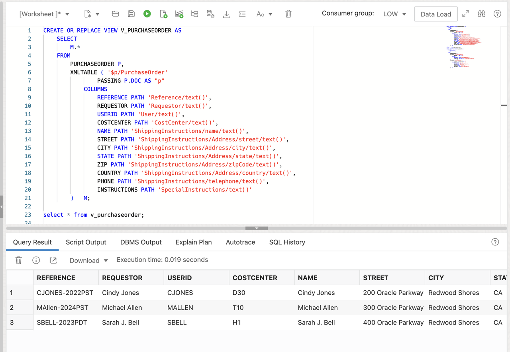
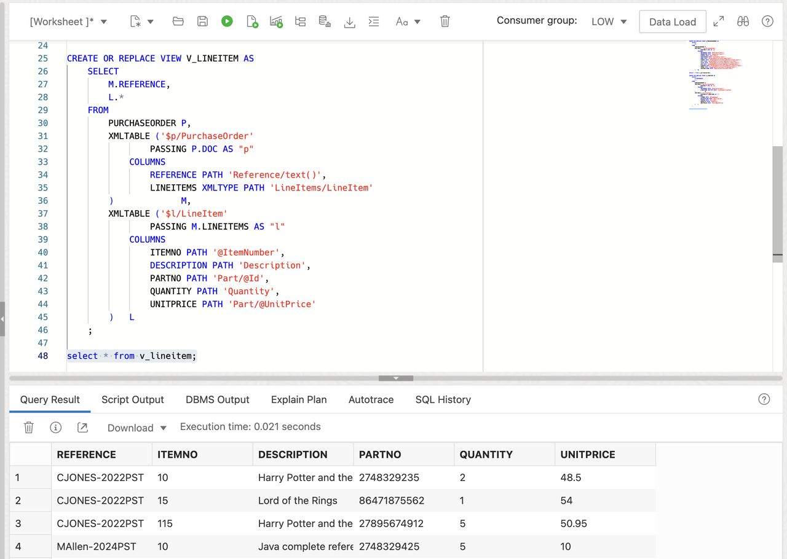

# Expose your XML documents transparently as relational data

## Introduction

Often, your XML application has to make data available to systems or tools that rely on purely relational data representation of your data. Relational database views over XML data provide conventional, relational access over XML documents. We will use XML-specific functions and methods provided by Oracle XML DB to create conventional database views. We will then use the views to work with XML content but in relational ways.

Estimated Time: 20 minutes

### Objectives
In this lab, you will learn:
-	How to create relational views over XML documents

### Prerequisites
- Be logged into your Oracle Cloud Account and have access to the SQL Worksheet in Database Actions.


## Task 1: Generate Relational Data from XML data

The XMLTable function is to extract data from XML documents in a relational form. We can then create a relational view on top of the query, Subdequently, non-xml aware tools and application can directly work on these relational views without knowing the xml content.


If we want to show the information from the Purchaseorder documents in a relational format, we can use XMLTable function. 

```
<copy>
SELECT
    M.*
FROM
    PURCHASEORDER P,
    XMLTABLE ('$p/PurchaseOrder'
            PASSING P.DOC AS "p"
        COLUMNS
            REFERENCE PATH 'Reference/text()',
            REQUESTOR PATH 'Requestor/text()',
            USERID PATH 'User/text()',
            COSTCENTER PATH 'CostCenter/text()',
            NAME PATH 'ShippingInstructions/name/text()',
            STREET PATH 'ShippingInstructions/Address/street/text()',
            CITY PATH 'ShippingInstructions/Address/city/text()',
            STATE PATH 'ShippingInstructions/Address/state/text()',
            ZIP PATH 'ShippingInstructions/Address/zipCode/text()',
            COUNTRY PATH 'ShippingInstructions/Address/country/text()',
            PHONE PATH 'ShippingInstructions/telephone/text()',
            INSTRUCTIONS PATH 'SpecialInstructions/text()'
    ) M;
</copy>
```

In SQL Worksheet, copy the above statement into the worksheet area and press "Run Statement". You'll see a relational result set being generated at runtime from your XML documents.


## Task 2: Create Relational Views

1. Create a relational view V_PURCHASEORDER
    
    The previous task generated a relational result set at runtime, based on our XML documents. A relational view can be created on top of the query from previous example, creating a view from elements that occur at most once per each document stored in Purchaseorder table.

    ```
    <copy>
    CREATE OR REPLACE VIEW V_PURCHASEORDER AS
        SELECT
            M.*
        FROM
            PURCHASEORDER P,
            XMLTABLE ( '$p/PurchaseOrder'
                    PASSING P.DOC AS "p"
                COLUMNS
                    REFERENCE PATH 'Reference/text()',
                    REQUESTOR PATH 'Requestor/text()',
                    USERID PATH 'User/text()',
                    COSTCENTER PATH 'CostCenter/text()',
                    NAME PATH 'ShippingInstructions/name/text()',
                    STREET PATH 'ShippingInstructions/Address/street/text()',
                    CITY PATH 'ShippingInstructions/Address/city/text()',
                    STATE PATH 'ShippingInstructions/Address/state/text()',
                    ZIP PATH 'ShippingInstructions/Address/zipCode/text()',
                    COUNTRY PATH 'ShippingInstructions/Address/country/text()',
                    PHONE PATH 'ShippingInstructions/telephone/text()',
                    INSTRUCTIONS PATH 'SpecialInstructions/text()'
            )   M;
    </copy>
    ```

    Copy the above statement into the worksheet area and press "Run Statement".

    

    You will see the scalar values of our XML documents as relational columns in our view.

    

2. Create a relational view V_LINEITEM using chained XMLTable
    
    The purchaseorder relational view contains all the elements except LineItems/LineItem because LineItem element can occur more than once per document. So let's mapp these elements to an XMLType column which is passed to the second XMLTable function. By chaining to XMLTABLE function calls, we are unnesting the elements in the lineitem fragments. 
    
    Let's now create a LineItem view with the reference column and the LineItem information.

    ```
    <copy>
    CREATE OR REPLACE VIEW V_LINEITEM AS
        SELECT
            M.REFERENCE,
            L.*
        FROM
            PURCHASEORDER P,
            XMLTABLE ('$p/PurchaseOrder'
                    PASSING P.DOC AS "p"
                COLUMNS
                    REFERENCE PATH 'Reference/text()',
                    LINEITEMS XMLTYPE PATH 'LineItems/LineItem'
            )             M,
            XMLTABLE ('$l/LineItem'
                    PASSING M.LINEITEMS AS "l"
                COLUMNS
                    ITEMNO PATH '@ItemNumber',
                    DESCRIPTION PATH 'Description',
                    PARTNO PATH 'Part/@Id',
                    QUANTITY PATH 'Quantity',
                    UNITPRICE PATH 'Part/@UnitPrice'
            )   L;
    </copy>
    ```

    Copy the above statement into the worksheet area and press "Run Statement".

    

    You will see the reference column and all lineitem values of our XML documents as relational columns in our view.

    

## Task 3: Query over the views
    
Once we have created our relational views on top of XML Content using XMLTable functions, we can use them in any relational SQL queries.

1. Join our two relational views 
    
    After creating our two views V\_PURCHASEORDER and V\_LINEITEM, we can join them just like the relational tables. 

    ```
    <copy>
    SELECT
        M.REFERENCE,
        INSTRUCTIONS,
        ITEMNO,
        PARTNO,
        DESCRIPTION,
        QUANTITY,
        UNITPRICE
    FROM
        V_PURCHASEORDER M,
        V_LINEITEM      D
    WHERE
            M.REFERENCE = D.REFERENCE
        AND M.REQUESTOR = 'Cindy Jones'
        AND D.QUANTITY > 0
        AND D.UNITPRICE > 50.00;
    </copy>
    ```

    Copy the above statement into the worksheet area and press "Run Statement".

    

    Having relational views created, you will be able to use SQL as you would do with normal relational tables (or views). For example, you can easily leverage Group by and SQL Analytics functionalities, which we will do in the next two steps.

2. Apply an aggregation using GROUP BY
    
    Let us find out how many purchase orders are for each cost center using this query.

    ```
    <copy>
    SELECT
        COSTCENTER,
        COUNT(*)
    FROM
        V_PURCHASEORDER
    GROUP BY
        COSTCENTER
    ORDER BY
        COSTCENTER;
    </copy>
    ```

    Copy the above statement into the worksheet area and press "Run Statement".

    

3. Use SQL analytics functionalities
    
    We will show a simple query using Group by extension ROLLUP function to apply SQL analytics on XML data.
    
    In the following query, the Group by extension ROLLUP function enables a SELECT statement to calculate multiple levels of subtotals across a specified group of dimensions, as well as a grand total.

    ```
    <copy>
    SELECT
        PARTNO,
        COUNT(*) "Orders",
        QUANTITY "Copies"
    FROM
        V_LINEITEM
    WHERE
        PARTNO = '91982117354'
    GROUP BY
        ROLLUP(PARTNO, QUANTITY);
    </copy>
    ```

    Copy the above statement into the worksheet area and press "Run Statement".

    

    In the following query, the analytic function LAG provides access to more than one row of a table at the same time without a self-join. Given a series of rows returned from a query and a position of the cursor, LAG provides access to a row at a given physical offset prior to that position.

    ```
    <copy>
    SELECT
        PARTNO,
        REFERENCE,
        QUANTITY,
        QUANTITY - LAG(QUANTITY,
        1,
        QUANTITY)
                OVER(
            ORDER BY
                SUBSTR(REFERENCE,
                    INSTR(REFERENCE, '-') + 1)
                ) AS DIFFERENCE
    FROM
        V_LINEITEM
    WHERE
        PARTNO = '1'
    ORDER BY
        SUBSTR(REFERENCE,
            INSTR(REFERENCE, '-') + 1) DESC;
    </copy>
    ```

    Copy the above statement into the worksheet area and press "Run Statement".

    

You may now **proceed to the next lab**.

## Learn More

* [Get started with Oracle Autonomous Database Serverless ](https://docs.oracle.com/en/cloud/paas/autonomous-database/serverless/videos.html)
- [XML DB Developer's Guide](https://docs.oracle.com/en/database/oracle/oracle-database/23/adxdb/index.html)
- [Oracle XML DB](https://www.oracle.com/database/technologies/appdev/xmldb.html)


## Acknowledgements
* **Author** - Harichandan Roy, Principal Member of Technical Staff, Oracle Document DB
* **Contributors** -  XDB Team
- **Last Updated By/Date** - Ernesto Alvarez, April 2024
