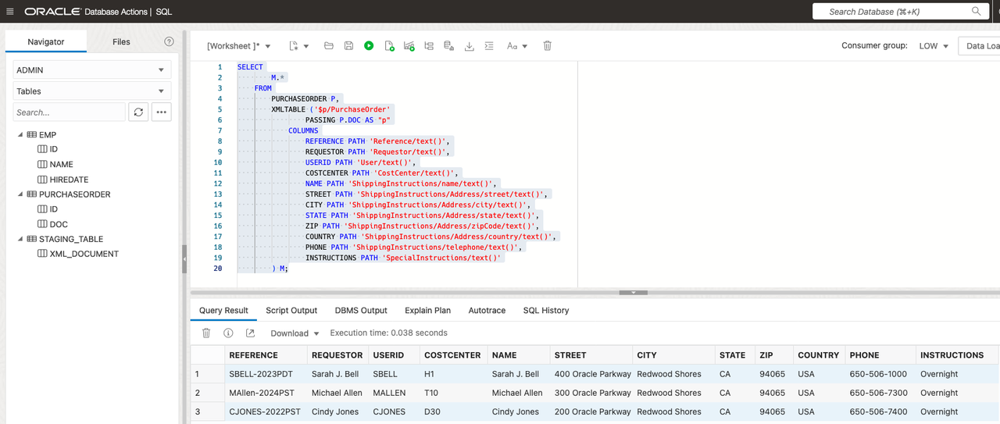
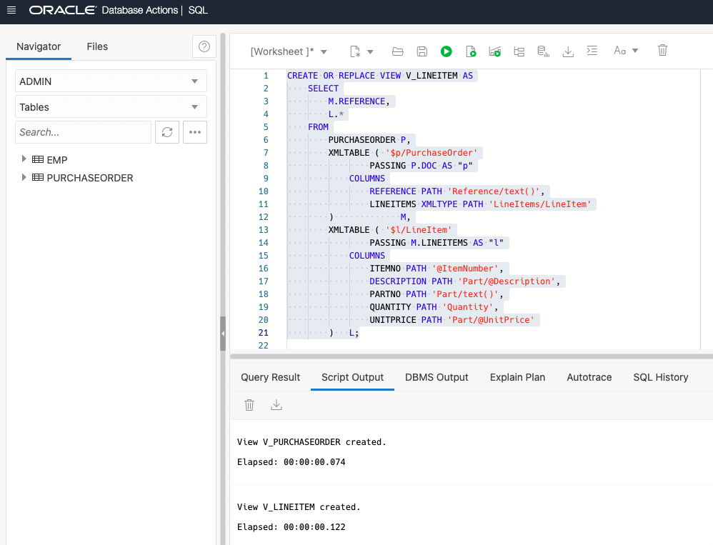
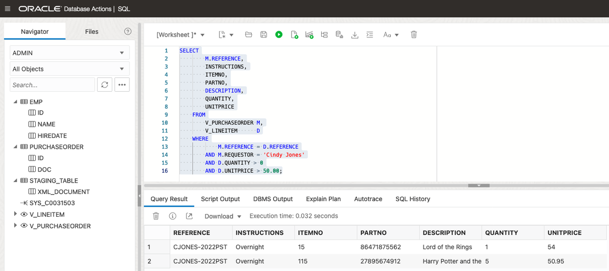
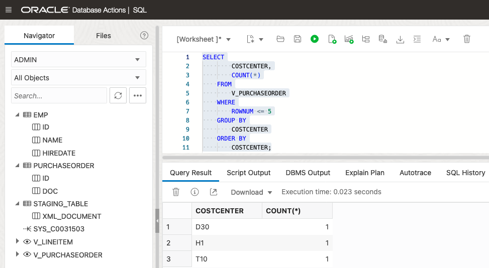
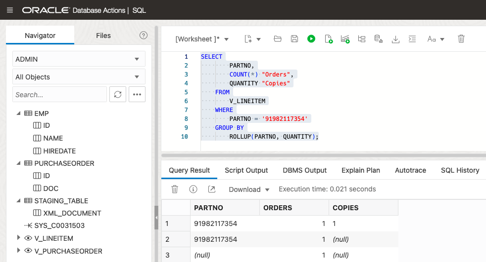
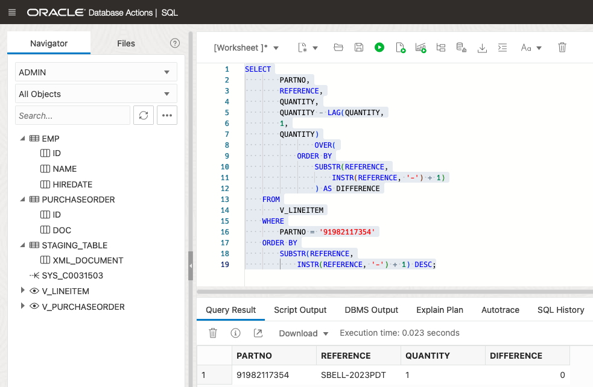

# Generate relational data from XML data

## Introduction

Relational database views over XML data provide conventional, relational access to XML content. We will use XML-specific functions and methods provided by Oracle XML DB to create conventional database views. We will then use the views to work with XML content but in relational ways.

Estimated Time: 30 minutes

### Objectives
In this lab, you will learn:
-	Creating relational views from XML data

### Prerequisites
Be logged into your Oracle Cloud Account.

## Task 1: Open Database Actions

1. Log in to the Oracle Cloud.
2. If you are using a Free Trial or Always Free account, and you want to use Always Free Resources,  you need to be in a region where Always Free Resources are available. You can see your current default Region in the top, right-hand corner of the page.
3. Click the navigation menu in the upper left to show top-level navigation choices.
4. Click on Oracle Database and choose Autonomous Transaction Processing.
5. If using FreeTier, your compartment should be the root compartment for your tenancy.
Note: Avoid the use of the ManagedCompartmentforPaaS compartment as this is an Oracle default used for Oracle Platform Services.
6. You should see your database XMLDB listed in the center. Click on the database name "XMLDB".
7. On the database page, choose Database Actions.
8. You are now in Database Actions.
Database Actions allows you to connect to your Autonomous Database through various browser-based tools. We will just be using the SQL workshop tool.
9. You should be in the Database Actions panel. Click on the SQL card

## Task 2: Relational Data from XML Data
The XMLTable function is to extract data from XML documents in a relational form. We can create a view and then query on the view.

1. Generate Relational Data from XML data

    To decompose the result of an XQuery expression’s evaluation into the relational rows and columns of a new, virtual table, we will use XMLTable. We can insert this data into a relational table, or we can query it using SQL depending on the use cases.

    This query will show a lot of information from Purchaseorder documents in a relational format.

    ```
    <copy>
    SELECT
        M.*
    FROM
        PURCHASEORDER P,
        XMLTABLE ( '$p/PurchaseOrder'
                PASSING P.DOC AS "p"
            COLUMNS
                REFERENCE PATH 'Reference/text()',
                REQUESTOR PATH 'Requestor/text()',
                USERID PATH 'User/text()',
                COSTCENTER PATH 'CostCenter/text()',
                NAME PATH 'ShippingInstructions/name/text()',
                STREET PATH 'ShippingInstructions/Address/street/text()',
                CITY PATH 'ShippingInstructions/Address/city/text()',
                STATE PATH 'ShippingInstructions/Address/state/text()',
                ZIP PATH 'ShippingInstructions/Address/zipCode/text()',
                COUNTRY PATH 'ShippingInstructions/Address/country/text()',
                PHONE PATH 'ShippingInstructions/telephone/text()',
                INSTRUCTIONS PATH 'SpecialInstructions/text()'
        ) M;
    </copy>
    ```

    Copy the above statement into the worksheet area and press "Run Statement".

    

2. Create Relational Views

    2.1. Create a purchaseorder relational view
    
    Here we will create a view from elements that occur at most once per document.

    ```
    <copy>
    CREATE OR REPLACE VIEW V_PURCHASEORDER AS
        SELECT
            M.*
        FROM
            PURCHASEORDER P,
            XMLTABLE ( '$p/PurchaseOrder'
                    PASSING P.DOC AS "p"
                COLUMNS
                    REFERENCE PATH 'Reference/text()',
                    REQUESTOR PATH 'Requestor/text()',
                    USERID PATH 'User/text()',
                    COSTCENTER PATH 'CostCenter/text()',
                    NAME PATH 'ShippingInstructions/name/text()',
                    STREET PATH 'ShippingInstructions/Address/street/text()',
                    CITY PATH 'ShippingInstructions/Address/city/text()',
                    STATE PATH 'ShippingInstructions/Address/state/text()',
                    ZIP PATH 'ShippingInstructions/Address/zipCode/text()',
                    COUNTRY PATH 'ShippingInstructions/Address/country/text()',
                    PHONE PATH 'ShippingInstructions/telephone/text()',
                    INSTRUCTIONS PATH 'SpecialInstructions/text()'
            )   M;

    </copy>
    ```

    Copy the above statement into the worksheet area and press "Run Statement".

    


    2.2. Create a LineItem relational view
    
    The purchaseorder relational view contains all the elements except LineItem because LineItem can occur more than once per document. Let's now create a LineItem view with LineItem information.

    ```
    <copy>
    CREATE OR REPLACE VIEW V_LINEITEM AS
        SELECT
            M.REFERENCE,
            L.*
        FROM
            PURCHASEORDER P,
            XMLTABLE ( '$p/PurchaseOrder'
                    PASSING P.DOC AS "p"
                COLUMNS
                    REFERENCE PATH 'Reference/text()',
                    LINEITEMS XMLTYPE PATH 'LineItems/LineItem'
            )             M,
            XMLTABLE ( '$l/LineItem'
                    PASSING M.LINEITEMS AS "l"
                COLUMNS
                    ITEMNO PATH '@ItemNumber',
                    DESCRIPTION PATH 'Part/@Description',
                    PARTNO PATH 'Part/text()',
                    QUANTITY PATH 'Quantity',
                    UNITPRICE PATH 'Part/@UnitPrice'
            )   L;
    </copy>
    ```

    Copy the above statement into the worksheet area and press "Run Statement".

    

    

3. Query over the views
    
    Once we are done creating the views, let’s query them.

    3.1. Join the views 
    
    After creating some views, you can join them just like the relational tables.
    Sometimes you may need to write a very complex XQuery to get the expected results. To write clean and concise code, you can create views from XML content and then do SQL join on them. It will not only increase the code readability but also give you a modular data model. 

    ```
    <copy>
    SELECT
        M.REFERENCE,
        INSTRUCTIONS,
        ITEMNO,
        PARTNO,
        DESCRIPTION,
        QUANTITY,
        UNITPRICE
    FROM
        V_PURCHASEORDER M,
        V_LINEITEM      D
    WHERE
            M.REFERENCE = D.REFERENCE
        AND M.REQUESTOR = 'H. Roy 3'
        AND D.QUANTITY > 0
        AND D.UNITPRICE > 17.00;
    </copy>
    ```

    Copy the above statement into the worksheet area and press "Run Statement".

    

    

    On top of that, having relational views created, you will be able to use SQL language capabilities. For example, you can easily leverage Group by and SQL Analytics functionalities.

    3.2. Group by query
    
    We will show a simple group by query on the purchaseorder view that we created. 
    Note- XQuery 1.0 did not support the concept of group by. By creating a view from XML content, you can easily utilize group by whenever needed. 

    For example, we can find how many purchase orders are for each cost center using this query.

    ```
    <copy>
    SELECT
        COSTCENTER,
        COUNT(*)
    FROM
        V_PURCHASEORDER
    WHERE
        ROWNUM <= 5
    GROUP BY
        COSTCENTER
    ORDER BY
        COSTCENTER;
    </copy>
    ```

    Copy the above statement into the worksheet area and press "Run Statement".

    

    
        
    3.3. SQL analytics functionalities
    
    We will show a simple query using Group by extension ROLLUP function to apply SQL analytics on XML data.
    Note- SQL Analytics functionalities are not provided by XQuery.

    In the following query, the Group by extension ROLLUP function enables a SELECT statement to calculate multiple levels of subtotals across a specified group of dimensions, as well as a grand total.

    ```
    <copy>
    SELECT
        PARTNO,
        COUNT(*) "Orders",
        QUANTITY "Copies"
    FROM
        V_LINEITEM
    WHERE
        PARTNO = '1'
    GROUP BY
        ROLLUP(PARTNO, QUANTITY);
    </copy>
    ```

    Copy the above statement into the worksheet area and press "Run Statement".

    

    

    Here is another example of SQL Analytics.
    In the following query, the analytic function LAG provides access to more than one row of a table at the same time without a self-join. Given a series of rows returned from a query and a position of the cursor, LAG provides access to a row at a given physical offset prior to that position.

    ```
    <copy>
    SELECT
        PARTNO,
        REFERENCE,
        QUANTITY,
        QUANTITY - LAG(QUANTITY,
        1,
        QUANTITY)
                OVER(
            ORDER BY
                SUBSTR(REFERENCE,
                    INSTR(REFERENCE, '-') + 1)
                ) AS DIFFERENCE
    FROM
        V_LINEITEM
    WHERE
        PARTNO = '1'
    ORDER BY
        SUBSTR(REFERENCE,
            INSTR(REFERENCE, '-') + 1) DESC;
    </copy>
    ```

    Copy the above statement into the worksheet area and press "Run Statement".

    

You may now **proceed to the next lab**.

## Learn More
- [Database 19c - JSON] (https://apexapps.oracle.com/pls/apex/r/dbpm/livelabs/view-workshop?wid=638)
- [Developing with JSON and SODA in Oracle Database] (https://apexapps.oracle.com/pls/apex/r/dbpm/livelabs/view-workshop?wid=831)
- [JSON without Limits] (https://apexapps.oracle.com/pls/apex/r/dbpm/livelabs/view-workshop?wid=836)
- [Using the Database API for MongoDB] (https://apexapps.oracle.com/pls/apex/r/dbpm/livelabs/view-workshop?wid=3152)
- [Database API for MongoDB - The Basics] (https://apexapps.oracle.com/pls/apex/r/dbpm/livelabs/view-workshop?wid=3221)
- [Full-Text Search in Oracle Database] (https://apexapps.oracle.com/pls/apex/r/dbpm/livelabs/view-workshop?wid=3286)
- [Autonomous Database Dedicated](https://apexapps.oracle.com/pls/apex/dbpm/r/livelabs/view-workshop?wid=677)
- [Manage and Monitor Autonomous Database](https://apexapps.oracle.com/pls/apex/dbpm/r/livelabs/view-workshop?wid=553)
- [Scaling and Performance in the Autonomous Database](https://apexapps.oracle.com/pls/apex/dbpm/r/livelabs/view-workshop?wid=608)


## Acknowledgements
* **Author** - Harichandan Roy, Principal Member of Technical Staff, Oracle Document DB
* **Contributors** -  XDB Team
* **Last Updated By/Date** - Harichandan Roy, February 2023
