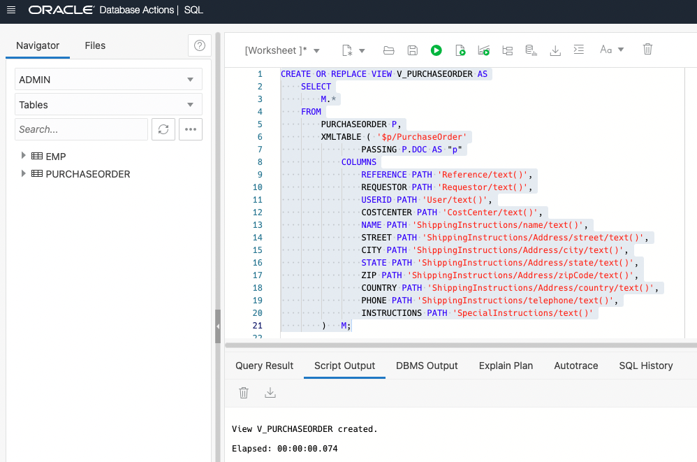

# Exposing XML transparently as relational data

## Introduction

Relational database views over XML data provide conventional, relational access to XML content. We will use XML-specific functions and methods provided by Oracle XML DB to create conventional database views. We will then use the views to work with XML content but in relational ways.

Estimated Time: 30 minutes

### Objectives
In this lab, you will learn:
-	Creating relational views from XML data

### Prerequisites
- Be logged into your Oracle Cloud Account.
- Go to the SQL worksheet in Database Actions.

## Task 1: Relational Data from XML Data

The XMLTable function is to extract data from XML documents in a relational form. We can then create a relational view on top of the query, Subdequently, non-xml aware tools and application can directly work on these relational views without knowing the xml content.

1. Generate Relational Data from XML data

    If we want to show the information from the Purchaseorder documents in a relational format, we can use XMLTable function. 

    ```
    <copy>
    SELECT
        M.*
    FROM
        PURCHASEORDER P,
        XMLTABLE ('$p/PurchaseOrder'
                PASSING P.DOC AS "p"
            COLUMNS
                REFERENCE PATH 'Reference/text()',
                REQUESTOR PATH 'Requestor/text()',
                USERID PATH 'User/text()',
                COSTCENTER PATH 'CostCenter/text()',
                NAME PATH 'ShippingInstructions/name/text()',
                STREET PATH 'ShippingInstructions/Address/street/text()',
                CITY PATH 'ShippingInstructions/Address/city/text()',
                STATE PATH 'ShippingInstructions/Address/state/text()',
                ZIP PATH 'ShippingInstructions/Address/zipCode/text()',
                COUNTRY PATH 'ShippingInstructions/Address/country/text()',
                PHONE PATH 'ShippingInstructions/telephone/text()',
                INSTRUCTIONS PATH 'SpecialInstructions/text()'
        ) M;
    </copy>
    ```

    Copy the above statement into the worksheet area and press "Run Statement".

    

2. Create Relational Views

    2.1. Create a purchaseorder relational view
    
    A relational view can be created on top of the query from previous example. Here we will create a view from elements that occur at most once per each document stored in Purchaseorder table.

    ```
    <copy>
    CREATE OR REPLACE VIEW V_PURCHASEORDER AS
        SELECT
            M.*
        FROM
            PURCHASEORDER P,
            XMLTABLE ( '$p/PurchaseOrder'
                    PASSING P.DOC AS "p"
                COLUMNS
                    REFERENCE PATH 'Reference/text()',
                    REQUESTOR PATH 'Requestor/text()',
                    USERID PATH 'User/text()',
                    COSTCENTER PATH 'CostCenter/text()',
                    NAME PATH 'ShippingInstructions/name/text()',
                    STREET PATH 'ShippingInstructions/Address/street/text()',
                    CITY PATH 'ShippingInstructions/Address/city/text()',
                    STATE PATH 'ShippingInstructions/Address/state/text()',
                    ZIP PATH 'ShippingInstructions/Address/zipCode/text()',
                    COUNTRY PATH 'ShippingInstructions/Address/country/text()',
                    PHONE PATH 'ShippingInstructions/telephone/text()',
                    INSTRUCTIONS PATH 'SpecialInstructions/text()'
            )   M;
    </copy>
    ```

    Copy the above statement into the worksheet area and press "Run Statement".

    

    2.2. Create a LineItem relational view using chained XMLTable
    
    The purchaseorder relational view contains all the elements except LineItems/LineItem because LineItem element can occur more than once per document. They are mapped to XMLType column which is passed to the second XMLTable function. Let's now create a LineItem view with LineItem information.

    ```
    <copy>
    CREATE OR REPLACE VIEW V_LINEITEM AS
        SELECT
            M.REFERENCE,
            L.*
        FROM
            PURCHASEORDER P,
            XMLTABLE ('$p/PurchaseOrder'
                    PASSING P.DOC AS "p"
                COLUMNS
                    REFERENCE PATH 'Reference/text()',
                    LINEITEMS XMLTYPE PATH 'LineItems/LineItem'
            )             M,
            XMLTABLE ('$l/LineItem'
                    PASSING M.LINEITEMS AS "l"
                COLUMNS
                    ITEMNO PATH '@ItemNumber',
                    DESCRIPTION PATH 'Description',
                    PARTNO PATH 'Part/@Id',
                    QUANTITY PATH 'Quantity',
                    UNITPRICE PATH 'Part/@UnitPrice'
            )   L;
    </copy>
    ```

    Copy the above statement into the worksheet area and press "Run Statement".

    

3. Query over the views
    
    Once we have created relational views on top of XML Content using XMLTable functions, they can be used in any relational SQL queries.

    3.1. Join the views 
    
    After creating some views, you can join them just like the relational tables. 

    ```
    <copy>
    SELECT
        M.REFERENCE,
        INSTRUCTIONS,
        ITEMNO,
        PARTNO,
        DESCRIPTION,
        QUANTITY,
        UNITPRICE
    FROM
        V_PURCHASEORDER M,
        V_LINEITEM      D
    WHERE
            M.REFERENCE = D.REFERENCE
        AND M.REQUESTOR = 'Cindy Jones'
        AND D.QUANTITY > 0
        AND D.UNITPRICE > 50.00;
    </copy>
    ```

    Copy the above statement into the worksheet area and press "Run Statement".

    

    On top of that, having relational views created, you will be able to use SQL language capabilities. For example, you can easily leverage Group by and SQL Analytics functionalities.

    3.2. Group by query
    
    We can find how many purchase orders are for each cost center using this query.

    ```
    <copy>
    SELECT
        COSTCENTER,
        COUNT(*)
    FROM
        V_PURCHASEORDER
    WHERE
        ROWNUM <= 5
    GROUP BY
        COSTCENTER
    ORDER BY
        COSTCENTER;
    </copy>
    ```

    Copy the above statement into the worksheet area and press "Run Statement".

    

    3.3. SQL analytics functionalities
    
    We will show a simple query using Group by extension ROLLUP function to apply SQL analytics on XML data.
    
    In the following query, the Group by extension ROLLUP function enables a SELECT statement to calculate multiple levels of subtotals across a specified group of dimensions, as well as a grand total.

    ```
    <copy>
    SELECT
        PARTNO,
        COUNT(*) "Orders",
        QUANTITY "Copies"
    FROM
        V_LINEITEM
    WHERE
        PARTNO = '91982117354'
    GROUP BY
        ROLLUP(PARTNO, QUANTITY);
    </copy>
    ```

    Copy the above statement into the worksheet area and press "Run Statement".

    

    Here is another example of SQL Analytics.
    In the following query, the analytic function LAG provides access to more than one row of a table at the same time without a self-join. Given a series of rows returned from a query and a position of the cursor, LAG provides access to a row at a given physical offset prior to that position.

    ```
    <copy>
    SELECT
        PARTNO,
        REFERENCE,
        QUANTITY,
        QUANTITY - LAG(QUANTITY,
        1,
        QUANTITY)
                OVER(
            ORDER BY
                SUBSTR(REFERENCE,
                    INSTR(REFERENCE, '-') + 1)
                ) AS DIFFERENCE
    FROM
        V_LINEITEM
    WHERE
        PARTNO = '1'
    ORDER BY
        SUBSTR(REFERENCE,
            INSTR(REFERENCE, '-') + 1) DESC;
    </copy>
    ```

    Copy the above statement into the worksheet area and press "Run Statement".

    

You may now **proceed to the next lab**.

## Learn More

- [Manage and Monitor Autonomous Database](https://apexapps.oracle.com/pls/apex/dbpm/r/livelabs/view-workshop?wid=553)
- [Scale and Performance in the Autonomous Database](https://apexapps.oracle.com/pls/apex/dbpm/r/livelabs/view-workshop?wid=608)
- [Oracle XML DB](https://www.oracle.com/database/technologies/appdev/xmldb.html)
- [Oracle Autonomous Database](https://www.oracle.com/database/autonomous-database.html)
- [XML DB Developer Guide](https://docs.oracle.com/en/database/oracle/oracle-database/23/adxdb/index.html)


## Acknowledgements
* **Author** - Harichandan Roy, Principal Member of Technical Staff, Oracle Document DB
* **Contributors** -  XDB Team
* **Last Updated By/Date** - Harichandan Roy, February 2023
