# Create the Target Autonomous Database Credentials

## Introduction
In this lab, you will be:
  * Creating an authentication token for your Oracle Cloud Infrastructure (OCI) user profile.
  * Creating an object storage bucket.
  * Logging into your migration target autonomous database and creating the credential file you will need to connect to your OCI user.
  * Creating movedata\_user in the autonomous database.

Estimate Lab Time: 15 minutes

## Task 1: Create Authentication Token
1. Go to your OCI profile by selecting the icon in the top right and clicking user.
    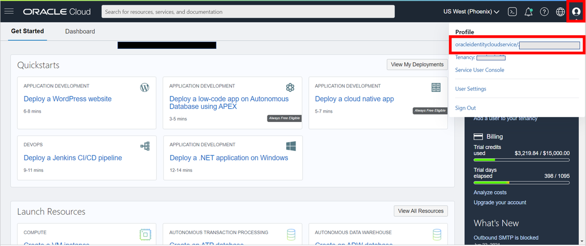

2. Under Resources in the bottom left select Auth Tokens and click generate token.
    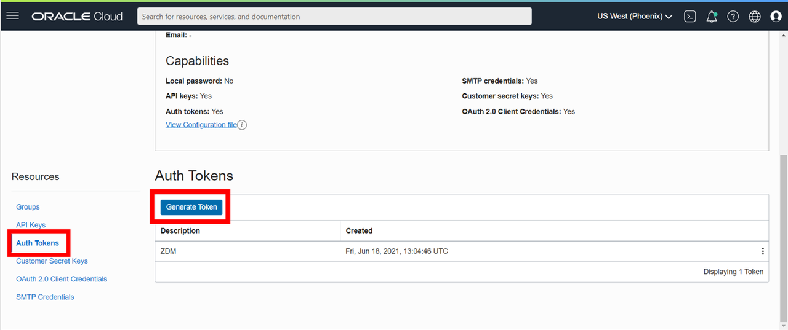

3. Set a description and click generate token and make sure to write down the token displayed as you cannot get access to it again. If you lose the token you will need to generate a new one.
    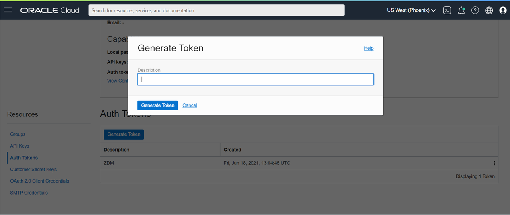

## Task 2: Create an Object Storage Bucket

1. You will need an object storage bucket for your data during the migration as an intermediary point before being transferred to your target autonomous database. In your OCI Dashboard: select the hamburger menu, Storage -> Buckets.
    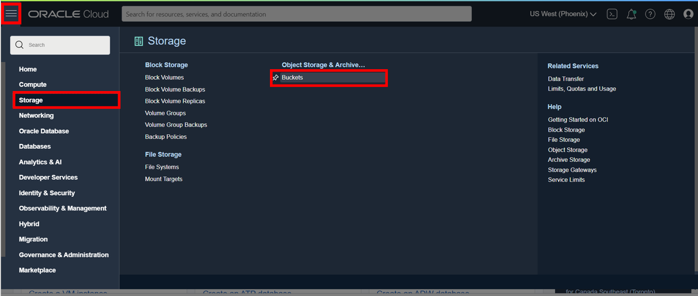

2. Select 'Create Bucket'.
    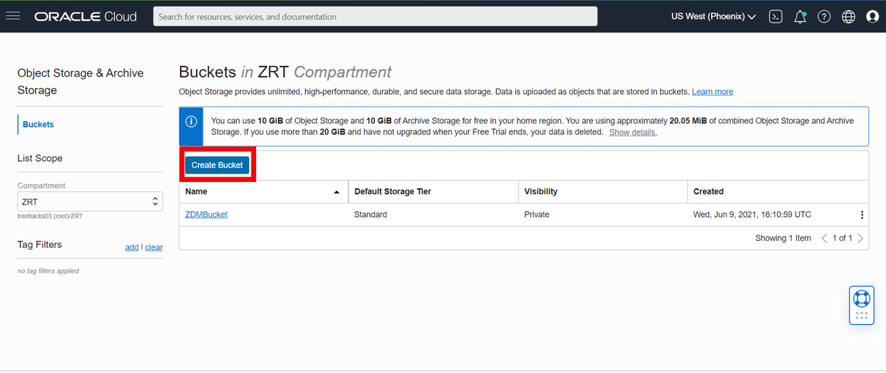

3. Fill in the details. We will be using the name ZDMBucket. Make sure Default Storage Tier is 'Standard' and Encryption is 'Encrypt using Oracle managed keys'. Other than these 3 fields, leave the rest blank and click 'Create'.
    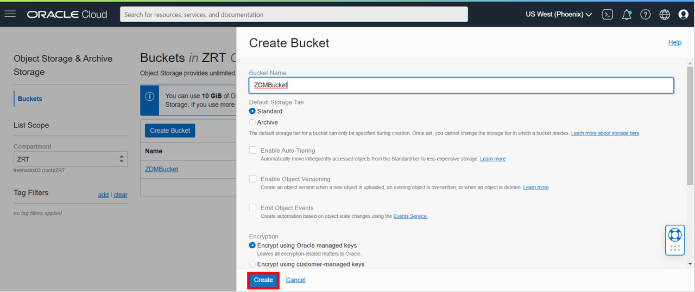

4. On the Details page the two most important pieces of information for us are the bucket name and namespace which we will need later.
    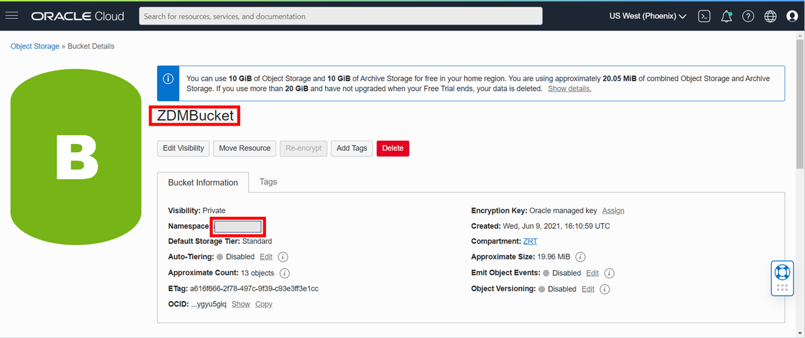

## Task 3: Log Into SQL on the Autonomous Database

1. In your OCI Dashboard: select the hamburger menu, Oracle Database -> Autonomous Database.
    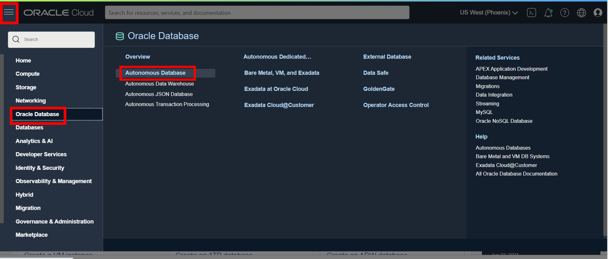

2. Select the target database.
    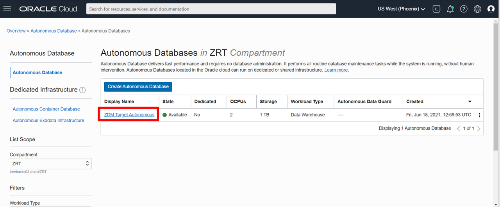

3. In the database menu go to Tools -> Open Database Actions.
    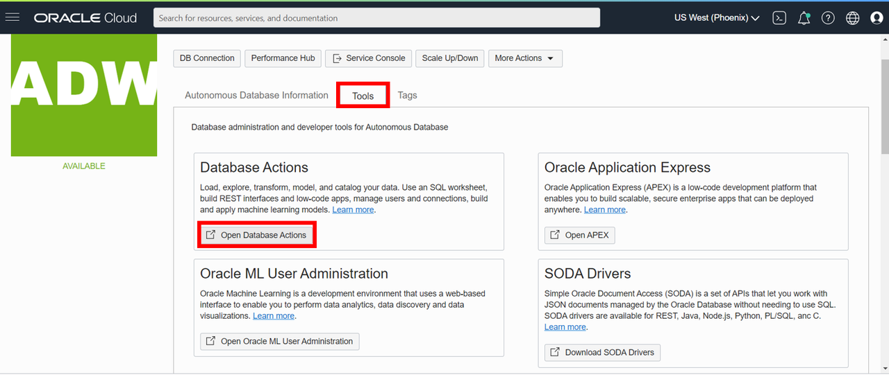

4. Fill in ADMIN for the username and the password will be `WELcome123ZZ` unless you set it as something different.

5. Select SQL
    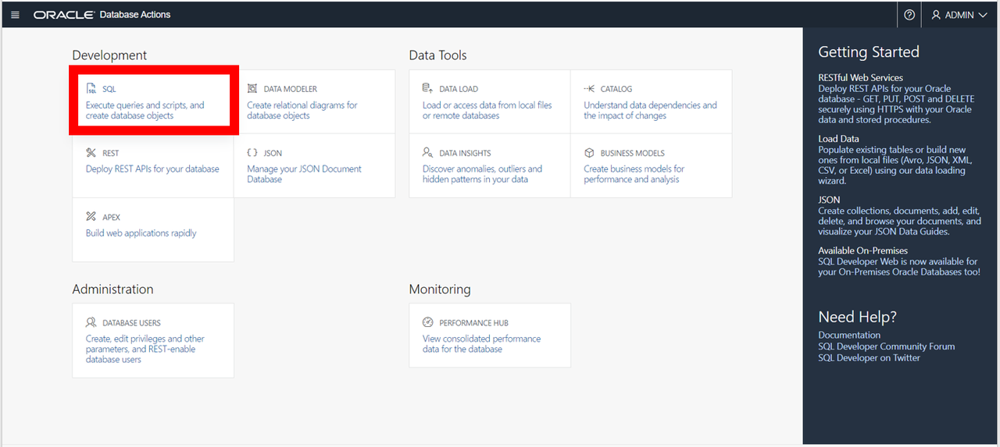


## Task 4: Run Credential Script
1. In the script below replace `<oci_user>`, `<oci_tenancy>`, `<api_private_key>`, and `<fingerprint>` with their respective information and paste it into SQL.

    `<oci_user>`, `<oci_tenancy>`, and `<fingerprint>` are in the Configuration File Preview under API Keys in your OCI user profile from the previous labs.

    

    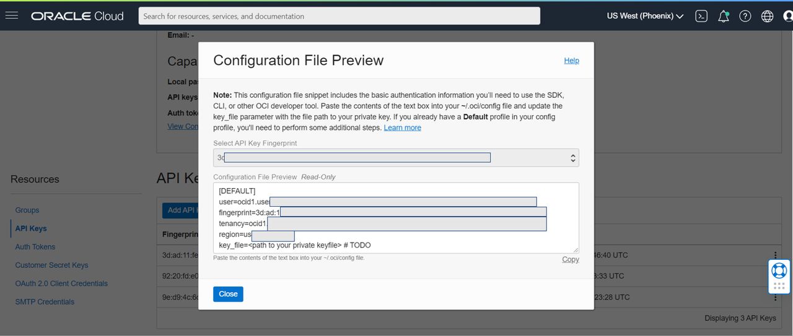

    `<api_private_key>` is your API private key from the Host Environment lab. To view it again, in command prompt as 'zdmuser':

    ```
    <copy>
    cd /u01/app/zdmhome/.oci
    cat oci_api_key.pem
    </copy>
    ```

    SQL Script. When pasting the API private key only paste the contents, don't include "Begin RSA Private Key" and "End RSA Private Key"

    ```
    <copy>
    begin
    DBMS_CLOUD.CREATE_CREDENTIAL (
    'CredentialZDM',
    '<oci_user>',
    '<oci_tenancy>',
    '<api_private_key>',
    '<fingerprint>');
    end;
    /
    </copy>
    ```

2. Select 'Run Script'.
    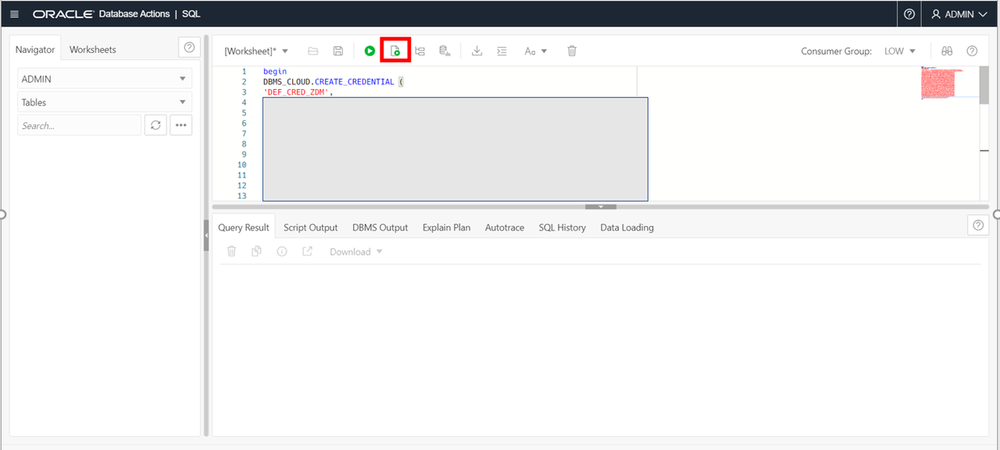

## Task 5: Create User in Autonomous Database
1. You will need to pre-create movedata\_user in the autonomous database. Start by deleting the script you ran in the last step.

    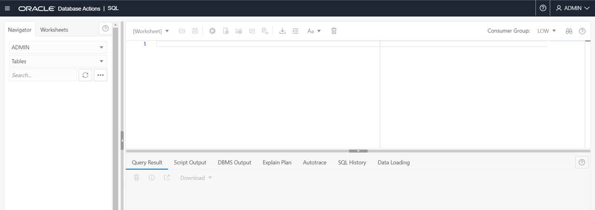

2. Test to make sure the user doesn't already exist by running the drop command. It is fine if it fails:

    ```
    <copy>
    drop user movedata_user cascade;
    </copy>
    ```

    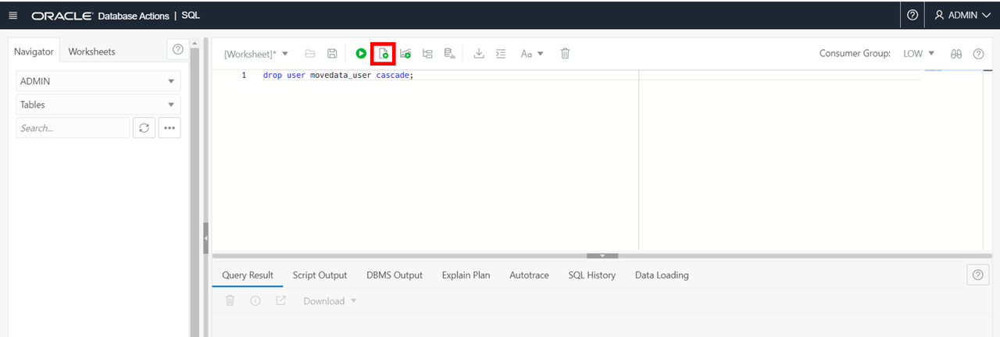

3. Create the user and grant it privileges:

    ```
    <copy>
    create user movedata_user identified by WELcome123ZZ;
    grant dwrole to movedata_user;
    </copy>
    ```

    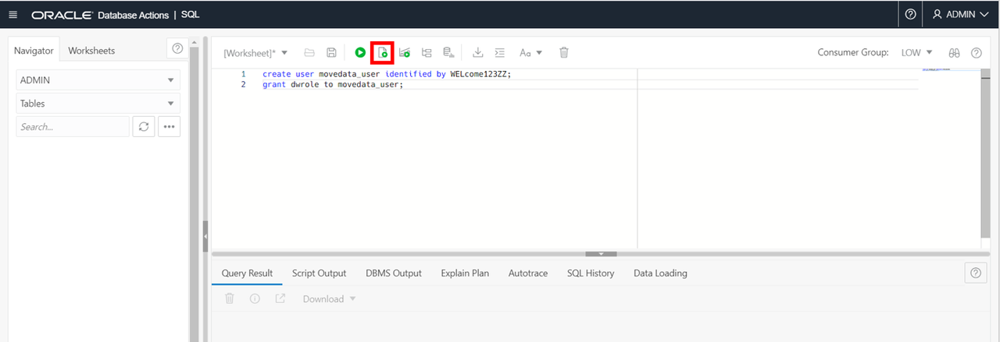


## Acknowledgements
* **Author** - Zachary Talke, Solutions Engineer, NA Tech Solution Engineering
* **Last Updated By/Date** - Zachary Talke, July 2021
