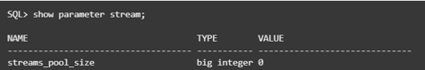
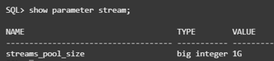

# Connect to Database and Creating Your Migration User

## Introduction
In this lab, you will connect to your source database as system database administrator, create two database users to complete the migration, bestow them with the necessary privileges, and create a sample table to track through the migration.

The purpose of creating a database user and loading it with sample data is to simulate the user and data we are looking to migrate in a practical application.

ZDM will be running on the same server as the source database for the purpose of this workshop and resource conservation.

Disclaimer: The Zero Downtime Migration service host should be a dedicated system, but it can be shared for other purposes, as it is in this lab; however, the Zero Downtime Migration service host should not have Oracle Grid Infrastructure running on it.

Estimate Lab Time: 15 minutes


## Task 1: Connect to Your Database
1. Verify that you are user 'opc' in your instance.

2. Switch from 'opc' user to user 'oracle'.
    ```
    <copy>
    sudo su - oracle
    </copy>
    ```

3. Set the environment variables to point to the Oracle binaries. When prompted for the SID (Oracle Database System Identifier) respond to the prompt with ORCL.
    ```
    <copy>
    . oraenv
    </copy>
    ```

4. Log into SQL as system database administrator (dba).
    ```
    <copy>
    sqlplus / as sysdba
    </copy>
    ```

5. Set streams pool size parameter that will be needed for running the migration.

    Check the current status:
    ```
    <copy>
    show parameter stream;
    </copy>
    ```

    

    Set the parameter:
    ```
    <copy>
    alter system set streams_pool_size=1g scope=both;    
    </copy>
    ```

    Confirm the update went through:
    ```   
    <copy>
    show parameter stream;        
    </copy>
    ```

    

6. Switch the session of your container database to ORCLPDB.

    ```
    <copy>
    alter session set container=ORCLPDB;
    </copy>
    ```

## Task 2: Creating Users for Your Database Migration
1. Disclaimer: Throughout the workshop there will be locations where you are copying and pasting multiple lines of code at a time from the instructions into SQLPlus. However, the last line pasted will not commit until you manually hit enter a second time. To avoid statement failure, please be cognizant of this and hit enter twice when pasting.  

2. After connecting to your container database create the user 'orcl_user'. If you would like you can replace `WELcome123ZZ` with a password of your choice. Write down or save the password as you will need it later.
    ```
    <copy>
    create user orcl_user identified by WELcome123ZZ;
    </copy>
    ```

3. Grant the user privileges it will need for the migration.
    ```
    <copy>
    grant create user to orcl_user;
    grant create session to orcl_user;
    grant resource to orcl_user;
    grant create table to orcl_user;
    grant unlimited tablespace to orcl_user;
    grant create any directory to orcl_user;
    grant dba to orcl_user;
    </copy>
    ```

4. Create the user 'movedata_user'. We are using the password `WELcome123ZZ` again for ease and consistency. If you would like you can replace `WELcome123ZZ` with a password of your choice. Write down or save the password as you will need it later.
    ```
    <copy>
    create user movedata_user identified by WELcome123ZZ;
    </copy>
    ```

5. Grant the user privileges it will need for the migration.

    ```
    <copy>
    grant create user to movedata_user;
    grant create session to movedata_user;
    grant resource to movedata_user;
    grant create table to movedata_user;
    grant unlimited tablespace to movedata_user;
    grant create any directory to movedata_user;
    </copy>
    ```

## Task 3: Load Sample Table
1. Connect to your database user. Enter password `WELcome123ZZ` at the prompt that you set for your user.
    ```
    <copy>
    connect movedata_user@ORCLPDB;
    </copy>
    ```

    Password:
    ```
    <copy>
    WELcome123ZZ
    </copy>
    ```


2. As movedata_user run the following code to create a sample table.
    ```
    <copy>
    CREATE TABLE test1 (person_id NUMBER, first_name VARCHAR2(50), last_name VARCHAR2(50));
    INSERT INTO test1 (person_id, first_name, last_name) VALUES (1, 'Joe', 'Shmoe');
    INSERT INTO test1 (person_id, first_name, last_name) VALUES (1, 'John', 'Shepard');
    INSERT INTO test1 (person_id, first_name, last_name) VALUES (1, 'Kate', 'Tallen');
    INSERT INTO test1 (person_id, first_name, last_name) VALUES (1, 'Edmond', 'Dantes');
    </copy>
    ```

3. Check for the table name 'test1'.

    ```
    <copy>
    select table_name from user_tables;
    </copy>
    ```

4. View the sample table.

    ```
    <copy>
    select * from test1;
    </copy>
    ```

5. Exit SQL.

    ```
    <copy>
    exit
    </copy>
    ```

6. Exit 'oracle' to 'opc'.

    ```
    <copy>
    exit
    </copy>
    ```

## Acknowledgements
* **Author** - Zachary Talke, Solutions Engineer, NA Tech Solution Engineering
* **Last Updated By/Date** - Zachary Talke, July 2021
