# Configure the Zero Downtime Migration Template

## Introduction

In this lab, you will be configuring the template file used to inform your migration and then running the offline logical database migration.

Estimate Lab Time: 25 minutes

## Task 1: Copy the Template File
1. Return to the command prompt connected to your compute instance as 'zdmuser'.

    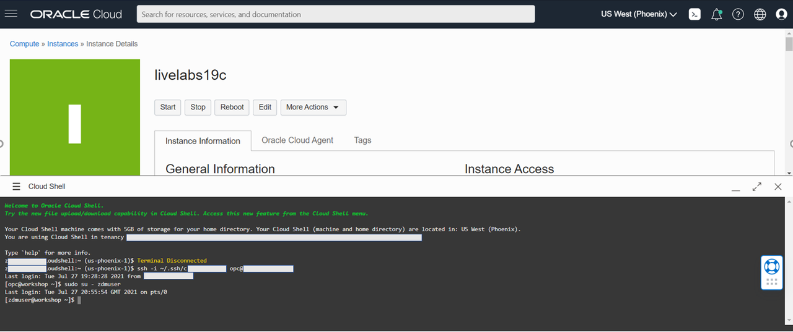

2. If you need to reconnect you can do so with the following command. Replace < sshkeyname > and < Your Compute Instance Public IP Address > with the key file name and IP address of your source compute instance:

    ```
    <copy>
    ssh -i ~/.ssh/<sshkeyname> opc@<Your Compute Instance Public IP Address>
    </copy>
    ```

3. If you need to return to 'zdmuser' and are currently user 'oracle' type the command `exit` to switch to 'opc'. To go from 'opc' to 'zdmuser' run the following command:

    ```
    <copy>
    sudo su - zdmuser
    </copy>
    ```

4. As 'zdmuser' in your compute instance command prompt run the following commands:

    ```
    <copy>
    cd ~
    mkdir labs
    cp /u01/app/zdmhome/rhp/zdm/template/zdm_logical_template.rsp ~/labs
    cd labs
    cp zdm_logical_template.rsp zdm_logical_mv_to_adb.rsp
    </copy>
    ```

## Task 2: Fill Out the Template
1. Go into the migration file and delete all of the existing lines.

    ```
    <copy>
    vi zdm_logical_mv_to_adb.rsp
    </copy>
    ```

    In vi editor the following command deletes all of the existing lines. You will need to type it in manually.

    ```
    <copy>
    :%d
    </copy>
    ```

2. Paste the below contents into the empty file.

    ```
    <copy>
    MIGRATION_METHOD=OFFLINE_LOGICAL
    DATA_TRANSFER_MEDIUM=OSS
    TARGETDATABASE_OCID=<Update>
    TARGETDATABASE_ADMINUSERNAME=ADMIN
    SOURCEDATABASE_ADMINUSERNAME=orcl_user
    SOURCEDATABASE_CONNECTIONDETAILS_HOST=localhost
    SOURCEDATABASE_CONNECTIONDETAILS_PORT=1521
    SOURCEDATABASE_CONNECTIONDETAILS_SERVICENAME=ORCLPDB
    OCIAUTHENTICATIONDETAILS_USERPRINCIPAL_TENANTID=<Update>
    OCIAUTHENTICATIONDETAILS_USERPRINCIPAL_USERID=<Update>
    OCIAUTHENTICATIONDETAILS_USERPRINCIPAL_FINGERPRINT=<Update>
    OCIAUTHENTICATIONDETAILS_USERPRINCIPAL_PRIVATEKEYFILE=/u01/app/zdmhome/.oci/oci_api_key.pem
    OCIAUTHENTICATIONDETAILS_REGIONID=<Update>


    TARGETDATABASE_CONNECTIONDETAILS_BASTIONDETAILS_PORT=22
    SOURCEDATABASE_CONNECTIONDETAILS_BASTIONDETAILS_PORT=22
    SOURCECONTAINERDATABASE_CONNECTIONDETAILS_BASTIONDETAILS_PORT=22
    GOLDENGATESETTINGS_REPLICAT_MAPPARALLELISM=4
    GOLDENGATESETTINGS_REPLICAT_MINAPPLYPARALLELISM=4
    GOLDENGATESETTINGS_REPLICAT_MAXAPPLYPARALLELISM=50
    GOLDENGATESETTINGS_ACCEPTABLELAG=30


    DATAPUMPSETTINGS_JOBMODE=SCHEMA
    DATAPUMPSETTINGS_DELETEDUMPSINOSS=TRUE
    DATAPUMPSETTINGS_FIXINVALIDOBJECTS=TRUE
    DATAPUMPSETTINGS_DATAPUMPPARAMETERS_ENCRYPTION=ALL
    DATAPUMPSETTINGS_DATAPUMPPARAMETERS_TABLEEXISTSACTION=TRUNCATE
    DATAPUMPSETTINGS_DATAPUMPPARAMETERS_IMPORTPARALLELISMDEGREE=1
    DATAPUMPSETTINGS_DATAPUMPPARAMETERS_EXPORTPARALLELISMDEGREE=1
    DATAPUMPSETTINGS_DATAPUMPPARAMETERS_EXCLUDETYPELIST=user
    DATAPUMPSETTINGS_DATABUCKET_NAMESPACENAME=<Update>
    DATAPUMPSETTINGS_DATABUCKET_BUCKETNAME=<Update>
    DATAPUMPSETTINGS_EXPORTDIRECTORYOBJECT_NAME=DB_EXP_DR
    DATAPUMPSETTINGS_EXPORTDIRECTORYOBJECT_PATH=/u01/app/oracle/export
    DATAPUMPSETTINGS_CREATEAUTHTOKEN=FALSE
    DATAPUMPSETTINGS_OMITENCRYPTIONCLAUSE=TRUE
    DATAPUMPSETTINGS_SECUREFILELOB=TRUE
    DATAPUMPSETTINGS_SKIPDEFAULTTRANSFORM=FALSE
    EXCLUDEOBJECTS-1=owner:ORCL_USER, objectName:.*
    EXCLUDEOBJECTS-2=owner:PDBADMIN, objectName:.*


    DUMPTRANSFERDETAILS_PARALLELCOUNT=3
    DUMPTRANSFERDETAILS_RETRYCOUNT=3
    DUMPTRANSFERDETAILS_RSYNCAVAILABLE=FALSE
    DUMPTRANSFERDETAILS_SOURCE_USEOCICLI=FALSE
    DUMPTRANSFERDETAILS_TARGET_USEOCICLI=FALSE
    </copy>
    ```

3. Update the following lines in the file. Replace `<Update>` with the information. Be careful and make sure the entire text is pasted as there is a tendency for the first character to sometimes get cut off:
    * TARGETDATABASE\_OCID: On your Autonomous Database home page.
    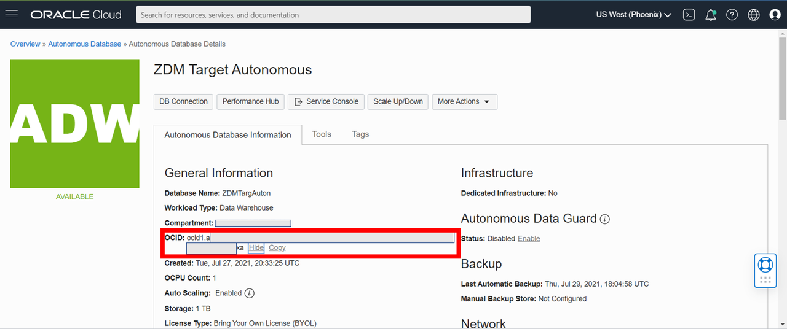
    * OCIAUTHENTICATIONDETAILS\_USERPRINCIPAL\_TENANTID: On your API key configuration file preview.
    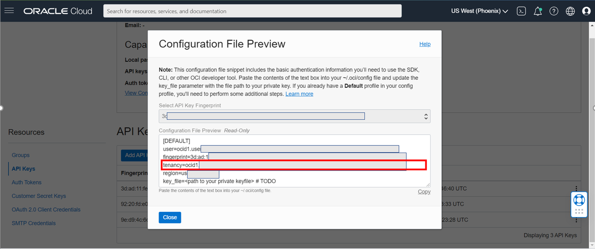
    * OCIAUTHENTICATIONDETAILS\_USERPRINCIPAL\_USERID: On your API key configuration file preview.
    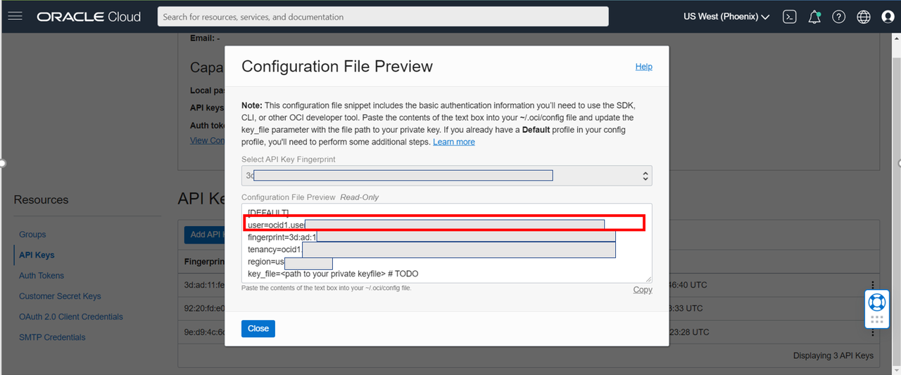
    * OCIAUTHENTICATIONDETAILS\_USERPRINCIPAL\_FINGERPRINT: On your API key configuration file preview.
    
    * OCIAUTHENTICATIONDETAILS\_REGIONID: On your API key configuration file preview.
    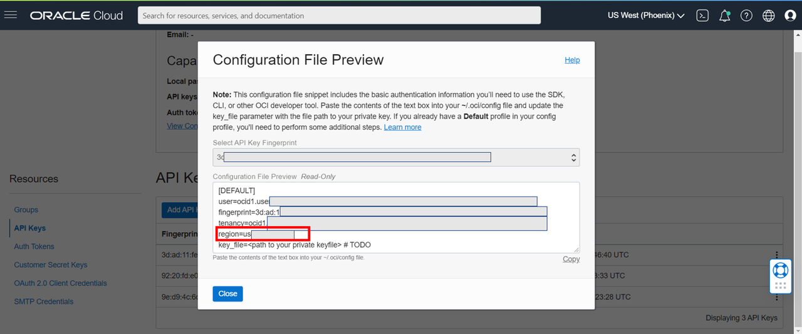
    * DATAPUMPSETTINGS_DATABUCKET\_NAMESPACENAME: On your object storage bucket homepage.
    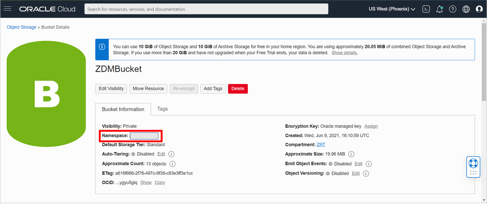
    * DATAPUMPSETTINGS_DATABUCKET\_BUCKETNAME: On your object storage bucket homepage.
    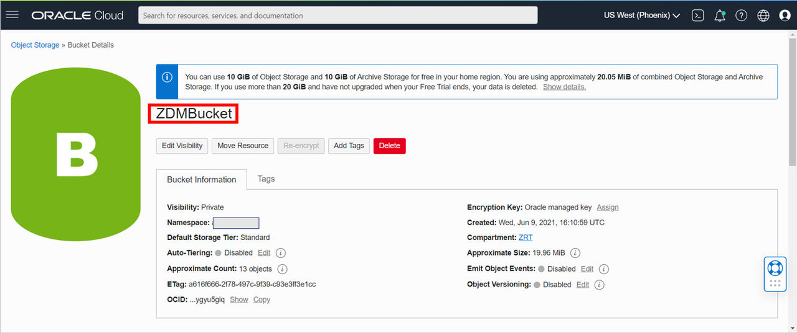

    For easy access go back under your OCI user profile, API Keys, select the ellipses under your fingerprint, and 'View Configuration File'.

    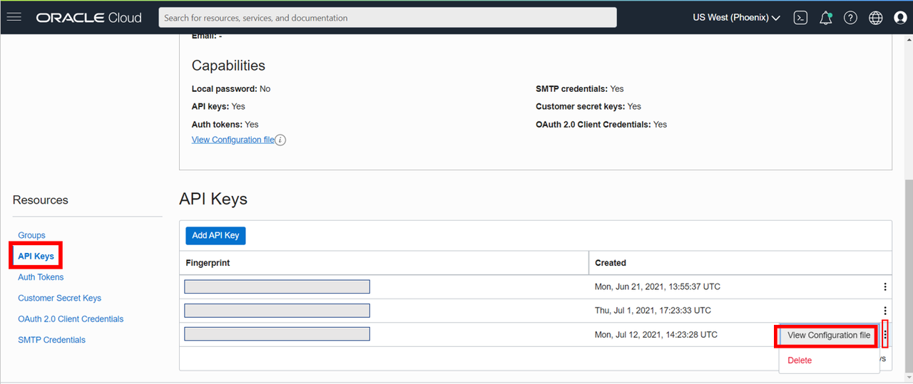

4. After the lines are updated save and quit vi editor.

## Task 3: Run the Migration Command
1. In command prompt as 'zdmuser' run the following command:

    ```
    <copy>
    /u01/app/zdmhome/bin/zdmcli migrate database -rsp /home/zdmuser/labs/zdm_logical_mv_to_adb.rsp -sourcenode localhost -srcauth zdmauth -srcarg1 user:opc -srcarg2 identity_file:/home/zdmuser/.ssh/id_rsa -srcarg3 sudo_location:/bin/sudo -sourcedb ORCL
    </copy>
    ```

## Task 4: Answer the Migration Prompts
1. **'orcl_user' password:**

    ```
    <copy>
    WELcome123ZZ
    </copy>
    ```
2. **'ADMIN' password:**

    ```
    <copy>
    WELcome123ZZ
    </copy>
    ```

3. **Authentication Token:**
    Type the token you saved earlier.

4. **Data Pump Encryption password:** Setting it on this prompt. We are using the password `WELcome123ZZ` again for ease and consistency. If you would like you can replace `WELcome123ZZ` with a password of your choice.

    ```
    <copy>
    WELcome123ZZ
    </copy>
    ```

## Task 5: Check on Job Status
1. Go to the 'scheduled' directory.

    ```
    <copy>
    cd /u01/app/zdmbase/chkbase/scheduled
    </copy>
    ```

2. View the job progress. When you see the cleanup complete message the migration has finished. Ctrl + c keys escapes the feed.

    ```
    <copy>
    tail -100f job-1*
    </copy>
    ```

    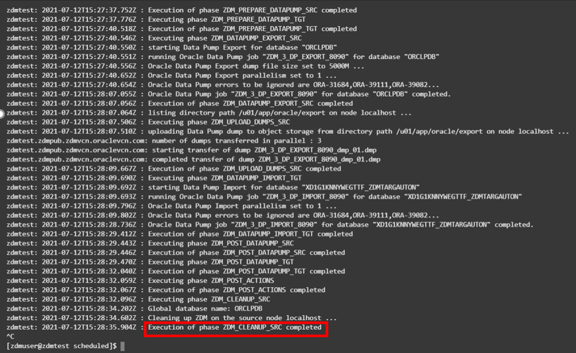

3. In addition you can confirm the job completion by running the following command:

    ```
    <copy>
    /u01/app/zdmhome/bin/zdmcli query job -jobid 1
    </copy>
    ```

    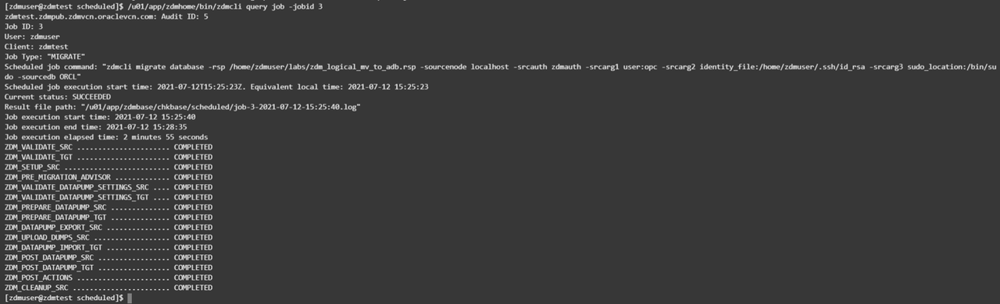

4. If you need to run the migration multiple times you will have a different job ID each time. In this case, in the tail and query job commands above, you would replace the job ID of 1 with your current job ID. To check for the most recent job ID in the 'scheduled' directory, run the ```ls``` command and the most recent job is the highest number:

    ```
    <copy>
    ls
    </copy>
    ```

    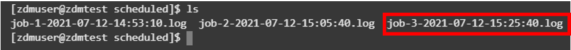

## Task 6: Check Job in Autonomous Database
1. In your autonomous database SQL command prompt run the command:

    ```
    <copy>
    select * from movedata_user.test1;
    </copy>
    ```

2. If you see the table you have successfully completed the migration.
    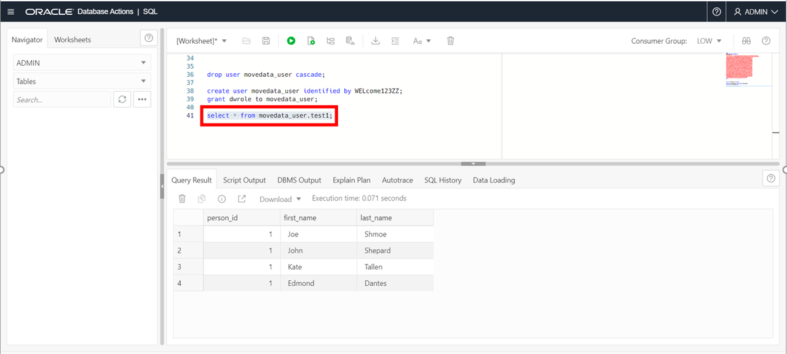


## Acknowledgements
* **Author** - Zachary Talke, Solutions Engineer, NA Tech Solution Engineering
* **Last Updated By/Date** - Zachary Talke, July 2021
